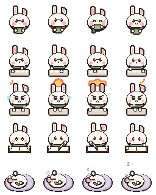
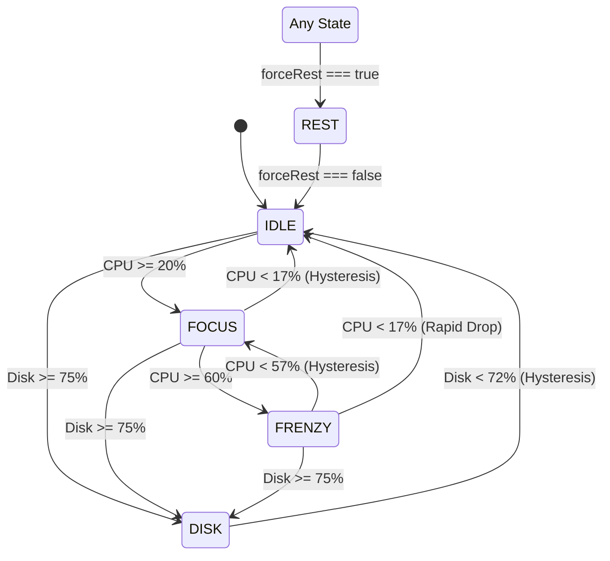

# 🐰 Lo-fi Bun Companion

<p align="center">
  
</p>

<p align="center">
  <strong>A cozy, lightweight Virtual Desk Companion featuring hardware-reactive pixel animations, Pomodoro focus timer, and ambient lo-fi soundscapes.</strong>
</p>

<p align="center">
  <a href="#-key-features"></a>
  <a href="#-5-pillar-automated-quality-gates"></a>
  <a href="#-pure-css-animation-engine"></a>
  <a href="#-typescript-architecture"></a>
  <a href="LICENSE"></a>
</p>

---

## ✨ Overview

**Lo-fi Bun Companion** transforms your desktop into a calm, productive workspace. Inspired by classic desktop mascots (like RunCat and Bongo Cat) and modern lo-fi aesthetics, our animated bunny reacts in real-time to your computer's hardware workload (CPU, RAM, and Disk I/O) while providing zero-friction productivity tools.

---

## 🎮 Key Features

### 1. ⚙️ Hardware-Reactive Companion State Machine
Our bunny intelligently transitions across 5 workload states and dynamic prop layers based on system utilization:

| State | Hardware Condition | Bunny Visual Animation |
| :--- | :--- | :--- |
| **`IDLE`** | CPU `< 20%` | Chilling, sipping warm tea/coffee, gentle ear wiggles |
| **`FOCUS`** | CPU `20% - 60%` | Typing calmly on a mechanical keyboard at steady speed |
| **`FRENZY`** | CPU `> 60%` | Turbo-typing with sweat drops and intense focus |
| **`DISK`** | Disk I/O `> 75%` | Flipping furiously through study book pages |
| **`REST`** | User Override / Break | Cozy sleeping cap, snoring bubbles (`Zzz`) |
| **`HEAVY RAM`** *(Prop Layer)* | RAM `> 80%` | Balanced carrot stack atop bunny's head (across all states) |



### 2. ⚡ Pure CSS GPU Step Animator (0.0% CPU Footprint)
- **Zero JavaScript Render Loops**: Animation frames are handled purely via CSS `@keyframes` with `steps(4)` and GPU-accelerated texture translations.
- **Ultra-Lightweight SVG Spritesheet**: Crisp vector rendering at any DPI scale with crisp pixel-art styling (`image-rendering: pixelated`).

### 3. 🎯 Asymmetric Hysteresis Anti-Jitter Smoothing
- Implements a $\pm 3\%$ dual-threshold deadband to eliminate rapid state flapping when system metrics hover near boundary thresholds (e.g. CPU oscillating between $19.9\%$ and $20.1\%$).

### 4. 🎛️ Interactive Metric Controller & HUD
- Real-time hardware sliders (CPU, RAM, Disk) for live state simulation.
- Force Rest mode toggle switch.
- Live Performance HUD with instant state badge indicators.

---

## 🏗️ Architecture & Project Structure

```text
lofi_bun_companion/
├── AGENTS.md                  # Master guidelines, tech stack & protocols
├── README.md                  # Project overview & documentation
├── non-docs/
│   ├── tasks/                 # Dated task plans & implementation roadmaps
│   ├── devlogs/               # Daily progress & architectural decision logs
│   └── specs/                 # Technical specifications & ADRs
└── lofi-bun-companion/        # Application Source Code
    ├── src/
    │   ├── assets/sprites/    # SVG Vector Spritesheets (bun-sprites.svg, prop-carrot.svg)
    │   ├── components/
    │   │   ├── Pet/           # PetSprite Pure CSS step animator
    │   │   └── Controls/      # MockMetricController simulation sliders
    │   ├── stores/            # Zustand state management (companionStore)
    │   ├── utils/             # State resolver & hysteresis math utilities
    │   ├── types/             # TypeScript type definitions
    │   └── __tests__/         # Vitest automated test suites (59 tests)
    ├── package.json
    └── vite.config.ts
```

---

## 🛡️ 5-Pillar Automated Quality Gates

Every release is strictly verified against 5 automated quality pillars:

```bash
npm run verify
```

```
┌────────────────────────────────────────────────────────────┐
│              5-Pillar Quality Gate Pipeline                │
├─────────────────┬──────────────────────────────────────────┤
│ 1. Linting      │ npm run lint         (ESLint v9 Flat)   │
│ 2. Formatting   │ npm run format:check (Prettier)          │
│ 3. Type Safety  │ npm run typecheck    (tsc --noEmit)      │
│ 4. Unit Tests   │ npm test             (Vitest - 59 tests) │
│ 5. Build        │ npm run build        (Vite Production)   │
└─────────────────┴──────────────────────────────────────────┘
```

> **Adversarial Mutation Tested**: Verified with 100% Mutation Kill Rate against math boundary, state machine hierarchy, and DOM rendering mutations.

---

## 🚀 Quickstart & Development

### Prerequisites
- Node.js (v18.0.0 or higher)
- npm or yarn

### Installation & Run Locally

```bash
# Clone the repository
git clone https://github.com/vavinon/lofi-bun-companion.git
cd lofi_bun_companion/lofi-bun-companion

# Install dependencies
npm install

# Start local development server
npm run dev
```

### Run Tests & Verification

```bash
# Run Vitest unit tests in watch mode
npm run test:watch

# Run Vitest single run
npm test

# Run full 5-pillar verification gate
npm run verify
```

---

## 🗺️ Roadmap & Milestones

- [x] **v0.1.0 — Core Sprite Engine & State Machine** *(Current)*
  - [x] Pure CSS Step Animator (`steps(4)`) & Vector Spritesheets
  - [x] Hardware-Reactive State Resolver with $\pm 3\%$ Hysteresis
  - [x] Zustand State Store with selective reactive subscriptions
  - [x] Interactive Simulation Controls & Showcase HUD
  - [x] 59/59 Automated Vitest Suites & Mutation Verification
- [ ] **v0.2.0 — Pomodoro Focus Timer & Ambient Soundscape Mixer**
  - [ ] Configurable 25/5 Pomodoro interval timer with visual pet rest hooks
  - [ ] Multi-channel Web Audio Mixer (Lo-fi Beats, Rain, Keyboard Clicks, Cafe Ambience)
- [ ] **v0.3.0 — Real System Metrics Hook & Desktop Widget Mode**
  - [ ] Real-time hardware telemetry integration
  - [ ] Floating draggable companion badge with Always-on-Top support
- [ ] **v1.0.0 — Production Packaging (Tauri Desktop App)**
  - [ ] Cross-platform desktop release for Windows / macOS / Linux

---

## 📄 License & Attribution

- **Original Character & Artwork**: All vector sprites and pixel graphics are 100% original artwork designed for Lo-fi Bun Companion.
- **Code License**: Released under the [MIT License](LICENSE).
