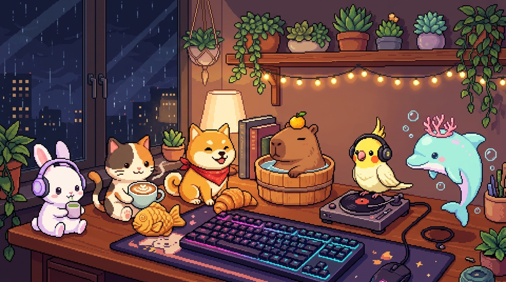
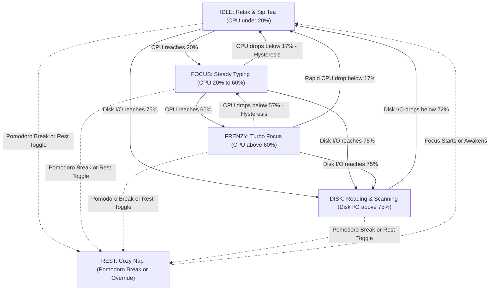

# 🐰 Lo-fi Bun Companion

<p align="center">
  
</p>

<p align="center">
  <strong>A cozy, lightweight Virtual Desk Companion featuring hardware-reactive pixel animations, Bun & Friends Multiverse, Pomodoro focus timer, and ambient lo-fi soundscapes.</strong>
</p>

<p align="center">
  <a href="#-key-features"></a>
  <a href="#-5-pillar-automated-quality-gates"></a>
  <a href="#-pure-css-animation-engine"></a>
  <a href="#-typescript-architecture"></a>
  <a href="LICENSE"></a>
</p>

---

## ✨ Overview

**Lo-fi Bun Companion** transforms your desktop into a calm, productive workspace. Inspired by classic desktop mascots (like RunCat and Bongo Cat) and modern lo-fi aesthetics, our animated companions react in real-time to your computer's hardware workload (CPU, RAM, and Disk I/O) while providing zero-friction Pomodoro focus productivity tools.

---

## 🎮 Key Features

### 1. 🐾 Bun & Friends Multiverse (6 Unique Mascots)
Switch between 6 handcrafted pixel-art animal companions on the fly via the right-click context menu or dashboard ribbon:

| Companion | Name & Title | Specialty & Personality | Heavy RAM Prop (>80%) |
| :---: | :--- | :--- | :---: |
| 🐰 | **Lo-fi Bun** *(Flagship)* | Focus Study & Cozy Tea Time | 🥕 Stacked Carrot |
| 🐱 | **Coffee Neko** | Barista & Relaxed Ambient Study | 🐟 Taiyaki Fish Pastry |
| 🐶 | **Bakery Shiba** | Energetic Artisan Baker & Morale Booster | 🥐 Golden Croissant Stack |
| 🍊 | **Onsen Capybara** | Zen Master & Anti-Burnout Companion | 🍊 Hot Spring Yuzu Orange |
| 🦜 | **DJ Cockatiel** | Beat Maker & Lo-fi Rhythm Master | 🎵 Retro Vinyl Record |
| 🐬 | **Wave Dolphin** | Deep Work Flow State & Ocean Breeze | 🪸 Coral & Pearl Crown |

---

### 2. 🍅 Pomodoro Focus Suite & Companion Sleep Sync (v2.0.0)
- **Configurable Productivity Intervals**:
  - **Classic 25/5**: Standard 25-minute focus intervals with 5-minute short breaks.
  - **Deep Work 50/10**: Extended 50-minute deep concentration intervals with 10-minute breaks.
  - **Custom Timer**: Tailor your own Focus, Short Break, and Long Break durations.
- **4-Cycle Long Break Automation**: Automatically unlocks a 15-minute restorative Long Break after completing 4 consecutive focus cycles.
- **💤 Rest Automation Hook (`usePomodoroTimer`)**: When break begins, companions automatically transition to their cozy `REST` sleep pose (snoring bubbles, pillow nap, yuzu onsen soak), reminding you to rest your eyes. When focus starts, companions automatically awaken!
- **Daily Focus Streak Tracker**: LocalStorage persistence tracking completed cycles (🍅 counter) and accumulated minutes per calendar day.
- **🔔 Soft Pentatonic Bell Chime (`soundSynth.ts`)**: Synthesized dual-tone harmonic chime using native Web Audio API oscillators with zero external audio assets and zero latency.
- **Dual Focus Widgets**:
  - **Floating Mini Progress Ring**: Sleek circular SVG progress ring and time readout directly on the Desktop Mascot.
  - **Full Focus Dashboard Modal**: Double-click mascot or trigger via context menu to view large countdown, streak cards, and preferences.

---

### 3. 🪟 The Hardware Desk Pet (Tauri Desktop Mascot)
- **Frameless & Transparent Floating Window**: Seamless desktop mascot floating gracefully over your wallpaper with no intrusive titlebars.
- **Draggable Canvas (`data-tauri-drag-region`)**: Freely position the companion anywhere on your desktop.
- **Context Menu Overhaul**: Glassmorphism controls for companion switching, Pomodoro quick actions, telemetry mode, opacity tuning (40%–100%), always-on-top pinning, and custom Lo-fi Slim Scrollbars.
- **Dual View Modes**: Seamlessly toggle between **Compact Mascot View** (minimal floating widget) and **Full Showcase Dashboard** (complete hardware lab).

---

### 4. ⚙️ Hardware-Reactive Companion State Machine
Every companion intelligently transitions across 5 workload states and dynamic prop layers based on system utilization:

| State | Hardware Condition | Mascot Visual Behavior |
| :--- | :--- | :--- |
| **`IDLE`** | CPU `< 20%` | Relaxing, sipping tea/coffee, gentle idle animations |
| **`FOCUS`** | CPU `20% - 60%` | Typing calmly on a keyboard / steady work rhythm |
| **`FRENZY`** | CPU `> 60%` | Turbo work mode with sweat drops and high-energy focus |
| **`DISK`** | Disk I/O `> 75%` | Furious reading / fast scanning / rapid snack chewing |
| **`REST`** | User Override / Pomodoro Break | Cozy sleeping posture, gentle snoring bubbles (`Zzz`) |
| **`HEAVY RAM`** *(Prop Layer)* | RAM `> 80%` | Balanced signature prop dynamically overlaid on mascot's head |



---

### 5. ⚡ Native OS Telemetry Engine (Rust + `sysinfo`)
- Non-blocking background hardware polling (1.5s interval) in Rust with zero main-thread overhead.
- Pluggable provider architecture (`NativeTelemetryProvider` for desktop, `WebMockTelemetryProvider` for browsers and Vitest).

---

### 6. ⚡ Pure CSS GPU Step Animator (0.0% CPU Footprint)
- **Zero JavaScript Render Loops**: Animation frames are handled purely via CSS `@keyframes` with `steps(4)` and GPU-accelerated texture translations.
- **Ultra-Lightweight SVG Spritesheet**: Crisp vector rendering at any DPI scale with crisp pixel-art styling (`image-rendering: pixelated`).

---

### 7. 🎯 Asymmetric Hysteresis Anti-Jitter Smoothing
- Implements a $\pm 3\%$ dual-threshold deadband to eliminate rapid state flapping when system metrics hover near boundary thresholds.

---

## 🏗️ Architecture & Project Structure

```text
lofi_bun_companion/
├── AGENTS.md                  # Master guidelines, tech stack & protocols
├── README.md                  # Project overview & documentation
├── CHANGELOG.md               # Version history (Keep a Changelog 1.1.0)
├── non-docs/
│   ├── tasks/                 # Dated task plans & implementation roadmaps
│   ├── devlogs/               # Daily progress & architectural decision logs
│   └── specs/                 # Technical specifications & ADRs
└── lofi-bun-companion/        # Application Source Code
    ├── src-tauri/             # Tauri Rust Desktop Core (sysinfo sampler & IPC commands)
    ├── src/
    │   ├── assets/sprites/    # SVG Vector Spritesheets (6 companions & 6 overlay props)
    │   ├── components/
    │   │   ├── Desktop/       # CompactMascotView, PetContextMenu, WindowHeader
    │   │   ├── Pet/           # PetSprite Pure CSS step animator
    │   │   └── Controls/      # PomodoroModal, PomodoroWidget, MockMetricController
    │   ├── data/              # Pluggable Companion Registry (companionRegistry.ts)
    │   ├── hooks/             # usePomodoroTimer hook
    │   ├── stores/            # Zustand stores (companionStore, pomodoroStore)
    │   ├── telemetry/         # Pluggable telemetry engine (Native & WebMock)
    │   ├── utils/             # soundSynth, stateResolver, hysteresis utilities
    │   ├── types/             # TypeScript type definitions (companion, desktop, pomodoro)
    │   └── __tests__/         # Vitest automated test suites (171 tests passing 100%)
    ├── package.json
    └── vite.config.ts
```

---

## 🛡️ 5-Pillar Automated Quality Gates

Every release is strictly verified against 5 automated quality pillars:

```bash
npm run verify
```

```
┌────────────────────────────────────────────────────────────┐
│              5-Pillar Quality Gate Pipeline                │
├─────────────────┬──────────────────────────────────────────┤
│ 1. Linting      │ npm run lint         (ESLint v9 Flat)   │
│ 2. Formatting   │ npm run format:check (Prettier)          │
│ 3. Type Safety  │ npm run typecheck    (tsc --noEmit)      │
│ 4. Unit Tests   │ npm test             (Vitest - 171 tests)│
│ 5. Build        │ npm run build        (Vite Production)   │
└─────────────────┴──────────────────────────────────────────┘
```

---

## 🚀 Quickstart & Development

### Prerequisites
- Node.js (v18.0.0 or higher)
- Rust & Cargo (for desktop packaging)

### Installation & Run Locally

```bash
# Clone the repository
git clone https://github.com/vavinon/lofi-bun-companion.git
cd lofi_bun_companion/lofi-bun-companion

# Install dependencies
npm install

# Start local web development server
npm run dev

# Start Tauri Desktop Mascot
npm run tauri:dev
```

### Run Tests & Verification

```bash
# Run full 5-pillar verification gate
npm run verify

# Build desktop release installers
npm run tauri:build
```

---

## 🗺️ Roadmap & Milestones

- [x] **v0.1.0 — Core Sprite Engine & State Machine** *(Completed 🟢)*
- [x] **v0.2.0 — Real Hardware Telemetry Engine** *(Completed 🟢)*
- [x] **v1.0.0 — 📦 The Hardware Desk Pet (Official Desktop Release)** *(Completed 🟢)*
- [x] **v1.1.0 — 🐾 Bun & Friends Multiverse (Character Expansion)** *(Completed 🟢)*
- [x] **v2.0.0 — 🍅 The Productivity Update (Pomodoro Focus Suite)** *(Completed 🟢)*
  - [x] Configurable 25/5 Pomodoro interval timer with auto-rest hooks for companion
  - [x] Daily focus streak tracker and break reminder cues
  - [x] Zero-asset Web Audio soft bell chime synthesizer
  - [x] Mini Progress Widget & Full Focus Dashboard Modal
  - [x] Context Menu overhaul with slim scrollbars
  - [x] 171/171 automated unit & integration tests passing 100%
- [ ] **v3.0.0 — 🎧 The Soundscape Update (Ambient Lo-fi Audio Mixer)** *(Next Up 🎯)*
  - [ ] Multi-channel Web Audio soundscape mixer (Lo-fi beats, rain, mechanical keyboard clicks, cafe murmur)
  - [ ] Independent audio channel volume controls and mute presets

---

## 📄 License & Attribution

- **Original Character & Artwork**: All vector sprites and pixel graphics are 100% original artwork designed for Lo-fi Bun Companion.
- **Code License**: Released under the [MIT License](LICENSE).
