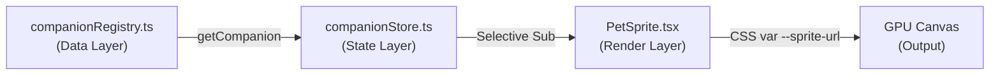

# 📅 Devlog: 2026-08-30

## 🎯 Focus: Software Engineering Standards Alignment (SemVer 2.0.0 & Conventional Commits)

### 📌 Summary of Changes:
1. **Operating Guidelines ([AGENTS.md](file:///c:/DevProjects/lofi_bun_companion/AGENTS.md))**:
   - บันทึกมาตรฐาน **SemVer 2.0.0** (`MAJOR.MINOR.PATCH`) สำหรับทุก Release Milestone
   - กำหนดมาตรฐานการเขียน Commit ด้วย **Conventional Commits 1.0.0** (`<type>(<scope>): <subject>`)
   - กำหนดมาตรฐานการตั้งชื่อ Git Branch: `feat/<semver>-<slug>`, `fix/<slug>`, `chore/<slug>`
   - เพิ่มมาตรฐานการบันทึก **ADRs** (`non-docs/specs/adr/`) และ **Keep a Changelog 1.1.0**

2. **Master Roadmap ([version-roadmap.md](file:///c:/DevProjects/lofi_bun_companion/non-docs/specs/version-roadmap.md))**:
   - ปรับผังเวอร์ชันสู่ SemVer 2.0.0:
     - `0.1.0`: Core Sprite & State Engine (Flagship PoC)
     - `0.2.0`: Windows Real Hardware Telemetry Engine
     - `1.0.0`: The Hardware Desk Pet (Official Desktop Launch 🎉)
     - `1.1.0`: Bun & Friends Multiverse (+5 Companion Roster)
     - `2.0.0`: The Productivity Update (Pomodoro Focus Suite)
     - `3.0.0`: The Soundscape Update (Ambient Lo-fi Audio Mixer)

3. **Active Task & Git Branch**:
   - สร้างแผนงาน [2026-08-30-0.1.0-core-sprite-engine.md](file:///c:/DevProjects/lofi_bun_companion/non-docs/tasks/2026-08-30-0.1.0-core-sprite-engine.md)
   - ปรับชื่อ Git Branch สู่ `feat/0.1.0-core-sprite-engine`

4. **Multi-Character Architecture & Specifications ([non-docs/specs/characters/](file:///c:/DevProjects/lofi_bun_companion/non-docs/specs/characters/))**:
   - แยกไฟล์สเปกตัวละครแบบโมดูลาร์ 1 ตัวละคร = 1 ไฟล์ `.md` (`bun`, `neko`, `shiba`, `capybara`, `cockatiel`, `dolphin`)
   - สร้าง [characters/README.md](file:///c:/DevProjects/lofi_bun_companion/non-docs/specs/characters/README.md) กำหนด Universal 5-State Contract และ Color Palette Tokens
   - สร้าง [character-gallery.html](file:///c:/DevProjects/lofi_bun_companion/non-docs/specs/characters/character-gallery.html) เพื่อดู Pixel Art Studio, Live Hardware Slider, และ State Animations แบบ Interactive

5. **Master Menu & Navigation Architecture ([menu-navigation-spec.md](file:///c:/DevProjects/lofi_bun_companion/non-docs/specs/menu-navigation-spec.md))**:
   - ออกแบบโครงสร้างเมนูคลิกขวา (Quick Context Menu), เมนูย่อย (Submenus), และ Preferences Modal
   - จัดทำ Release Phasing Matrix สำหรับแต่ละเมนูตั้งแต่ `0.1.0` ถึง `1.x.x`
   - บันทึกข้อกำหนด Mouse Interactions Map ลงใน [cozy-mechanics-spec.md](file:///c:/DevProjects/lofi_bun_companion/non-docs/specs/cozy-mechanics-spec.md) และ [companion-hardware-spec.md](file:///c:/DevProjects/lofi_bun_companion/non-docs/specs/companion-hardware-spec.md)

---

## 🎯 Phase 2: Domain Types & Decoupled State Machine (Completed)

### 📌 Key Implementations:
1. **Domain Types ([companion.ts](file:///c:/DevProjects/lofi_bun_companion/lofi-bun-companion/src/types/companion.ts))**:
   - ประกาศ Type Contracts สำหรับ `CompanionState`, `HardwareMetrics`, `ResolvedCompanionState`, `CompanionMetadata`, และ `CompanionRegistry`
2. **Hysteresis Smoothing ([hysteresis.ts](file:///c:/DevProjects/lofi_bun_companion/lofi-bun-companion/src/utils/hysteresis.ts))**:
   - อัลกอริทึม Asymmetric Dual-Threshold พร้อมบัฟเฟอร์ $\pm 3\%$ ป้องกันอาการ Flicker ตามช่วง CPU (20%, 60%) และ Disk (75%)
3. **State Priority Evaluator ([stateResolver.ts](file:///c:/DevProjects/lofi_bun_companion/lofi-bun-companion/src/utils/stateResolver.ts))**:
   - Pure State Resolver จัดลำดับ Priority: `REST` (1) > `DISK` (2) > `FRENZY` / `FOCUS` / `IDLE` (3) พร้อม `isHeavyRam` (>80%)
4. **TDD Automated Unit Tests ([__tests__/](file:///c:/DevProjects/lofi_bun_companion/lofi-bun-companion/src/__tests__/))**:
   - `hysteresis.test.ts` (13 tests ครอบคลุมทุก Threshold และ Boundary Cases)
   - `stateResolver.test.ts` (16 tests ครอบคลุม State Hierarchy, Overrides, และ Prop Flags)
5. **5-Pillar Quality Gate Verification (`npm run verify`)**:
   - ผ่านครบ 100%: Linting (0 errors/warnings), Formatting, Typecheck, 30 Vitest tests, และ Production Build

---

## 🎯 Phase 3: Zustand State Store (Completed)

### 📌 Key Implementations:
1. **Reactive Store Architecture ([companionStore.ts](file:///c:/DevProjects/lofi_bun_companion/lofi-bun-companion/src/stores/companionStore.ts))**:
   - สร้าง Zustand Store `useCompanionStore` ด้วย TypeScript
   - ใช้ `subscribeWithSelector` middleware เพื่อสนับสนุน Selective Subscriptions Pattern (Component Subscribe เฉพาะ State Slice ที่ต้องการ เพื่อรักษา 0% CPU Idle)
   - Store State ประกอบด้วย: `metrics`, `forceRest`, `activeCompanionId`, `resolvedState`
   - Store Actions: `setMetrics`, `setForceRest`, `setActiveCompanionId`, `resetToDefaults`
2. **Store Integration Tests (TDD Approach - [companionStore.test.ts](file:///c:/DevProjects/lofi_bun_companion/lofi-bun-companion/src/__tests__/companionStore.test.ts))**:
   - 13 Test Cases ครอบคลุม Default states, dynamic transitions, smoothing, forceRest override, reset, และ selective subscriptions
3. **5-Pillar Quality Gate Verification (`npm run verify`)**:
   - ผ่านครบ 100% (43 Vitest tests, Lint, Format, Typecheck, Build ผ่านทั้งหมด)

---

## 🎯 Phase 4: Vector Pixel-Art & GPU CSS Step Animator (Completed)

### 📌 Key Implementations:
1. **Lo-fi Bun Vector Spritesheet ([bun-sprites.svg](file:///c:/DevProjects/lofi_bun_companion/lofi-bun-companion/src/assets/sprites/bun-sprites.svg))**:
   - Canvas Grid: 256 x 320 px (64x64 px ต่อเฟรม, 4 คอลัมน์ x 5 แถว)
   - ครบทั้ง 5 ท่าทางหลัก: `IDLE` 🍵, `FOCUS` ⌨️, `FRENZY` 🔥, `DISK` 📖, `REST` 💤
2. **Carrot Stack Overlay Prop ([prop-carrot.svg](file:///c:/DevProjects/lofi_bun_companion/lofi-bun-companion/src/assets/sprites/prop-carrot.svg))**:
   - กองแครอทซ้อน 3 หัวผูกโบว์ชมพู สำหรับแสดงเมื่อ RAM Usage >80%
3. **Pure CSS Step Animator ([PetSprite.tsx](file:///c:/DevProjects/lofi_bun_companion/lofi-bun-companion/src/components/Pet/PetSprite.tsx))**:
   - ขับเคลื่อนด้วย Pure CSS GPU Keyframes (`steps(4)`) โหลด CPU 0.0% ตอน Idle

---

## 🎯 Phase 5: Cozy Showcase Lab UI & Controller (Completed)

### 📌 Key Implementations:
1. **Glassmorphism Controller ([MockMetricController.tsx](file:///c:/DevProjects/lofi_bun_companion/lofi-bun-companion/src/components/Controls/MockMetricController.tsx))**:
   - Slider ควบคุม CPU, RAM, Disk พร้อมปุ่ม Rest Mode Override และ Reset
2. **Lo-fi Desk Mat Showcase Container ([App.tsx](file:///c:/DevProjects/lofi_bun_companion/lofi-bun-companion/src/App.tsx))**:
   - Dark Espresso Theme, Live HUD State Badges, และ Character Tag

---

## ⚡ Session 4: Release 0.2.0 — Real Hardware Telemetry Engine & UI Controls

### 📌 Summary of Changes:
1. **Pluggable Telemetry Providers (`src/telemetry/`)**:
   - `types.ts`: Telemetry domain types (`TelemetryMode`, `TelemetryProviderStatus`, `HardwareTelemetryProvider`).
   - `NativeTelemetryProvider.ts`: Native OS provider reading Windows CPU, RAM, Disk I/O with 1.5s non-blocking interval.
   - `WebMockTelemetryProvider.ts`: Web / Mock provider for browser environments and deterministic Vitest testing.
   - `telemetryManager.ts`: Singleton managing active provider switching, listeners, and background sampling loop.
   - `useTelemetry.ts`: React hook managing telemetry lifecycle with auto-start and mount/unmount cleanup.
2. **Store & UI Controls (`src/components/Controls/`, `src/App.tsx`)**:
   - `MockMetricController.tsx`: Added **⚡ LIVE METRICS** vs **🎛️ MANUAL SIMULATION** mode selector, live pulsing indicator banner, and automatic slider disabling in LIVE mode.
   - `App.tsx`: Top-level `useTelemetry()` activation and Telemetry Status HUD Badges (`⚡ LIVE`/`🎛️ MANUAL`, `🖥️ Provider`, `🟢 POLLING`/`⚪ IDLE`).
3. **Versioning & 5-Pillar Automated Quality Verification**:
   - Bumped `package.json` to version `0.2.0` (SemVer 2.0.0).
   - Created root `CHANGELOG.md` adhering to Keep a Changelog 1.1.0 specifications.
   - 12 Test files / 84 tests passing 100% in Vitest.
   - 5-Pillar automated gates (`npm run verify`) passing with 0 errors.

---

## 🏆 Session 5: Milestone Release 1.0.0 — The Hardware Desk Pet (Tauri Desktop Mascot)

### 📌 Summary of Key Deliverables:
1. **Tauri Core & Native Windows OS Telemetry (`src-tauri/`)**:
   - `tauri.conf.json`: Frameless, transparent, floating mascot window configuration (`transparent: true`, `decorations: false`, `alwaysOnTop: true`).
   - `telemetry.rs` & `main.rs`: Native Rust hardware telemetry engine leveraging the `sysinfo` crate for zero main-thread CPU, RAM, and Disk polling.
   - `NativeTelemetryProvider.ts`: Seamless Tauri IPC command bridge with web fallback.
2. **Desktop UI Components & Mascot View (`src/components/Desktop/`)**:
   - `CompactMascotView.tsx`: Lightweight, draggable desktop pet widget with dynamic state halo glow, minimal hardware metric pills (⚡ CPU, 🧠/🥕 RAM, 💾 Disk), and `data-tauri-drag-region`.
   - `PetContextMenu.tsx`: Right-click floating glassmorphism context menu offering instant controls (Live/Manual, Rest toggle, Opacity tuning, Always-on-top, View switch, Exit).
   - `WindowHeader.tsx`: Subtle top window control bar with Pin, View Toggle, Minimize, and Close buttons.
3. **Master App Switcher & Store Integration (`src/App.tsx`, `companionStore.ts`)**:
   - Seamless conditional rendering between `CompactMascotView` (in transparent borderless root container) and `Full Showcase Desk Mat`.
   - Extended `useCompanionStore` with `viewMode`, `windowOpacity`, and `isAlwaysOnTop`.
4. **5-Pillar Quality Gate & Automated Testing**:
   - 15 Test suites / 111 tests passing 100% in Vitest.
   - Strict `tsc --noEmit` 0 type errors.
   - ESLint v9 Flat Config 100% clean.
   - Prettier formatting verified.
   - Vite production bundle compiled cleanly.

---

## 📦 Session 6: Release 1.0.0 Windows Installer Packaging — Phase 1 Tooling & Setup

### 📌 Summary of Completed Work:
1. **Rust Toolchain & Build Tooling Installation**:
   - Installed Rust toolchain (`rustup`, `cargo`, `rustc` v1.98.0) with default target `stable-x86_64-pc-windows-gnu`.
   - Installed WinLibs MinGW-w64 toolchain (`gcc`, `g++`, `dlltool`, `ld`, `windres` v16.1.0) via winget to support native C runtime and linking.
2. **Tauri CLI & Package Scripts Configuration**:
   - Added `@tauri-apps/cli` (`^2.11.4`) into `devDependencies` in `lofi-bun-companion/package.json`.
   - Added scripts: `"tauri": "tauri"`, `"tauri:dev": "tauri dev"`, `"tauri:build": "tauri build"`.
3. **Build Toolchain Cleanliness & Ignore Configurations**:
   - Configured `eslint.config.js`, `.prettierignore`, and root `.gitignore` to ignore `src-tauri/target/` and `src-tauri/gen/`.
4. **5-Pillar Quality Gate Verification (`npm run verify`)**:
   - Passed with 100% success (0 lint errors, 0 format issues, 0 type errors, 111/111 vitest unit tests passing, production build successful).

---

## 🎨 Session 7: Release 1.0.0 Windows Installer Packaging — Phase 2 Assets & Bundler Configuration
 
### 📌 Summary of Completed Work:
1. **Master App Icon & Multi-Platform Asset Generation**:
   - ออกแบบ Master App Icon SVG (`src-tauri/icons/app-icon.svg`) ขนาด 512x512 px ถ่ายทอดเอกลักษณ์ Lo-fi Bun กอดถ้วยชามัทฉะอุ่นๆ บนพื้นหลัง Dark Espresso Squircle
   - ใช้ `npx tauri icon` แปลงและสร้างชุด Icon ทุกขนาด: `32x32.png`, `128x128.png`, `128x128@2x.png`, `icon.ico`, `icon.png`, `icon.icns`
   - คัดลอก Icon ไปยัง `public/favicon.png` และ `public/favicon.ico` พร้อมเชื่อมโยงใน `index.html`
2. **Tauri Windows Bundler Configuration (`src-tauri/tauri.conf.json`)**:
   - กำหนด Bundle Targets สำหรับ Windows: `["nsis", "msi"]`
   - กำหนด Product Name (`"Lo-fi Bun Companion"`), Identifier (`"com.lofibun.companion"`), Version (`"1.0.0"`), Publisher (`"Lo-fi Bun Team"`), และ Copyright
   - กำหนดการตั้งค่า NSIS Installer Mode (`currentUser`, `languages: ["English"]`) และ WiX (`language: "en-US"`)
   - แมปรายการ Icon ครบถ้วน
3. **Rust Backend Compilation & Command Macro Tuning**:
   - แก้ไขการประกาศ Macro Scope สำหรับ Tauri IPC Commands ใน `src-tauri/src/main.rs`
   - อัปเดต `src-tauri/src/telemetry.rs` เข้ากับ `sysinfo::Disks::refresh()`
   - รัน `cargo check` ผ่านสมบูรณ์ (Finished dev profile target in 1.79s)
4. **5-Pillar Quality Gate Verification (`npm run verify`)**:
   - ผ่าน 100% ครบทั้ง 5 ด้าน

---

## 🧪 Session 8: QA Verification, Window Controls & Desktop Layout Polish

### 📌 Summary of Completed Work:
1. **Window Sizing & View Mode Switching (`src-tauri/tauri.conf.json`, `main.rs`, `companionStore.ts`)**:
   - ปรับ `resizable: true` ในคอนฟิก Tauri เพื่อให้ Windows OS อนุญาตให้โปรแกรมปรับขนาดย่อ-ขยายระหว่าง `COMPACT` (320x380) และ `FULL` (1060x680) ได้อย่างสมบูรณ์
   - ปรับปรุง `set_view_mode` ใน Rust Backend พร้อมเชื่อมต่อผ่าน `isTauri()` ของ Tauri v2
2. **Native Always-on-Top Synchronization (`companionStore.ts`)**:
   - เชื่อมต่อ `setAlwaysOnTop` เข้ากับ `getCurrentWindow().setAlwaysOnTop(enabled)` ของ Official Tauri v2 Window API สลับการปักหมุดลอยเหนือแอปอื่นได้จริงบน Windows
3. **Unified Header & Cozy Custom Scrollbar (`App.tsx`, `App.module.css`, `WindowHeader.module.css`)**:
   - รวมปุ่มควบคุมหน้าต่าง (🪟 Mascot View, 📌 Pin, − Minimize, ✕ Close) เข้ากับ Top Header Bar ของ Dashboard โดยตรงอย่างกลมกลืน
   - เพิ่ม Dark Espresso & Amber Custom Scrollbar พร้อมเปิด `overflow-y: auto` ในโหมด Full Dashboard ให้สามารถเลื่อนดูสวิตช์ Rest Mode Override และปุ่ม Reset ได้อย่างสะดวกสบาย
4. **5-Pillar Quality Gate Verification (`npm run verify`)**:
   - ผ่านครบ 100%: 0 Lint errors, 0 Typecheck errors, Prettier compliant, 15 Vitest test suites (111 tests passed), และ Production build verified

---

## 📦 Session 9: Release 1.0.0 Windows Installer Packaging Execution (Phase 3 & 4)

### 📌 Summary of Completed Work:
1. **Windows Release Build Compilation (`npm run tauri:build`)**:
   - คอมไพล์ Production Frontend ด้วย Vite (`tsc && vite build`)
   - คอมไพล์ Release Profile Rust Native Core พร้อม `sysinfo` telemetry engine
   - สร้าง Installer Bundles อัตโนมัติด้วย NSIS 3.11 และ WiX 3.14 Toolset ผ่าน `@tauri-apps/cli`
2. **Release Artifacts Collection (`releases/v1.0.0/`)**:
   - รวบรวม Deliverables ครบ 3 รูปแบบ พร้อมคำนวณ Checksum:
     - `lofi-bun-companion_1.0.0_x64-setup.exe` (NSIS Wizard Installer, 5.17 MB / 5,425,861 B, SHA256: `6E86CC4A9DEF04250BDC668F114D42617DF9F3EB932563650A1AEA226BBD357B`)
     - `lofi-bun-companion_1.0.0_x64_en-US.msi` (WiX Windows Installer, 7.50 MB / 7,868,416 B, SHA256: `00994D04E7DB1BAED0B0B24751A18C740DE261AC4BE231443D8D08E8D74A1F7F`)
     - `lofi-bun-companion.exe` (Standalone Portable Binary, 25.25 MB / 26,479,921 B, SHA256: `D6BE1F9A33F7B2E9BE302EF5D43B66E8DBA7AC03C078C1929AB66A03189B175A`)
3. **5-Pillar Automated Quality Gate Verification (`npm run verify`)**:
   - ผ่านครบ 100% ทั้ง 5 เสาหลัก:
     - 🛡️ ESLint: 0 errors, 0 warnings
     - 🎨 Prettier: 100% matched code style
     - 🔒 TypeScript: `tsc --noEmit` 0 errors
     - 🧪 Vitest: 15 suites, 111 tests passed
     - 📦 Vite: production bundle built successfully in 822ms
4. **Documentation & Changelog Alignment**:
   - อัปเดต `non-docs/tasks/2026-08-30-1.0.0-windows-installer-packaging.md` สู่สถานะ 🟢 Completed (100%)
   - อัปเดต `CHANGELOG.md` ระบุรายละเอียด Release Bundles ภายใต้ `[1.0.0]` เรียบร้อย 100%

---

## 🎯 Session 10: Milestone v1.1.0 Planning — Bun & Friends Multiverse (Character Expansion 🐾)

### 📌 Session Objective:
จัดทำเอกสารวางแผนครบถ้วนสำหรับ Milestone `1.1.0` ก่อนเริ่ม Implementation จริง โดยยึดหลัก **Plan-First Alignment** ตาม AGENTS.md

---

### 🏗️ Key Architectural Decisions (การตัดสินใจเชิงสถาปัตยกรรม)

#### ADR-001 (Informal): Pluggable Companion Registry Pattern
**บริบท (Context):** ระบบต้องรองรับตัวละครเพิ่มขึ้นจาก 1 → 6 ตัว โดยไม่ต้องแก้ไข Renderer Core

**การตัดสินใจ (Decision):** ใช้ **Pluggable Data Registry Pattern** — สร้างไฟล์ `src/data/companionRegistry.ts` เป็น Single Source of Truth ที่รวบรวม metadata ทั้งหมด



**เหตุผล (Rationale):**
- **Extensibility**: เพิ่มตัวละครใหม่ใน v1.2.0+ ได้โดย append entry ใน Registry — ไม่ต้องแตะ Renderer
- **Type Safety**: ใช้ `CompanionId` Union Type บังคับ TypeScript Compiler จับ Invalid ID ก่อน Runtime
- **Testability**: Registry เป็น Pure Data Object ทดสอบได้ 100% โดยไม่ต้อง Mock DOM

**Alternatives Considered:**
- ❌ Hard-code per-character in `PetSprite.tsx` → ไม่ขยายได้ ต้องแก้ Renderer ทุกครั้ง
- ❌ Dynamic Import / Code Splitting → Over-engineering สำหรับ 6 ตัวละครขนาดเล็ก

---

#### ADR-002 (Informal): CSS Custom Properties as Dynamic Sprite Bridge
**บริบท (Context):** SVG Sprite URL และ Animation Duration ต้องเปลี่ยนตาม Active Companion แบบ Dynamic

**การตัดสินใจ (Decision):** ใช้ **CSS Custom Properties** (`--sprite-url`, `--prop-url`, `--anim-duration`) Set ผ่าน TSX inline `style` prop

```typescript
// Pattern ที่เลือกใช้:
<div
  className={styles.sprite}
  style={{
    '--sprite-url': `url(${companion.spriteUrl})`,
    '--anim-duration': `${companion.animationDurations[state]}ms`,
  } as React.CSSProperties}
/>
```

**เหตุผล (Rationale):**
- **Zero Re-render Cost**: CSS var เปลี่ยนโดยตรงบน DOM Element — ไม่ Trigger React Re-render
- **GPU Continuity**: Pure CSS `steps()` animation ไม่ถูก Reset เมื่อ var เปลี่ยน ถ้าหากใช้ class แทน
- **Simplicity**: ไม่ต้องสร้าง dynamic `@keyframes` หรือ JavaScript-driven animation loop

**Alternatives Considered:**
- ❌ Dynamic `className` switching → ต้องมี CSS class สำหรับแต่ละตัวละคร (12 classes)
- ❌ JavaScript `requestAnimationFrame` loop → เพิ่ม CPU usage บน Idle

---

#### ADR-003 (Informal): Universal 6-State Animation Contract as Enforcement Layer
**บริบท (Context):** ตัวละครทั้ง 6 ต้องสลับได้โดยไม่ต้องเขียน Logic แยกต่างหาก

**การตัดสินใจ (Decision):** บังคับ **Universal 6-State Contract** เป็น Interface สำหรับทุก `CompanionMetadata` entry:
- 5 Animated States: `IDLE`, `FOCUS`, `FRENZY`, `DISK`, `REST`
- 1 Overlay Layer: `HEAVY_RAM` (Prop ซ้อนทับบนหัว — ไม่ใช่ State แยก)
- Animation Timing Standard: `idle=800ms, focus=600ms, frenzy=300ms, disk=400ms, rest=1000ms`

**เหตุผล (Rationale):** Renderer ไม่ต้องรู้ว่า Active Companion เป็นใคร — รู้แค่ว่าต้องเล่น State อะไร ด้วย Duration เท่าไหร่ และ URL ไหน ทำให้ระบบขยายได้อย่างแท้จริง

---

### 📋 Implementation Plan Summary (5 Phases)

| Phase | งาน | ไฟล์หลัก | Task Count |
| :--- | :--- | :--- | :--- |
| **1** | Data Registry & Type Enhancements | `companionRegistry.ts`, `companion.ts`, `companionStore.ts` | 3 tasks |
| **2** | Vector Pixel Art SVG Assets | 5x Spritesheet + 5x Prop = 10 SVG files | 10 tasks |
| **3** | PetSprite GPU Renderer | `PetSprite.tsx`, `PetSprite.module.css` | 4 tasks |
| **4** | UI Companion Switcher | `PetContextMenu.tsx`, `App.tsx`, `CompactMascotView.tsx` | 3 tasks |
| **5** | Vitest Tests & 5-Pillar Quality Gate | 4x test files + `npm run verify` | 5 tasks |

**รวม**: 25 Tasks | Target Test Count: ≥130 Tests

---

### 🐾 Character Asset Summary (SVG Spritesheets & Props)

| ตัวละคร | Spritesheet | Prop | Key Colors |
| :--- | :--- | :--- | :--- |
| 🐰 Lo-fi Bun | `bun-sprites.svg` ✅ | `prop-carrot.svg` ✅ | `FUR_BASE #FFF8F0`, `SCARF_SAGE #8DA399` |
| 🐱 Coffee Neko | `neko-sprites.svg` 🔲 | `prop-fish.svg` 🔲 | `NEKO_ORANGE #FF9E4A`, `EYE_EMERALD #4E9F3D` |
| 🐶 Bakery Shiba | `shiba-sprites.svg` 🔲 | `prop-croissant.svg` 🔲 | `SHIBA_GOLD #E5A953`, `HAT_WHITE #FFFFFF` |
| 🍊 Onsen Capybara | `capybara-sprites.svg` 🔲 | `prop-yuzu.svg` 🔲 | `CAPY_BROWN #8C6239`, `YUZU_YELLOW #FFD13B` |
| 🦜 DJ Cockatiel | `cockatiel-sprites.svg` 🔲 | `prop-vinyl.svg` 🔲 | `TIEL_YELLOW #FFF176`, `GEAR_TEAL #4DB6AC` |
| 🐬 Wave Dolphin | `dolphin-sprites.svg` 🔲 | `prop-coral.svg` 🔲 | `OCEAN_BLUE #4EA8DE`, `CORAL_PINK #FF8FAB` |

---

### ✅ Consistency Check Results (การตรวจสอบความสอดคล้อง)

1. **vs. `version-roadmap.md`**: ✅ สอดคล้อง — `1.1.0` กำหนดเป็น "Bun & Friends Multiverse (+5 Companion Roster)" ซึ่งตรงกับ Task scope ทุกประการ
2. **vs. `characters/README.md`**: ✅ สอดคล้อง — Universal 6-State Contract (`IDLE/FOCUS/FRENZY/DISK/REST/HEAVY_RAM`), Asset Standard (256x320px spritesheet, 64x64px prop), และ Color Palette Budget (16-24 สี) ถูกนำมาใช้เป็น Acceptance Criteria ใน Phase 2
3. **vs. Character Spec Files** (bun/neko/shiba/capybara/cockatiel/dolphin): ✅ สอดคล้อง — Animation timing, Prop descriptions, และ Color Token values ในแต่ละ spec ถูกนำมาใส่ใน Phase 2 Checklist แบบ 1:1
4. **Branch Name**: ✅ `dev-feat/1.1.0-friends-multiverse` ถูกสร้างและระบุใน Task Document แล้ว

---

### 📁 Documents Created/Updated This Session:
- ✅ **อัปเดต** [`non-docs/tasks/2026-08-30-1.1.0-friends-multiverse.md`](file:///c:/DevProjects/lofi_bun_companion/non-docs/tasks/2026-08-30-1.1.0-friends-multiverse.md) — เพิ่ม Roster Table, Checklist 5 Phase, Acceptance Criteria ต่อ Phase, Master DoD
- ✅ **อัปเดต** [`non-docs/devlogs/2026-08/2026-08-30.md`](file:///c:/DevProjects/lofi_bun_companion/non-docs/devlogs/2026-08/2026-08-30.md) — บันทึก ADR การตัดสินใจสถาปัตยกรรม Pluggable Registry & CSS Custom Properties Bridge

---

## 🐾 Session 11: Release 1.1.0 — Phase 1: Data Registry & Type Enhancements (Completed)

### 📌 Summary of Completed Work:
1. **Pluggable Companion Registry (`src/data/companionRegistry.ts`)**:
   - สร้าง Single Source of Truth (SSOT) สำหรับข้อมูลตัวละครครบทั้ง 6 ตัว (`bun`, `neko`, `shiba`, `capybara`, `cockatiel`, `dolphin`).
   - บันทึก metadata ครบทุกฟิลด์: `id`, `displayName`, `emoji`, `role`, `spriteUrl`, `propUrl`, `animationDurations`.
   - สร้าง `DEFAULT_ANIMATION_DURATIONS` Universal Contract: `{ idle: 800, focus: 600, frenzy: 300, disk: 400, rest: 1000 }`.
   - Export pure helper functions: `getCompanion(id)` (พร้อม fallback ไปยัง `bun`) และ `getAllCompanions()`.
2. **Extended Type Contracts (`src/types/companion.ts`)**:
   - เพิ่ม `CompanionId` union type (`'bun' | 'neko' | 'shiba' | 'capybara' | 'cockatiel' | 'dolphin'`).
   - เพิ่ม `AnimationDurations` interface.
   - อัปเดต `CompanionMetadata` และ `CompanionRegistry` ให้ผูกมัด strict type กับ `CompanionId`.
3. **Zustand State Store Integration (`src/stores/companionStore.ts`)**:
   - ปรับปรุง `activeCompanionId` type สู่ `CompanionId` (default: `'bun'`).
   - อัปเดต `setActiveCompanionId(id: CompanionId)`.
   - เพิ่ม `useActiveCompanionMetadata()` selector hook ดึง metadata จาก Registry แบบ reactive.
4. **Automated Unit Tests & 5-Pillar Quality Gate (`npm run verify`)**:
   - สร้าง `src/__tests__/companionRegistry.test.ts` (6 tests ตรวจสอบความถูกต้องของ Registry, Default Durations, และ Helper Fallback).
   - อัปเดต `src/__tests__/companionStore.test.ts` (20 tests ตรวจสอบ default companion, switching, และ reactive selector).
   - รวม Vitest test suites: **16 passed (118 tests passed, +7 tests)**.
   - ผ่านครบทั้ง 5 เสาหลัก (`npm run verify` Exit Code 0: Linting, Formatting, Typecheck, Tests, Build).

---

## 🎨 Session 12: Release 1.1.0 — [P2-1] Vector Pixel Art: Coffee Neko Spritesheet (Completed)

### 📌 Summary of Completed Work:
1. **Vector Pixel Art Spritesheet (`src/assets/sprites/neko-sprites.svg`)**:
   - สร้าง SVG Spritesheet ขนาด `256 x 320 px` (4 Columns x 5 Rows, 64x64 px per frame) สไตล์ 16-bit Cozy Lo-fi Pixel Art พร้อม 1-pixel dark outline (`#2E221F`)
   - ครบถ้วนตาม **Universal 6-State Animation Contract (20 Frames รวม)**:
     - **Row 0 (`IDLE` 800ms)**: นั่งกอดแก้วกาแฟดริปอุ่นๆ ควันกาแฟลอยกรุ่นดุ๊กดิ๊ก หางแกว่งซ้ายขวา หูกระดิก จิบกาแฟอย่างมีความสุข (^ ^)
     - **Row 1 (`FOCUS` 600ms)**: รัวอุ้งมือนุ่มกดคีย์บอร์ดแจ๊สสลับ 2 ข้างอย่างตั้งใจ หูเอียงจับจังหวะ
     - **Row 2 (`FRENZY` 300ms)**: หูพับแบบ Airplane ears ตากลมโต รัวอุ้งมือด้วยความเร็วสูง มีไฟลุกท่วมและเม็ดเหงื่อสู้ชีวิต
     - **Row 3 (`DISK` 400ms)**: สองอุ้งมือข่วน/ฝนเล็บบนกล่องพัสดุ Kraft (`BOX_KRAFT`) รัวๆ เศษกระดาษฟุ้งกระจาย
     - **Row 4 (`REST` 1000ms)**: ขดตัวกลมหลับในกล่องพัสดุใบโปรด หางพันรอบตัว ตัวกระเพื่อมหายใจเข้าออกช้าๆ พร้อมสัญลักษณ์ `z Z`
   - สี Palette สอดคล้องตาม Spec: `NEKO_ORANGE #FF9E4A`, `NEKO_CREAM #FFF5EB`, `STRIPE_BROWN #C86D28`, `EYE_EMERALD #4E9F3D`, `APRON_MOCHA #5C3D2E`
2. **Automated Verification & 5-Pillar Quality Gate (`npm run verify`)**:
   - `svgAssets.test.ts` ตรวจสอบ XML Well-Formedness ของ `neko-sprites.svg` ผ่าน 100%
   - รัน 5-Pillar Quality Gate: Linting, Formatting, Typecheck, 16 Test Suites (118 Tests), Build Production Bundle สำเร็จ 100% ด้วย Exit Code 0
   - ติ๊ก Checkbox `[P2-1]` ใน `non-docs/tasks/2026-08-30-1.1.0-friends-multiverse.md` เรียบร้อย

---

## 🐟 Session 13: Release 1.1.0 — [P2-2] Vector Pixel Art: Coffee Neko Heavy RAM Prop (Completed)

### 📌 Summary of Completed Work:
1. **Signature Heavy RAM Overlay Prop (`src/assets/sprites/prop-fish.svg`)**:
   - สร้าง SVG Prop ขนาด `28 x 20 px` (`viewBox="0 0 28 20"`) สไตล์ 16-bit Cozy Lo-fi Pixel Art พร้อม 1-pixel dark outline (`#2E221F`) สำหรับแสดงบนหัวของ Coffee Neko เมื่อ RAM > 80%
   - **Element Components**:
     - **Bottom-Left Grilled Mackerel**: ตัวล่างซ้าย ลำตัวโค้งมนสีเงิน-น้ำเงิน (`#6C829B`, `#A8B2C1`, `#E2E8F0`), มีตาจุดน่ารัก, รอยบั้งย่างเกรียมสีน้ำตาลเข้มหอมกรุ่น (`#7D4E38`)
     - **Bottom-Right Grilled Mackerel**: ตัวล่างขวา หันหัวไปทางขวา วางซ้อนเคียงคู่กันอย่างสมดุล
     - **Top-Center Plump Mackerel**: ตัวบนตรงกลาง อวบอ้วนน่ารัก มีรอยย่างเกรียม 3 ขีดและเส้นเหงือกปลา
     - **Fresh Lemon Slice Garnish**: ชิ้นเลมอนฝานครึ่งเสี้ยวสีเหลืองสดใส (`#FEE440`, `#FFF382`) วางประดับด้านบนสุด พร้อมใบพาร์สลีย์สีเขียวสดชื่น (`#7FB069`)
     - **Cozy Twine Wrap**: เชือกฟางมัดรวมกองปลาทู 3 ตัวพร้อมโบว์ตรงกลาง
2. **Automated Verification & 5-Pillar Quality Gate (`npm run verify`)**:
   - `svgAssets.test.ts` ตรวจสอบ XML Well-Formedness และ ViewBox ของ `prop-fish.svg` ผ่าน 100%
   - รัน 5-Pillar Quality Gate:
     - 🛡️ ESLint: 0 errors, 0 warnings
     - 🎨 Prettier: 100% matched code style
     - 🔒 TypeScript: `tsc --noEmit` 0 errors
     - 🧪 Vitest: 16 test suites, 118 tests passed
     - 📦 Vite: production bundle built successfully
   - ติ๊ก Checkbox `[P2-2]` ใน `non-docs/tasks/2026-08-30-1.1.0-friends-multiverse.md` เรียบร้อย

---

## 🥐 Session 14: Release 1.1.0 — [P2-3] & [P2-4] Bakery Shiba Spritesheet & Signature Prop (Completed)

### 📌 Summary of Completed Work:
1. **Bakery Shiba Spritesheet (`src/assets/sprites/shiba-sprites.svg`)**:
   - สร้าง SVG Spritesheet ขนาด `256 x 320 px` (4 Columns x 5 Rows, 64x64 px ต่อเฟรม) สไตล์ 16-bit Cozy Lo-fi Pixel Art พร้อม 1-pixel dark outline (`#2E221F`)
   - ครบถ้วนตาม **Universal 6-State Animation Contract (20 Frames รวม)**:
     - **Row 0 (`IDLE` 800ms)**: ยืนกอดก้อนแป้งโดว์นุ่มๆ หมวกเชฟขนมปังทรงสูงสีขาว (`HAT_WHITE`) เอียงเล็กน้อย หางม้วนกลมแกว่งดุ๊กดิ๊ก ตาแป๋วอารมณ์ดี พร้อมรอยยิ้มหวาน (^ ^)
     - **Row 1 (`FOCUS` 600ms)**: สองอุ้งมือนวดและกดแป้งโดว์อย่างตั้งใจ ขยับสองมือขึ้นลงสลับเข้าจังหวะบีท แป้งยุบตามแรงกด
     - **Row 2 (`FRENZY` 300ms)**: นวดแป้งติดสปีดเทอร์โบจนละอองแป้งฟุ้ง ตาหยีสู้ตายสุดใจ ควันจากเตาอบด้านหลังพวยพุ่งพร้อมประกายไฟ
     - **Row 3 (`DISK` 400ms)**: สองขาหน้าตะกุยขุดกระสอบแป้งอย่างขะมักเขม้น (Vigorous digging) หูตั้งตรง ละอองแป้งกระเด็นฟุ้ง
     - **Row 4 (`REST` 1000ms)**: นอนหงายแผ่สองสลึงพุงกาง หมวกเชฟหลุดมาปิดตา หายใจท้องกระเพื่อมเข้า-ออกอย่างน่าเอ็นดู พร้อมสัญลักษณ์ตัวอักษร `z Z` และฟองน้ำลาย
   - โทนสี Color Palette ตรงตาม Spec: `SHIBA_GOLD #E5A953`, `SHIBA_CREAM #FFF4E0`, `HAT_WHITE #FFFFFF`, `HAT_SHADOW #D8D2C9`, `DOUGH_BEIGE #F5EBE0`, `SACK_BEIGE #D5C7B6`
2. **Signature Heavy RAM Overlay Prop (`src/assets/sprites/prop-croissant.svg`)**:
   - สร้าง SVG Prop ขนาด `28 x 20 px` (`viewBox="0 0 28 20"`)
   - คอนโดครัวซองต์เนยสดสีทองกรอบ 4 ชิ้นซ้อนกันสูงโยกเยก พร้อมลวดลายชั้นเลเยอร์ครัวซองต์และเนยหยด สำหรับสวมบนหัว Bakery Shiba เมื่อ RAM > 80%
   - โทนสี: `CROISSANT_GOLD #E59840`, `CROISSANT_CRUST #C67D34`, `CROISSANT_SHADOW #9A531C`, `BUTTER_YELLOW #FEE440`, `BUTTER_LIGHT #FFF382`
3. **Automated Verification & 5-Pillar Quality Gate (`npm run verify`)**:
   - `svgAssets.test.ts` ตรวจสอบ XML Well-Formedness และ ViewBox ของไฟล์ใหม่ทั้ง 2 ไฟล์ผ่าน 100%
   - รัน 5-Pillar Quality Gate:
     - 🛡️ ESLint: 0 errors, 0 warnings
     - 🎨 Prettier: 100% matched code style
     - 🔒 TypeScript: `tsc --noEmit` 0 errors
     - 🧪 Vitest: 16 test suites, 118 tests passed
     - 📦 Vite: production bundle built successfully
   - อัปเดต Checkbox `[P2-3]` และ `[P2-4]` ใน `non-docs/tasks/2026-08-30-1.1.0-friends-multiverse.md`
   - อัปเดตสถานะใน `non-docs/specs/characters/character-design-shiba.md` สู่ `🟢 Specification Ready`

---

## 🍊 Session 15: Release 1.1.0 — [P2-5] & [P2-6] Onsen Capybara Spritesheet & Signature Prop (Completed)

### 📌 Summary of Completed Work:
1. **Onsen Capybara Spritesheet (`src/assets/sprites/capybara-sprites.svg`)**:
   - สร้าง SVG Spritesheet ขนาด `256 x 320 px` (4 Columns x 5 Rows, 64x64 px ต่อเฟรม) สไตล์ 16-bit Cozy Lo-fi Pixel Art พร้อม 1-pixel dark outline (`#2E221F`)
   - ครบถ้วนตาม **Universal 6-State Animation Contract (20 Frames รวม)**:
     - **Row 0 (`IDLE` 800ms)**: นั่งแช่น้ำในอ่างไม้ไซเปรส (`WOOD_CYPRESS`) ส้มยูซุวางนิ่งบนหัว ไอน้ำอุ่นลอยเอื่อย หน้าตาสงบนิ่ง Stoic ตาเรียวปิดครึ่งดวง ผิวน้ำกระเพื่อมเบาๆ
     - **Row 1 (`FOCUS` 600ms)**: กะพริบตาทีละข้างอย่างมีสมาธิขั้นสุด ใบไม้และผิวน้ำไหววนตามจังหวะบีท ส้มยูซุสะบัดเบาๆ ไอน้ำพวยพุ่งเป็นจังหวะ
     - **Row 2 (`FRENZY` 300ms)**: น้ำในอ่างเดือดปุดๆ ส้มยูซุหมุนติ้วและเด้งขึ้นลง ละอองน้ำแตกกระจาย หน้าตายังคง Zen ปลงกับชีวิต
     - **Row 3 (`DISK` 400ms)**: สองอุ้งมือถือขยับปากเคี้ยวแทะกิ่งไม้อย่างขะมักเขม้น (Rapid twig munching) เศษเปลือกไม้กระเด็น ตาหยี่มีความสุข
     - **Row 4 (`REST` 1000ms)**: จมตัวลงใต้น้ำเหลือแต่จมูกกับส้มยูซุ หลับตาพริ้ม ฟองอากาศปุดเบาๆ และตัวอักษร `z Z` ลอยขึ้น
   - โทนสี Color Palette ตรงตาม Spec: `CAPY_BROWN #8C6239`, `CAPY_SNOUT #543820`, `CAPY_LIGHT #A9825A`, `YUZU_YELLOW #FFD13B`, `YUZU_LEAF #5B8A3C`, `WOOD_CYPRESS #D1A774`, `SPRING_AQUA #8BD3DD`, `TWIG_BROWN #6F4E37`
2. **Signature Heavy RAM Overlay Prop (`src/assets/sprites/prop-yuzu.svg`)**:
   - สร้าง SVG Prop ขนาด `28 x 20 px` (`viewBox="0 0 28 20"`)
   - กองส้มยูซุสีเหลืองทอง 5 ผลซ้อนกันเป็นปิรามิด ประดับด้วยก้านและใบส้มสดชื่น พร้อมละอองน้ำและประกายไอน้ำแวววาว สำหรับสวมบนหัว Onsen Capybara เมื่อ RAM > 80%
   - โทนสี: `YUZU_YELLOW #FFD13B`, `YUZU_SHADOW #E5A524`, `YUZU_HIGHLIGHT #FFE680`, `YUZU_LEAF #5B8A3C`, `LEAF_SHADOW #3E6328`, `OUTLINE_DARK #2E221F`
3. **Automated Verification & 5-Pillar Quality Gate (`npm run verify`)**:
   - `svgAssets.test.ts` ตรวจสอบ XML Well-Formedness และ ViewBox ของไฟล์ใหม่ทั้ง 2 ไฟล์ผ่าน 100%
   - รัน 5-Pillar Quality Gate:
     - 🛡️ ESLint: 0 errors, 0 warnings
     - 🎨 Prettier: 100% matched code style
     - 🔒 TypeScript: `tsc --noEmit` 0 errors
     - 🧪 Vitest: 16 test suites, 118 tests passed
     - 📦 Vite: production bundle built successfully
   - อัปเดต Checkbox `[P2-5]` และ `[P2-6]` ใน `non-docs/tasks/2026-08-30-1.1.0-friends-multiverse.md`
   - อัปเดตสถานะใน `non-docs/specs/characters/character-design-capybara.md` สู่ `🟢 Specification Ready`

---

## 🦜 Session 16: Release 1.1.0 — [P2-7] & [P2-8] DJ Cockatiel Spritesheet & Signature Prop (Completed)

### 📌 Summary of Completed Work:
1. **DJ Cockatiel Spritesheet (`src/assets/sprites/cockatiel-sprites.svg`)**:
   - สร้าง SVG Spritesheet ขนาด `256 x 320 px` (4 Columns x 5 Rows, 64x64 px ต่อเฟรม) สไตล์ 16-bit Cozy Lo-fi Pixel Art พร้อม 1-pixel dark outline (`#2E221F`)
   - ครบถ้วนตาม **Universal 6-State Animation Contract (20 Frames รวม)**:
     - **Row 0 (`IDLE` 800ms)**: ยืนโยกหัวตามจังหวะบีท หงอนขนสีเหลืองสดใสพริ้วไหวขึ้นลง แก้มส้มแสดกลมสดใส ปีกสีเทาแซมแถบขาวขลิบสวยงาม กะพริบตาและขยิบตายิ้มหวาน
     - **Row 1 (`FOCUS` 600ms)**: สวมหูฟัง DJ สตูดิโอเรโทรสีเขียวมินต์ (`GEAR_TEAL`) จะงอยปากและอุ้งเท้าเคาะสแครชแผ่นเสียงไวนิลบนมิกเซอร์สร้างบีท พร้อมตัวโน้ตดนตรี `♪ ♫` ลอยละล่อง
     - **Row 2 (`FRENZY` 300ms)**: Extreme Headbang โยกหัวสุดเหวี่ยง หงอนขนสะบัดพริ้ว แผ่นเสียงหมุนไฟแลบ friction sparks พร้อมประกายโน้ตดนตรีระเบิดฟุ้ง
     - **Row 3 (`DISK` 400ms)**: จะงอยปากจิกแทะเมล็ดทานตะวันรัวๆ (Rapid seed cracking) เปลือกเมล็ดทานตะวันและเศษเนื้อทองกระเด็นฟุ้งกระจาย
     - **Row 4 (`REST` 1000ms)**: สลบคาคอนไม้/โต๊ะดีเจ หูฟังหลุดมาคล้องคออย่างสบาย มุดหน้าซุกจะงอยปากเข้าไปใต้ปีก หลับตาพริ้ม หายใจเบาๆ พร้อมฟองน้ำลายและตัวอักษร `z Z`
   - โทนสี Color Palette ตรงตาม Spec: `TIEL_BODY #ECEFF1`, `TIEL_GREY #B0BEC5`, `TIEL_SHADOW #78909C`, `TIEL_YELLOW #FFF176`, `CHEEK_ORANGE #FF7043`, `BEAK_DARK #546E7A`, `GEAR_TEAL #4DB6AC`, `VINYL_DARK #212121`, `SEED_GOLD #F4D03F`
2. **Signature Heavy RAM Overlay Prop (`src/assets/sprites/prop-vinyl.svg`)**:
   - สร้าง SVG Prop ขนาด `28 x 20 px` (`viewBox="0 0 28 20"`)
   - กองแผ่นเสียงไวนิลสีดำขลับซ้อนกัน 4 ชั้น พร้อมรอยร่องเสียง Concentric grooves ฉลากส้ม-เหลือง-ทีลเรโทร และประกายโน้ตดนตรี Groove Overlay สำหรับสวมบนหัว DJ Cockatiel เมื่อ RAM > 80%
   - โทนสี: `VINYL_DARK #212121`, `VINYL_SHADOW #181818`, `LABEL_ORANGE #FF7043`, `LABEL_YELLOW #FFD54F`, `LABEL_TEAL #4DB6AC`, `NOTE_GOLD #FBC02D`, `SPARKLE_GLOW #FFF176`
3. **Automated Verification & 5-Pillar Quality Gate (`npm run verify`)**:
   - `svgAssets.test.ts` ตรวจสอบ XML Well-Formedness และ ViewBox ของไฟล์ใหม่ทั้ง 2 ไฟล์ผ่าน 100%
   - รัน 5-Pillar Quality Gate:
     - 🛡️ ESLint: 0 errors, 0 warnings
     - 🎨 Prettier: 100% matched code style
     - 🔒 TypeScript: `tsc --noEmit` 0 errors
     - 🧪 Vitest: 16 test suites, 118 tests passed
     - 📦 Vite: production bundle built successfully
   - อัปเดต Checkbox `[P2-7]` และ `[P2-8]` ใน `non-docs/tasks/2026-08-30-1.1.0-friends-multiverse.md`
   - อัปเดตสถานะใน `non-docs/specs/characters/character-design-cockatiel.md` สู่ `🟢 Specification Ready`

