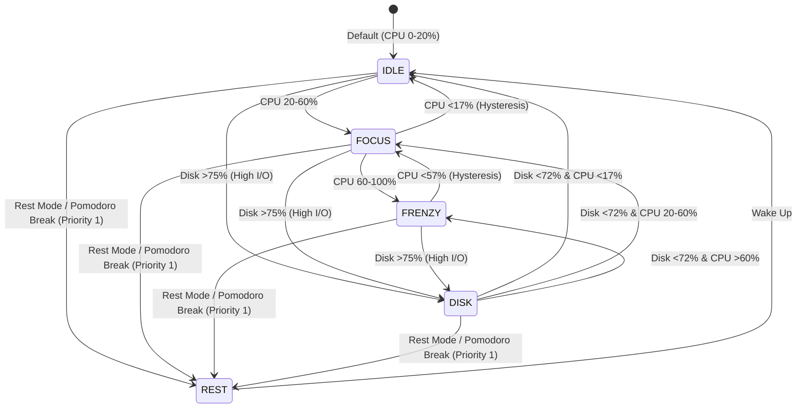

# 🐾 Multi-Character Companion Ecosystem & Standard Specification

> [!TIP]
> 🎨 **Interactive Visual Studio & Character Showcase**:
> สามารถเปิดไฟล์ [character-gallery.html](file:///c:/DevProjects/lofi_bun_companion/non-docs/specs/characters/character-gallery.html) บน Browser เพื่อดู Pixel Art Preview, สลับตัวละคร 6 ตัว, ปรับ State Simulator (IDLE/FOCUS/FRENZY/REST) และก๊อปปี้ Color Palette Tokens ได้ทันที!

---

## 1. 🌌 The Character Roster (จักรวาลเพื่อนร่วมโต๊ะทำงาน)

| ตัวละคร (Companion) | ID | Role / Archetype | Signature Prop | Target Release | Spec File |
| :--- | :--- | :--- | :--- | :--- | :--- |
| **🐰 Lo-fi Bun** | `bun` | **Flagship Companion** (Focus & Tea Lover) | กองแครอท & ชามัทฉะ | `0.1.0` (PoC) | [character-design-bun.md](file:///c:/DevProjects/lofi_bun_companion/non-docs/specs/characters/character-design-bun.md) |
| **🐱 Coffee Neko** | `neko` | Cozy Barista (Slow Life & Espresso) | กองปลาทู & แก้วกาแฟดริป | `1.1.0` (Multiverse) | [character-design-neko.md](file:///c:/DevProjects/lofi_bun_companion/non-docs/specs/characters/character-design-neko.md) |
| **🐶 Bakery Shiba** | `shiba` | Artisan Baker (Energetic & Kneading) | กองครัวซองต์ & ถุงแป้ง | `1.1.0` (Multiverse) | [character-design-shiba.md](file:///c:/DevProjects/lofi_bun_companion/non-docs/specs/characters/character-design-shiba.md) |
| **🍊 Onsen Capybara** | `capybara` | Zen Master (Ultimate Chill & Anti-Stress) | กองส้มยูซุ & อ่างน้ำร้อน | `1.1.0` (Multiverse) | [character-design-capybara.md](file:///c:/DevProjects/lofi_bun_companion/non-docs/specs/characters/character-design-capybara.md) |
| **🦜 DJ Cockatiel** | `cockatiel` | Beat Maker (Lo-fi Rhythm & Whistling) | แผ่นเสียงไวนิล & หูฟัง | `1.1.0` (Multiverse) | [character-design-cockatiel.md](file:///c:/DevProjects/lofi_bun_companion/non-docs/specs/characters/character-design-cockatiel.md) |
| **🐬 Wave Dolphin** | `dolphin` | Flow State Surfer (Deep Focus & Deep Blue) | ปะการัง & ฟองอากาศ | `1.1.0` (Multiverse) | [character-design-dolphin.md](file:///c:/DevProjects/lofi_bun_companion/non-docs/specs/characters/character-design-dolphin.md) |

---

## 2. 📐 Universal 6-State & Action Contract (สัญญา 6 สถานะและเลเยอร์กลาง)

เพื่อให้ระบบ Sprite Engine และ Registry สลับตัวละครได้ทันทีแบบ **Plug & Play Zero-Code Change** ทุกตัวละครจะต้องถูกออกแบบและมี Asset ครบตาม 6 สถานะ/เลเยอร์หลักดังนี้:

### รายละเอียดเกณฑ์มาตรฐานของ 6 สถานะ:
1. **`IDLE` (CPU 0–20%)**: ความเร็ว 800ms / loop (4 Frames) — อารมณ์สบายๆ ผ่อนคลาย จิบเครื่องดื่ม ขยับหายใจ
2. **`FOCUS` (CPU 20–60%)**: ความเร็ว 600ms / loop (4 Frames) — อารมณ์มีสมาธิ ทำงานจังหวะคงที่ Lo-fi Beat
3. **`FRENZY` (CPU 60–100%)**: ความเร็ว 300ms / loop (4 Frames) — สปีดรัวเร็ว มีเอฟเฟกต์ไฟ/เหงื่อ/ควันสู้ชีวิต
4. **`DISK` (Disk >75% I/O)**: ความเร็ว 400ms / loop (4 Frames) — แอ็กชันค้นหา/อ่าน/ขุด/โต้ตอบข้อมูลอย่างรวดเร็ว
5. **`REST` (โหมดพักผ่อน / AFK)**: ความเร็ว 1000ms / loop (4 Frames) — ท่านอน หลับตาพริ้ม สัปหงก หรือพักผ่อน
6. **`HEAVY_RAM` (RAM >80%)**: Sprite Overlay Layer บนหัว/ข้างตัว — กองสิ่งของตามเอกลักษณ์ของแต่ละตัวซ้อนทับ (ไม่ต้องวาดสไปรต์ตัวละครใหม่)

---

## 3. 🎨 Art, Asset & Window Sizing Specifications

* **Base Canvas Grid**: `64 x 64 px` ต่อ 1 Frame
* **Spritesheet Format**: `256 x 64 px` ต่อ 1 ท่าทาง (4 Frames เรียงแนวนอน)
* **Outline**: 1-pixel Dark Outline (แนะนำ `#2E221F` หรือ Dark Tone ประจำตัว)
* **Palette Budget**: จำกัด 16–24 สีต่อตัวละคร เพื่อคุมโทน Cozy Lo-fi Aesthetics
* **Rendering Engine**: ใช้ Pure CSS GPU Accelerated `steps(4)` พร้อม `image-rendering: pixelated;`
* **📐 Window Geometry & Integer Scaling Formula**:
  $$\text{Window Size} = (\text{Base Grid } 64\text{px} \times \text{Scale}) + \text{Padding } (16\text{-}32\text{px})$$
  - **Scale 1x**: ตัวละคร $64\text{px}$ $\rightarrow$ หน้าต่างรวม $80 \times 80\text{px}$
  - **Scale 2x**: ตัวละคร $128\text{px}$ $\rightarrow$ หน้าต่างรวม $160 \times 160\text{px}$
  - **Scale 3x**: ตัวละคร $192\text{px}$ $\rightarrow$ หน้าต่างรวม $224 \times 224\text{px}$
  - **Scale 4x**: ตัวละคร $256\text{px}$ $\rightarrow$ หน้าต่างรวม $288 \times 288\text{px}$

---

## 4. 📁 Directory Map & Architecture Specs

* [character-design-bun.md](file:///c:/DevProjects/lofi_bun_companion/non-docs/specs/characters/character-design-bun.md) — 🐰 Lo-fi Bun (Flagship)
* [character-design-neko.md](file:///c:/DevProjects/lofi_bun_companion/non-docs/specs/characters/character-design-neko.md) — 🐱 Coffee Neko
* [character-design-shiba.md](file:///c:/DevProjects/lofi_bun_companion/non-docs/specs/characters/character-design-shiba.md) — 🐶 Bakery Shiba
* [character-design-capybara.md](file:///c:/DevProjects/lofi_bun_companion/non-docs/specs/characters/character-design-capybara.md) — 🍊 Onsen Capybara
* [character-design-cockatiel.md](file:///c:/DevProjects/lofi_bun_companion/non-docs/specs/characters/character-design-cockatiel.md) — 🦜 DJ Cockatiel
* [character-design-dolphin.md](file:///c:/DevProjects/lofi_bun_companion/non-docs/specs/characters/character-design-dolphin.md) — 🐬 Wave Dolphin
* [menu-navigation-spec.md](file:///c:/DevProjects/lofi_bun_companion/non-docs/specs/menu-navigation-spec.md) — 🧭 Master Menu & Context Menu Architecture Spec
* [cozy-mechanics-spec.md](file:///c:/DevProjects/lofi_bun_companion/non-docs/specs/cozy-mechanics-spec.md) — 🧸 Cozy Mechanics & Mouse Interactions Spec
