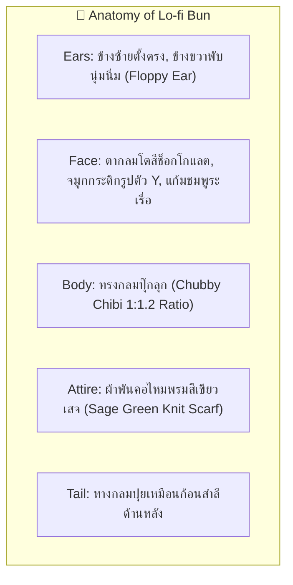
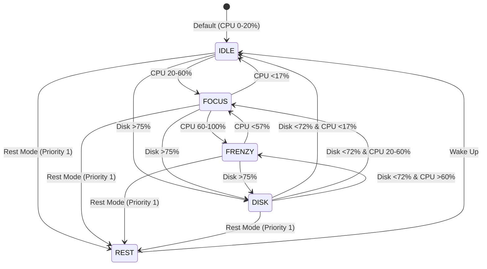

# 🐰 Character Design Specification: Lo-fi Bun (Flagship Companion)

- **Character ID**: `bun`
- **Character Name**: Lo-fi Bun (น้องต่ายบัน)
- **Role**: Flagship Desk Companion & Cozy Focus Partner
- **Art Style**: 16-bit Cozy Pixel Art (Chibi Proportions 1:1.2)
- **Base Grid**: `64x64 px` per frame (Scaled up sharply via `image-rendering: pixelated`)
- **Status**: 🟢 Specification Ready & Target for `0.1.0` PoC

---

## 1. 🌟 Visual Identity & Anatomy (อัตลักษณ์และสรีระ)



### 📏 สัดส่วนและโครงสร้าง Grid (Proportions & Layout)
* **Canvas Size**: `64 x 64 px`
* **Head-to-Body Ratio**: 1:1.2 (หัวโตตัวนุ่มนิ่ม สไตล์ Chibi/Tamagotchi)
* **Outline**: 1-pixel Dark Cocoa Outline (`#2E221F`) เพื่อให้ตัวละครตัดขอบคมชัดบนทุกพื้นหลัง

---

## 2. 🎨 Pixel Art Color Palette Tokens (จานสีจำกัด 16 สี)

| ส่วนประกอบ (Element) | Token Name | สีตัวอย่าง (HEX) | การใช้งาน |
| :--- | :--- | :--- | :--- |
| **ขนหลัก (Fur Base)** | `FUR_BASE` | `#FFF8F0` | สีขนหลัก (Warm Cream Vanilla) |
| **เงาขน (Fur Shadow)** | `FUR_SHADOW` | `#EADBC8` | เงาใต้คาง ใต้หู และขอบล่างลำตัว |
| **ไฮไลต์ (Fur Highlight)** | `FUR_LIGHT` | `#FFFFFF` | ไฮไลต์แสงบนกระหม่อมและแก้ม |
| **แก้ม & ปาก (Cheek/Blush)** | `CHEEK_PINK` | `#FFB5B5` | บลัชออนพวงแก้มและด้านในใบหู |
| **เส้นขอบ (Outline)** | `INK_OUTLINE` | `#2E221F` | เส้นขอบคมชัดสีดาร์กโกโก้ (ไม่ใช้สีดำสนิท) |
| **ตา (Eye Pupil)** | `EYE_DARK` | `#3D2B27` | ลูกตาสีน้ำตาลเข้มเป็นประกาย |
| **ผ้าพันคอ (Scarf Base)** | `SCARF_SAGE` | `#8DA399` | ผ้าพันคอไหมพรมสีเขียวเสจ |
| **เงาผ้าพันคอ (Scarf Shadow)**| `SCARF_SHADOW` | `#6A8076` | เงาและรอยพับของผ้าพันคอ |
| **ถ้วยมัทฉะ (Matcha Cup)** | `TEA_GREEN` | `#A3B899` | ชามเซรามิกใส่มัทฉะอุ่นๆ |
| **คีย์บอร์ด (Keyboard Base)** | `KEYBOARD_BEIGE` | `#E3DAC9` | แป้นพิมพ์ Retro Cream Mechanical Keyboard |
| **ไฟลุก (Frenzy Fire)** | `FIRE_ORANGE` | `#FF7A59` | เปลวไฟปุ๊กปิ๊กตอน CPU >60% |
| **แครอท (Carrot Base)** | `CARROT_ORANGE` | `#FF9A3C` | กองแครอท RAM Overlay (บนหัว) |
| **ใบแครอท (Carrot Leaves)**| `CARROT_LEAF` | `#7FB069` | ก้านใบแครอทเขียวสด |
| **ปกสมุด (Book Cover)** | `BOOK_COVER` | `#8B5A2B` | สมุดบันทึกหนังสีคาราเมลตอน Disk I/O |
| **หน้ากระดาษ (Book Pages)**| `BOOK_PAGES` | `#FFFDF0` | หน้ากระดาษสมุดพลิกรัวๆ |
| **หมอน (Pillow Base)** | `PILLOW_LAVENDER`| `#DDD5E9` | หมอนใบใหญ่นุ่มนิ่มตอน Rest Mode |

---

## 3. 🎬 Frame-by-Frame Storyboard (4 Frames ต่อ State)

แอนิเมชันทุกท่าทางทำงานแบบ **4-Frame Loop (ความเร็ว 300ms–1000ms ต่อรอบ)**:



---

### ☕ State 1: `IDLE` (CPU 0–20%) — *จิบชามัทฉะ & พักผ่อนสบายๆ*
* **ความเร็ว**: 800ms / loop (ช้า นุ่มนวล)
* **เฟรมที่ 1 (Frame 1)**: น้องต่ายนั่งกอดถ้วยมัทฉะสองมือ ควันจิ๋วรูปหัวใจลอยขึ้นจากถ้วย
* **เฟรมที่ 2 (Frame 2)**: หูขวาที่พับขยับดุ๊กดิ๊ก 1 พิกเซล มีการยุบตัวหายใจเข้า (Breathing in)
* **เฟรมที่ 3 (Frame 3)**: ยกถ้วยมัทฉะขึ้นแตะปาก ตาหลับพริ้มแบบมีความสุข
* **เฟรมที่ 4 (Frame 4)**: ลดถ้วยลง แก้มชมพูระเรื่อ ยิ้มหวานพร้อมลุยงานต่อ

---

### ⌨️ State 2: `FOCUS` (CPU 20–60%) — *พิมพ์งานจังหวะคงที่ คีย์บอร์ดเรโทร*
* **ความเร็ว**: 600ms / loop (จังหวะสม่ำเสมอ เป็นจังหวะ Lo-fi Beat)
* **เฟรมที่ 1 (Frame 1)**: เท้าน้อยๆ วางบนโต๊ะ มือน้อยข้างซ้ายกดลงบนแป้นพิมพ์ มีปุ่มเด้งลง 1 พิกเซล
* **เฟรมที่ 2 (Frame 2)**: มือน้อยข้างขวากดลงสลับ หูเอนไปข้างหลังเล็กน้อยด้วยความมุ่งมั่น
* **เฟรมที่ 3 (Frame 3)**: สลับมือกดอีกครั้ง ตากลมโตจ้องหน้าจออย่างตั้งใจ
* **เฟรมที่ 4 (Frame 4)**: หัวขยับพยักหน้าตามจังหวะพิมพ์ (Head-bobbing micro movement)

---

### 🔥 State 3: `FRENZY` (CPU 60–100%) — *พิมพ์ไฟลุกตาตั้ง สู้ชีวิต!*
* **ความเร็ว**: 300ms / loop (เร็ว รัว ไวมาก)
* **เฟรมที่ 1 (Frame 1)**: มือกดคีย์บอร์ดรัวเป็นภาพซ้อน (Afterimage motion blur), เม็ดเหงื่อพุ่งออกข้างแก้ม
* **เฟรมที่ 2 (Frame 2)**: เปลวไฟสีส้มปุ๊กปิ๊ก `FIRE_ORANGE` ลุกวูบขึ้นด้านหลังหัวน้อง
* **เฟรมที่ 3 (Frame 3)**: ตาเบิกกว้าง คิ้วขมวดจริงจังสุดขีด ปากอ้าเล็กน้อยแบบตะโกนสู้ตาย
* **เฟรมที่ 4 (Frame 4)**: เปลวไฟสะบัดอีกฝั่ง ควันลอยออกจากแป้นพิมพ์

---

### 📖 State 4: `DISK` (Disk I/O > 75%) — *เปิดสมุดพลิกหน้าค้นหารัวๆ (Fast Page-Flipping)*
* **ความเร็ว**: 400ms / loop (รวดเร็ว คล่องแคล่ว โฟกัสค้นหาข้อมูล)
* **เฟรมที่ 1 (Frame 1)**: น้องต่ายก้มมองสมุดบันทึกปกคาราเมล สองมือจับมุมกระดาษ ตากลมโตเพ่งอ่าน
* **เฟรมที่ 2 (Frame 2)**: มือน้อยสะบัดพลิกหน้ากระดาษขึ้น เกิดเส้นสปีดสีขาว 1 พิกเซล (Page flip motion)
* **เฟรมที่ 3 (Frame 3)**: หน้ากระดาษตกลงอีกฝั่ง หูขวาที่พับสะบัดตามลมกระดาษ
* **เฟรมที่ 4 (Frame 4)**: สลับมือเตรียมเปิดหน้าถัดไป หัวขยับสแกนบรรทัดใหม่อย่างรวดเร็ว (Loop ต่อเนื่อง)

---

### 🥕 State 5: `HEAVY_RAM` (RAM >80%) — *Carrot Stack Prop Layer (ซ้อนทับบนหัว)*
* **รูปแบบ**: ไม่ใช่การเปลี่ยนท่าสไปรต์ตัวละครหลัก แต่เป็น **Sprite Overlay ซ้อนทับบนหัวน้องต่าย**
* **ตำแหน่ง**: วางซ้อนบนหัวน้องต่ายพอดี ไม่บดบังท่าทางหลัก
* **ลักษณะ**: กองแครอทอ้วนๆ 3 หัวมัดรวมกัน วางซ้อนโยกเยกตามจังหวะหายใจของน้อง
* **แอนิเมชัน**: แครอทโยกเยกซ้าย-ขวา 1 พิกเซล ตามจังหวะ Step ของท่าทางหลัก

---

### 🛏️ State 6: `REST` (โหมดพักผ่อน / Pomodoro Break / AFK) — *กอดหมอนนุ่มนอนหลับปุ๋ย*
* **ความเร็ว**: 1000ms / loop (ช้า เงียบสงบ)
* **เฟรมที่ 1 (Frame 1)**: น้องต่ายนอนตะแคงขดตัว กอดหมอนใบใหญ่สีลาเวนเดอร์ `PILLOW_LAVENDER`
* **เฟรมที่ 2 (Frame 2)**: ท้องพองขึ้นตามจังหวะหายใจเข้า หูตกลู่แนบพื้น
* **เฟรมที่ 3 (Frame 3)**: ฟองอากาศ `z` ปุ๊กปิ๊กลอยออกจากจมูก
* **เฟรมที่ 4 (Frame 4)**: ท้องยุบลงตามจังหวะหายใจออก ฟองกลายเป็น `Z` ลอยสูงขึ้นแล้วแตกโป๊ะ

---

## 4. 🧩 CSS Sprite Mapping Structure

```css
/* Spritesheet Layout: 256x64 px per animation row (4 frames x 64px) */
.bun-idle {
  background: url('/sprites/bun-idle.svg') 0 0 no-repeat;
  width: 64px;
  height: 64px;
  animation: play-idle 0.8s steps(4) infinite;
}

.bun-focus {
  background: url('/sprites/bun-focus.svg') 0 0 no-repeat;
  animation: play-focus 0.6s steps(4) infinite;
}

.bun-frenzy {
  background: url('/sprites/bun-frenzy.svg') 0 0 no-repeat;
  animation: play-frenzy 0.3s steps(4) infinite;
}

.bun-disk {
  background: url('/sprites/bun-disk.svg') 0 0 no-repeat;
  animation: play-disk 0.4s steps(4) infinite;
}

.bun-rest {
  background: url('/sprites/bun-rest.svg') 0 0 no-repeat;
  animation: play-rest 1.0s steps(4) infinite;
}

/* Independent Prop Layer (Carrot Stack on Head) */
.prop-carrot-stack {
  position: absolute;
  top: -8px;
  left: 18px;
  width: 28px;
  height: 20px;
  background: url('/sprites/prop-carrot.svg') 0 0 no-repeat;
  animation: prop-bob 0.8s steps(2) infinite;
}
```
