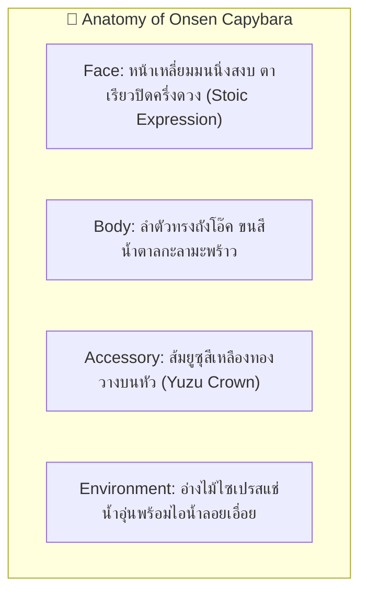
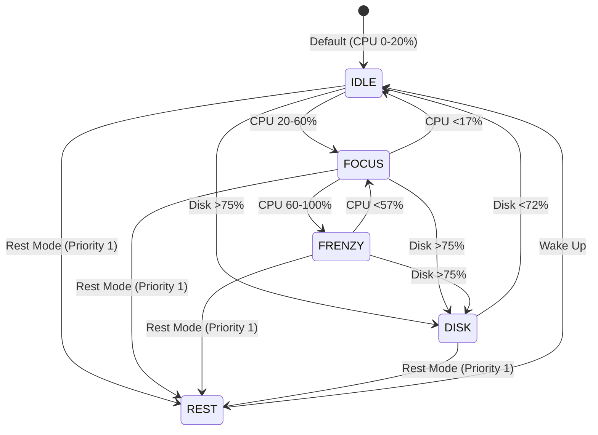

# 🍊 Character Design Specification: Onsen Capybara

- **Character ID**: `capybara`
- **Character Name**: Onsen Capybara (พี่กะปิ ออนเซ็นมาสเตอร์)
- **Role**: Zen Master & Anti-Burnout / Stress Reducer
- **Art Style**: 16-bit Cozy Pixel Art (Chibi Proportions 1:1.2)
- **Base Grid**: `64x64 px` per frame
- **Status**: 🟢 Specification Ready (Implemented Assets for `1.1.0` Bun & Friends Multiverse)

---

## 1. 🌟 Visual Identity & Anatomy (อัตลักษณ์และสรีระ)

---

## 2. 🎨 Pixel Art Color Palette Tokens (16 สี)

| ส่วนประกอบ (Element) | Token Name | สีตัวอย่าง (HEX) | การใช้งาน |
| :--- | :--- | :--- | :--- |
| **ขนลำตัว (Capy Brown)** | `CAPY_BROWN` | `#8C6239` | สีขนน้ำตาลเข้มธรรมชาติ |
| **จมูก/ปาก (Snout Dark)** | `CAPY_SNOUT` | `#543820` | ส่วนปากเหลี่ยมมน |
| **ส้มยูซุ (Yuzu Yellow)** | `YUZU_YELLOW`| `#FFD13B` | ส้มยูซุผลกลมบนหัว |
| **ใบส้ม (Yuzu Leaf)** | `YUZU_LEAF` | `#5B8A3C` | ก้านใบไม้สีเขียว |
| **อ่างไม้ (Wood Tub)** | `WOOD_CYPRESS`| `#D1A774` | ขอบอ่างน้ำไม้ |
| **น้ำออนเซ็น (Hot Spring)**| `SPRING_AQUA`| `#8BD3DD` | ผิวน้ำแร่อุ่นๆ |
| **กิ่งไม้ (Twig Brown)** | `TWIG_BROWN` | `#6F4E37` | กิ่งไม้เคี้ยวเพลินตอน Disk I/O |

---

## 3. 🎬 Frame-by-Frame Storyboard (6-State/Action Contract)

1. **`IDLE` (CPU 0–20%) — 800ms**: นั่งแช่น้ำในอ่างไม้ ส้มยูซุวางนิ่งบนหัว ไอน้ำลอยขึ้นเป็นละอองช้าๆ
2. **`FOCUS` (CPU 20–60%) — 600ms**: กะพริบตาทีละข้างอย่างมีสติ ใบไม้ค่อยๆ ลอยวนตามผิวน้ำ
3. **`FRENZY` (CPU 60–100%) — 300ms**: น้ำในอ่างเริ่มเดือดปุดๆ ส้มยูซุหมุนติ้ว แต่หน้าตายังคงนิ่งสงบแบบ Zen ปลงกับชีวิต
4. **`DISK` (Disk >75%) — 400ms**: ขยับปากเคี้ยวแทะกิ่งไม้อย่างรวดเร็วต่อเนื่อง (Rapid twig munching) ตาหยี่มีความสุข
5. **`HEAVY_RAM` (>80% RAM) — Overlay Prop**: กองส้มยูซุซ้อนกัน 5 ผลข้างอ่าง/บนหัว ลอยละล่องเหนือน้ำ
6. **`REST` (โหมดพักผ่อน) — 1000ms**: ค่อยๆ จมตัวลงไปในน้ำเหลือแต่จมูกกับส้มยูซุ หลับตาพริ้มฟินสุดๆ
