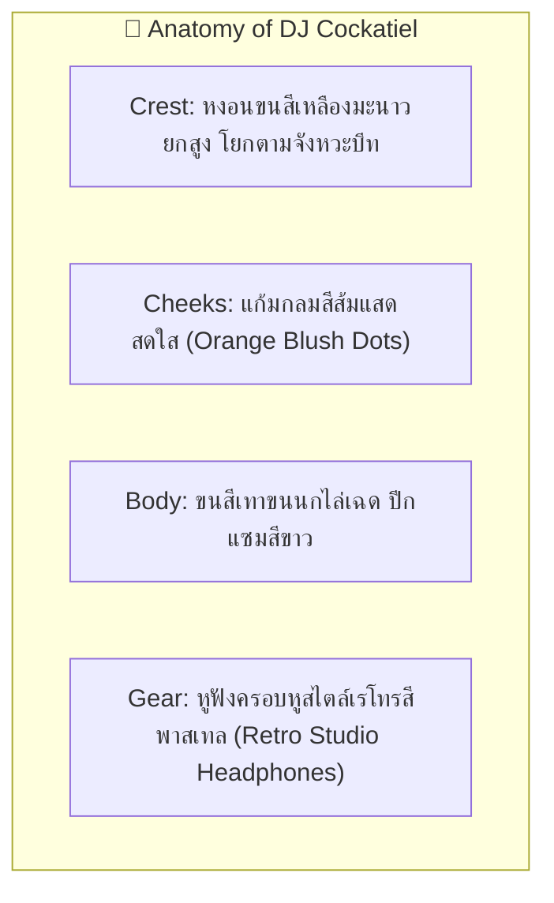
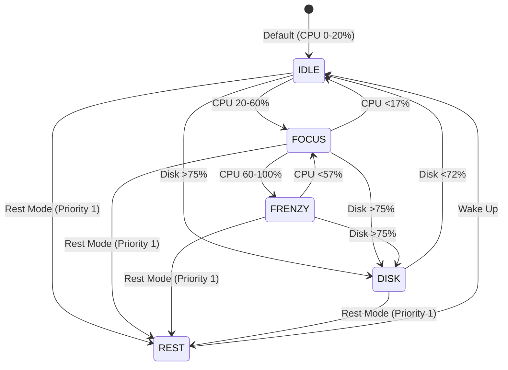

# 🦜 Character Design Specification: DJ Cockatiel

- **Character ID**: `cockatiel`
- **Character Name**: DJ Cockatiel (นกคอกคาเทลดีเจ)
- **Role**: Beat Maker & Lo-fi Rhythm Keeper
- **Art Style**: 16-bit Cozy Pixel Art (Chibi Proportions 1:1.2)
- **Base Grid**: `64x64 px` per frame
- **Status**: 🟢 Specification Ready (Assets implemented for `1.1.0` Bun & Friends Multiverse)

---

## 1. 🌟 Visual Identity & Anatomy (อัตลักษณ์และสรีระ)

---

## 2. 🎨 Pixel Art Color Palette Tokens (16 สี)

| ส่วนประกอบ (Element) | Token Name | สีตัวอย่าง (HEX) | การใช้งาน |
| :--- | :--- | :--- | :--- |
| **ขนสีเทา (Feather Grey)**| `TIEL_GREY` | `#9E9E9E` | ขนลำตัวสีเทาอ่อน |
| **หงอนสีเหลือง (Crest Yellow)**| `TIEL_YELLOW`| `#FFF176` | ขนหงอนและใบหน้า |
| **แก้มส้ม (Cheek Orange)** | `TIEL_ORANGE`| `#FF7043` | จุดกลมแก้มส้มสดใส |
| **หูฟัง (Headphones)** | `GEAR_TEAL` | `#4DB6AC` | เฮดโฟนเรโทรสีเขียวมินต์ |
| **แผ่นเสียง (Vinyl Record)** | `VINYL_BLACK`| `#212121` | แผ่นเสียงไวนิล RAM Overlay (บนหัว/ข้างตัว) |
| **เมล็ดทานตะวัน (Seed Gold)**| `SEED_GOLD` | `#F4D03F` | เมล็ดพืชแทะสะบัดตอน Disk I/O |

---

## 3. 🎬 Frame-by-Frame Storyboard (6-State/Action Contract)

1. **`IDLE` (CPU 0–20%) — 800ms**: ยืนโยกหัวเบาๆ ตามจังหวะ หงอนขนนกพริ้วไหวขึ้นลง
2. **`FOCUS` (CPU 20–60%) — 600ms**: สวมหูฟัง ใช้จะงอยปากและเท้าเคาะแผ่นไวนิล หมุนแผ่นสร้างบีท
3. **`FRENZY` (CPU 60–100%) — 300ms**: โยกหัวอย่างเมามันส์ (Extreme Headbang) แผ่นเสียงหมุนไฟแลบ โน้ตดนตรีลอยฟุ้ง
4. **`DISK` (Disk >75%) — 400ms**: จะงอยปากจิกแทะเมล็ดทานตะวันรัวๆ สะบัดเปลือกเมล็ดฟุ้งกระจาย (Scattering seeds)
5. **`HEAVY_RAM` (>80% RAM) — Overlay Prop**: กองแผ่นเสียงไวนิลซ้อนกัน 4 แผ่นข้างตัว/บนหัว
6. **`REST` (โหมดพักผ่อน) — 1000ms**: ซุกหน้าเก็บจะงอยปากเข้าไปในขนปีก หลับตานิ่งๆ บนคอนไม้
