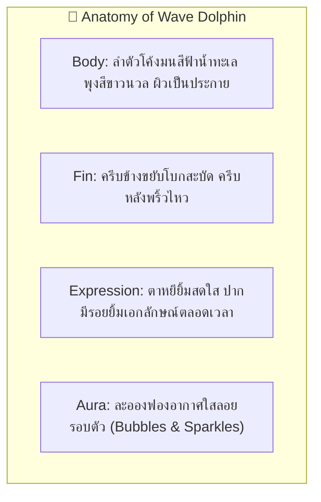

# 🐬 Character Design Specification: Wave Dolphin

- **Character ID**: `dolphin`
- **Character Name**: Wave Dolphin (โลมาโต้คลื่น)
- **Role**: Flow State Surfer & Deep Work Buddy
- **Art Style**: 16-bit Cozy Pixel Art (Chibi Proportions 1:1.2)
- **Base Grid**: `64x64 px` per frame
- **Status**: 🟡 Draft Specification (Target for `1.1.0` Bun & Friends Multiverse)

---

## 1. 🌟 Visual Identity & Anatomy (อัตลักษณ์และสรีระ)

---

## 2. 🎨 Pixel Art Color Palette Tokens (16 สี)

| ส่วนประกอบ (Element) | Token Name | สีตัวอย่าง (HEX) | การใช้งาน |
| :--- | :--- | :--- | :--- |
| **ผิวลำตัว (Ocean Blue)** | `OCEAN_BLUE` | `#4EA8DE` | สีผิวสีฟ้าสดใส |
| **เงาผิว (Deep Navy)** | `OCEAN_DEEP` | `#2D6A4F` | เงาใต้ครีบและลำตัว |
| **พุง (White Belly)** | `BELLY_WHITE`| `#F0F8FF` | ช่วงท้องสีขาวละมุน |
| **ฟองอากาศ (Bubble Aqua)**| `BUBBLE_AQUA`| `#90E0EF` | ฟองน้ำปุ๊กปิ๊กรอบตัว |
| **ปะการัง (Coral Pink)** | `CORAL_PINK` | `#FF8FAB` | กิ่งปะการัง RAM Overlay |

---

## 3. 🎬 Frame-by-Frame Storyboard (5-State Contract)

1. **`IDLE` (CPU 0–20%) — 800ms**: ลอยตัวนิ่งๆ บนผิวน้ำ ครีบขยับพยุงตัว ฟองอากาศรูปหัวใจลอยขึ้นช้าๆ
2. **`FOCUS` (CPU 20–60%) — 600ms**: แหวกว่ายเป็นวงกลมราบรื่น เข้าสู่สภาวะ Flow State คลื่นน้ำพลิ้วไหว
3. **`FRENZY` (CPU 60–100%) — 300ms**: กระโดดหมุนตัว 360 องศาพุ่งเหนือน้ำ ละอองน้ำแตกกระจายด้วยความเร็วสูง
4. **`HEAVY_RAM` (>80% RAM) — Overlay Prop**: กิ่งปะการังและหอยมุกหลากสีวางเรียงรายใต้ท้องน้ำ
5. **`REST` (โหมดพักผ่อน) — 1000ms**: หลับตาพักผ่อน ลอยตัวนิ่งบนห่วงยางเป็ดสีเหลือง ฟองอากาศลอยแตกเบาๆ
