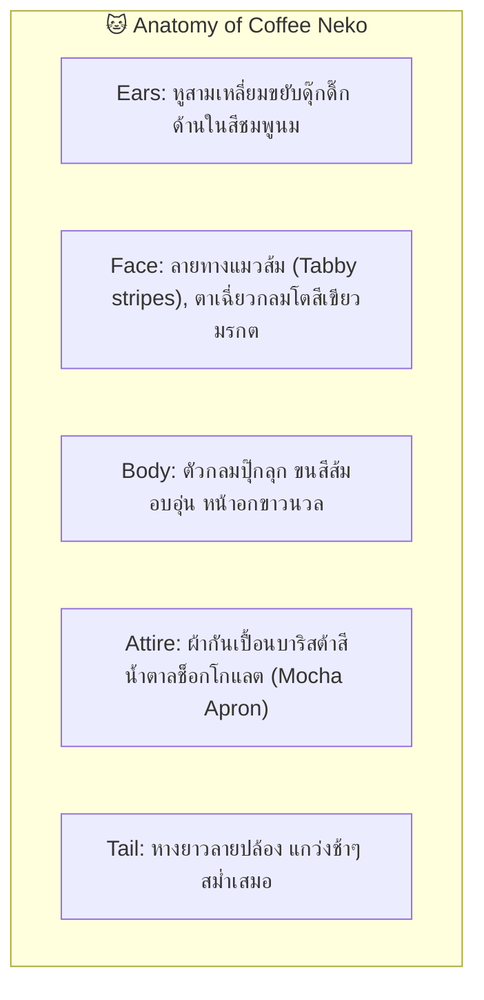
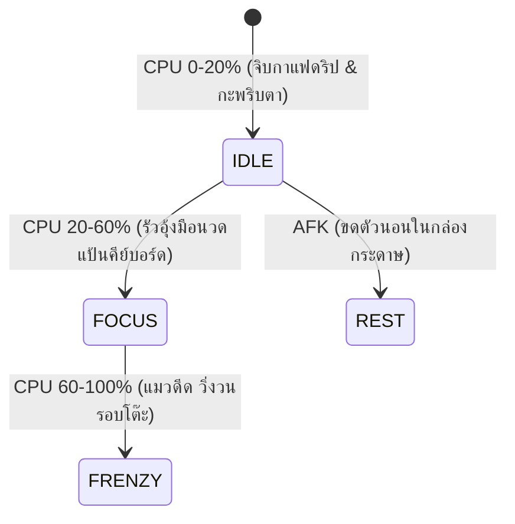

# 🐱 Character Design Specification: Coffee Neko

- **Character ID**: `neko`
- **Character Name**: Coffee Neko (เจ้าเหมียวส้มบาริสต้า)
- **Role**: Cozy Barista & Chill Study Companion
- **Art Style**: 16-bit Cozy Pixel Art (Chibi Proportions 1:1.2)
- **Base Grid**: `64x64 px` per frame
- **Status**: 🟡 Draft Specification (Target for `1.1.0` Bun & Friends Multiverse)

---

## 1. 🌟 Visual Identity & Anatomy (อัตลักษณ์และสรีระ)

---

## 2. 🎨 Pixel Art Color Palette Tokens (16 สี)

| ส่วนประกอบ (Element) | Token Name | สีตัวอย่าง (HEX) | การใช้งาน |
| :--- | :--- | :--- | :--- |
| **ขนหลัก (Orange Fur)** | `NEKO_ORANGE` | `#FF9E4A` | ขนสีส้มประกายทอง (Ginger Tabby) |
| **ลายทาง (Tabby Stripe)** | `NEKO_STRIPE` | `#D96B27` | ลายทางสีส้มอิฐเข้ม |
| **ขนหน้าอก (Chest Fur)** | `NEKO_CREAM` | `#FFF5EB` | ขนสีขาวครีมช่วงอกและปลายอุ้งเท้า |
| **หู/จมูก (Nose/Ear Pink)** | `NOSE_PINK` | `#FFB0B0` | ปลายจมูกและด้านในใบหู |
| **ตา (Emerald Eye)** | `EYE_EMERALD` | `#4E9F3D` | ดวงตาสีเขียวมรกตแวววาว |
| **ผ้ากันเปื้อน (Apron Brown)**| `APRON_MOCHA` | `#5C3D2E` | ผ้ากันเปื้อนผ้าฝ้ายสีมอคค่า |
| **ถ้วยกาแฟ (Coffee Mug)** | `CUP_CERAMIC` | `#E8DFD8` | ถ้วยเซรามิกดริปกาแฟ |
| **กาแฟ (Espresso)** | `COFFEE_DARK` | `#331D12` | น้ำกาแฟหอมกรุ่น |
| **กองปลาทู (Fish Stack)** | `FISH_SILVER` | `#A8B2C1` | กองปลาทู RAM Overlay |

---

## 3. 🎬 Frame-by-Frame Storyboard (5-State Contract)

1. **`IDLE` (CPU 0–20%) — 800ms**: นั่งกอดแก้วกาแฟดริป ควันลอยกรุ่น หางแกว่งซ้ายขวาอย่างผ่อนคลาย
2. **`FOCUS` (CPU 20–60%) — 600ms**: นั่งตัวตรง ใช้สองอุ้งมือนุ่ม (Paw Paws) กดแป้นพิมพ์เป็นจังหวะเพลงแจ๊ส
3. **`FRENZY` (CPU 60–100%) — 300ms**: หูพับแบบ Airplane ears ตากลมโต รัวอุ้งมือด้วยความเร็วสูง มีประกายสายฟ้าและเม็ดเหงื่อ
4. **`HEAVY_RAM` (>80% RAM) — Overlay Prop**: กองปลาทูย่างซ้อนกัน 3 ตัวบนหัว ดุ๊กดิ๊กตามจังหวะเดิน
5. **`REST` (โหมดพักผ่อน) — 1000ms**: ขดตัวกลมดิ๊กในกล่องพัสดุใบโปรด หูพับลง หางพันรอบตัวอย่างอบอุ่น
