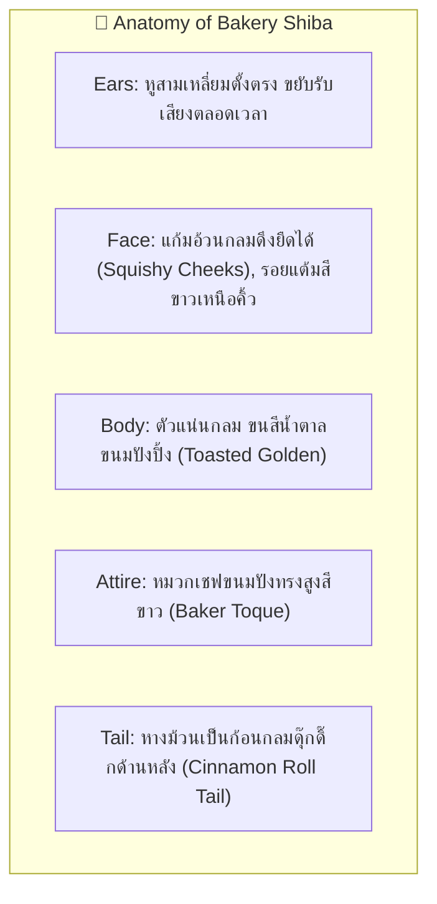
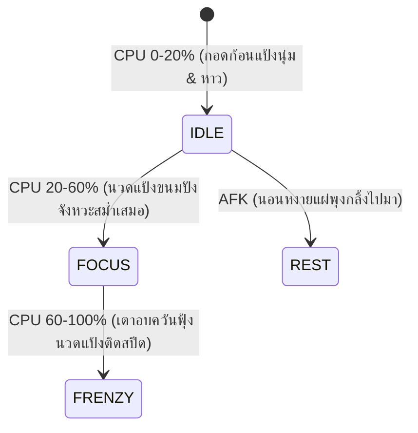

# 🐶 Character Design Specification: Bakery Shiba

- **Character ID**: `shiba`
- **Character Name**: Bakery Shiba (น้องชิบะนักทำขนมปัง)
- **Role**: Energetic Artisan Baker & Morale Booster
- **Art Style**: 16-bit Cozy Pixel Art (Chibi Proportions 1:1.2)
- **Base Grid**: `64x64 px` per frame
- **Status**: 🟡 Draft Specification (Target for `1.1.0` Bun & Friends Multiverse)

---

## 1. 🌟 Visual Identity & Anatomy (อัตลักษณ์และสรีระ)

---

## 2. 🎨 Pixel Art Color Palette Tokens (16 สี)

| ส่วนประกอบ (Element) | Token Name | สีตัวอย่าง (HEX) | การใช้งาน |
| :--- | :--- | :--- | :--- |
| **ขนสีทอง (Toasted Fur)** | `SHIBA_GOLD` | `#E5A953` | ขนสีน้ำตาลทองอบอุ่น |
| **ขนสีครีม (Cheek Cream)**| `SHIBA_CREAM` | `#FFF4E0` | แก้มและคิ้วจุดกลม |
| **หมวกเชฟ (Baker Hat)** | `HAT_WHITE` | `#FFFFFF` | หมวกเชฟสีขาวนวล |
| **เงาหมวก (Hat Shadow)** | `HAT_SHADOW` | `#D8D2C9` | เงารอยพับหมวกเชฟ |
| **แป้งขนมปัง (Dough Base)** | `DOUGH_BEIGE` | `#F5EBE0` | ก้อนแป้งโดนุ่มฟู |
| **ครัวซองต์ (Croissant)** | `CROISSANT_BROWN`| `#C67D34` | กองครัวซองต์ RAM Overlay |

---

## 3. 🎬 Frame-by-Frame Storyboard (5-State Contract)

1. **`IDLE` (CPU 0–20%) — 800ms**: ยืนกอดก้อนแป้งนุ่มๆ หมวกเชฟเอียงเล็กน้อย หางม้วนกลมแกว่งดุ๊กดิ๊ก
2. **`FOCUS` (CPU 20–60%) — 600ms**: นวดและกดแป้งโดว์อย่างตั้งใจ ขยับสองมือขึ้นลงเข้าจังหวะบีท
3. **`FRENZY` (CPU 60–100%) — 300ms**: นวดแป้งจนแป้งฟุ้งเป็นละอองขาว ตาหยีสู้ตาย เตาอบด้านหลังมีควันพุ่งฟุ้ง
4. **`HEAVY_RAM` (>80% RAM) — Overlay Prop**: คอนโดครัวซองต์เนยสด 4 ชิ้นซ้อนกันสูงโยกเยก
5. **`REST` (โหมดพักผ่อน) — 1000ms**: นอนแผ่สองสลึงพุงกาง หมวกเชฟหลุดมาปิดตา หายใจท้องกระเพื่อมน่ารัก
