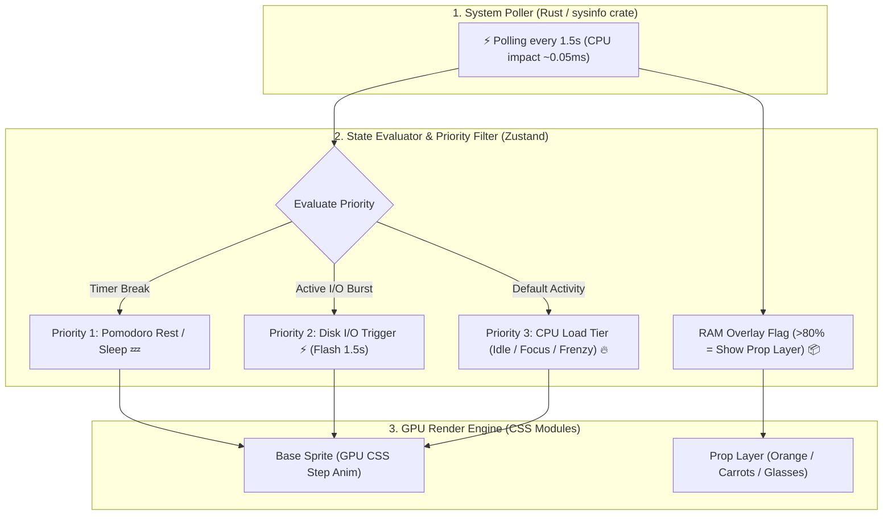
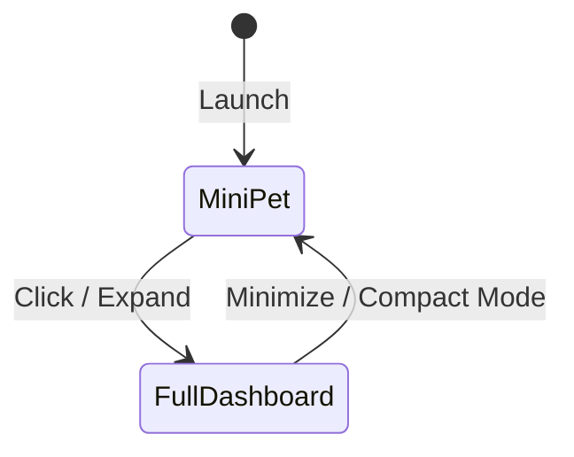

# 📊 Specification: Hardware-Reactive Companion & Floating Widget

## 1. 📌 Overview & Concept
The **Lo-fi Bun Companion** acts as a live desktop companion that mirrors the computer's workload in real-time (RunCat / Bongo Cat inspired) with cozy lo-fi vibes.

---

## 2. 🐾 6 Companions Hardware Metric & State Matrix

| Companion | 🍵 Idle (0-20% CPU) | 💻 Focus (20-60% CPU) | 🔥 Frenzy (60-100% CPU) | 📦 Heavy RAM (>80%) | ⚡ Disk Active | 💤 Rest / Break |
| :--- | :--- | :--- | :--- | :--- | :--- | :--- |
| 🐰 **Lo-fi Bun** | Tea sipping, ear twitch | Normal keyboard typing | Flaming keys, straight ears, sweat drops | Carrying tall stack of carrots/books | Fast page flipping | Hugging pillow, sleep bubble |
| 🐱 **Neko** | Cat loaf, tail swish | Soft alternating paw taps | Dual-paw typing frenzy, puffed fur | Tangled in yarn / huge fish bowl | Scratching box rapidly | Belly-up paw licking |
| 🐶 **Shiba** | Squinting smile, tail wag | Wearing glasses, typing | Running on treadmill, tongue out, sparks | Giant bone/ball stack wobble | Digging carpet vigorously | Back legs sploot nap |
| 🍊 **Capybara** | Onsen soak, single Yuzu on head | Single-finger calm typing | Wobbly Yuzu, wide eyes, zen fast typing | 10-orange pyramid head balance | Continuous twig munching | Onsen steam slumber |
| 🦜 **Cockatiel** | Perching, rhythmic head bob | Beak key tapping | Headbanging metalhead wing flapping | Seed-stuffed giant cheeks | Scattering seed husks | Head tucked under wing |
| 🐬 **Dolphin** | Gentle water float, small spout | Flippers on waterproof keys | Spin flips, rainbow high spout, splashing | Balancing pearls/beach balls on beak | Emitting sonar ring waves | Lifebuoy float, heart bubbles |

---

## 3. 🎯 State Machine Priority & Layering Rules

To ensure predictable behavior and avoid unnecessary re-renders, the state machine evaluates actions using a strict priority chain:

1. **Priority 1: Pomodoro Rest / Break Mode (`RESTING`)**
   - When focus timer completes, animal immediately enters sleep/relaxation state, overriding hardware metrics.
2. **Priority 2: Disk I/O Burst (`DISK_ACTIVE`)**
   - High disk read/write triggers a quick 1.5-second animation burst (e.g. flipping pages, sonar ping), then smoothly reverts back to baseline CPU tier.
3. **Priority 3: CPU Workload Tier (`IDLE` / `FOCUS` / `FRENZY`)**
   - Base body animation speed and pose are driven by CPU usage buckets with hysteresis (preventing erratic state switching when CPU fluctuates around thresholds).
4. **Independent Prop Layer: Memory Load (`HEAVY_RAM`)**
   - High RAM usage (>80%) activates an overlay prop (stack of carrots, oranges, or beach balls) without requiring full body re-drawing.

---

## 4. 🖥️ Display Modes

### 1. Mini Floating Pet Mode (Always-on-Top)
- **Size**: ~100x60px or ~80x80px (Adjustable scaling: 1x, 2x, 3x crisp pixel integer scale)
- **Window**: Transparent background, frameless, draggable anywhere on screen, Always-on-Top
- **Mouse Interactions**:
  - **Right Click**: Opens **Quick Context Menu** (Switch companions, toggle Pomodoro, mute audio, eco mode, exit)
  - **Single Left Click**: Quick Head Pat / Petting reaction (`FloatingHearts` + soft purr)
  - **Double Click**: Opens / Minimizes Full Dashboard
  - **Click & Drag**: Moves floating pet (dangling animation + edge snapping)
  - **Hover**: Shows cozy tooltip with live `CPU: X% | RAM: Y%` stats

### 2. Full Dashboard Mode
- **Pomodoro & Focus Timer Suite** (Toggleable / Optional module):
  - **Classic Pomodoro**: 25m Focus / 5m Short Break / 15m Long Break (Fully customizable)
  - **Custom Countdown**: Quick countdown timer for tasks/breaks (e.g. 10m, 45m)
  - **Focus Flow Stopwatch**: Open-ended stopwatch tracker for deep work
  - **Hydration & Eye Strain Reminder**: Optional 20-30m micro-break alert (20-20-20 rule)
- **Companion Switcher**: Switch between 6 animals (Bun, Neko, Shiba, Capybara, Cockatiel, Dolphin)
- **Optional Sound & Notification Settings**: Toggle subtle timer end chimes, mute all audio by default

---

## 5. 🔒 Permissions, Security & Distribution Architecture
- **Hardware Access**: Reads global CPU/RAM/Disk metrics via standard OS APIs (Rust `sysinfo`) and Browser System APIs (`chrome.system.cpu`, `chrome.system.memory`). **Zero Administrator / UAC prompts required**.
- **100% Offline & Private**: All metrics processed locally on-device. Zero telemetry, zero external data transmissions.
- **Desktop Notifications**: Standard OS / Web notification permission requested only if user enables timer completion popups.
- **Distribution Packages & Ecosystem Channels**:
  1. **Windows**:
     - *Portable Executable (`.exe`)*: Single-file (~10MB), zero installation, zero registry modifications.
     - *Standard Installer (`.msi` / NSIS)*: Start Menu, Desktop Shortcut, Optional Auto-start with Windows.
  2. **macOS**:
     - *`.dmg` (Drag-to-Applications)*: Universal binary (Apple Silicon M-series & Intel) + Menu Bar Companion.
  3. **Linux**:
     - *`.AppImage` & `.deb`*: Self-contained single executable running on all major Linux distributions.
  4. **Browser Extensions (Manifest V3)**:
     - *Chrome Web Store, Firefox Add-ons, Edge Add-ons*: Side Panel Companion, New Tab Desk, and Tab-Overload reactivity.
  5. **Web PWA / Browser Demo**: Instant evaluation via browser with mock hardware sliders.

---

## 6. ⚡ Performance & Zero-Overhead Constraints (ไม่หนักเครื่อง เน้นเบาและลื่น)
- **Polling Interval**: `1500ms` (1.5 seconds) with Rust `sysinfo` to avoid CPU wake-ups (<0.05ms execution time).
- **Battery Saver / Eco Mode**: Auto-drops animation to `10-12 FPS` retro style and increases polling to `3000ms` when on battery.
- **Hysteresis Filtering**: Threshold buffers (±3%) applied to metric inputs to prevent rapid state flutter.
- **Animation Engine**: Pure CSS `steps()` or transform transitions executing on the GPU compositor thread (Zero CPU render loop).
- **RAM Target**: `< 30-35MB` on idle.
- **Audio Engine**: Zero memory footprint when muted; Howler/Web Audio instances loaded lazily on demand.
- **Timer Engine**: Lightweight Web Worker / background interval with zero drift.

