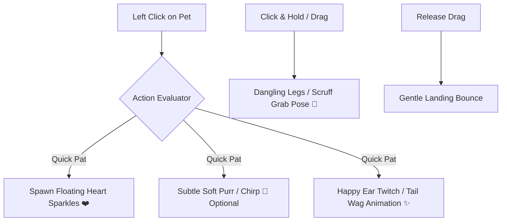
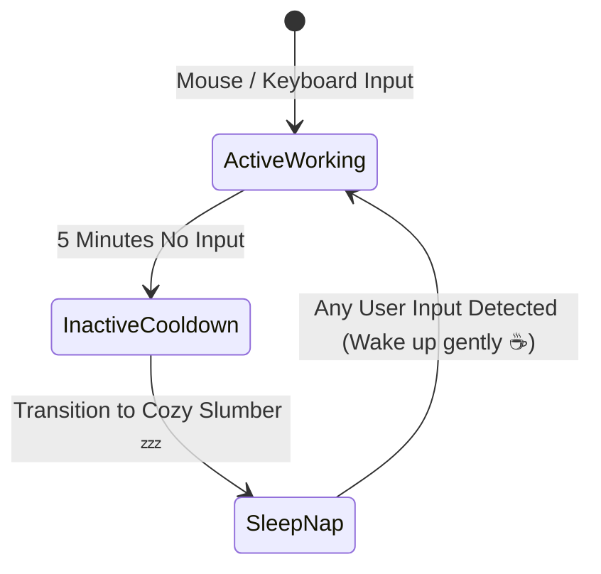

# 🧸 Specification: Cozy Mechanics & Emotional Companionship

## 1. 📌 Philosophy & Emotional Intent (สัตว์เลี้ยงแก้เหงา)
**Lo-fi Bun Companion** ไม่ใช่เพียงแอปพลิเคชันมอนิเตอร์ฮาร์ดแวร์ทั่วไป แต่ถูกสร้างขึ้นเพื่อเป็น **"เพื่อนร่วมโต๊ะทำงานที่อบอุ่นและมีชีวิต"**:
- ไม่ส่งเสียงหรือเคลื่อนไหวกระตุกรบกวนสมาธิ (Distraction-Free Comfort)
- ให้ความรู้สึกว่ามีสิ่งมีชีวิตตัวเล็กๆ คอยอยู่เคียงข้างและสู้ไปด้วยกันในทุกโปรเจกต์
- ตอบสนองต่อการสัมผัส (Tactile & Rewarding Feedback)

---

## 2. 🐾 Tactile Micro-Interactions (การตอบสนองเมื่อมีปฏิสัมพันธ์)

### 1. Head Patting & Rubbing
- **Trigger**: คลิกซ้ายที่ตัวสัตว์เลี้ยง
- **Visual Feedback**: แอนิเมชันหัวใจสีชมพูพาสเทลลอยขึ้น (`FloatingHearts`) พร้อมสัตว์เลี้ยงกระดิกหู/ยิ้มตาหยี
- **Audio Feedback**: เสียง Purr นุ่มๆ เบาๆ (เฉพาะเมื่อผู้ใช้เปิดเสียง)
- **Counter**: เก็บสถิติ "Pats Today" สั้นๆ เพื่อความเพลิดเพลิน

### 2. Dragging & Physics
- เมื่อคลิกค้างแล้วลากน้อง: ตัวละครจะเปลี่ยนเป็นท่าห้อยขากลางอากาศ (Dangling pose)
- เมื่อปล่อยเมาส์: มีแรงกระเด้งนุ่มนวล (Soft landing bounce) พร้อม Snap ติดขอบจออย่างเป็นระเบียบ

---

## 3. 💤 Inactivity & Ambient Life State (ระบบตรวจจับความเงียบ)

- **5-Minute AFK Rule**: หากไม่มีการใช้งานเมาส์หรือคีย์บอร์ดเกิน 5 นาที (แม้ CPU จะมีโปรแกรมอื่นรันอยู่):
  - สัตว์เลี้ยงจะค่อยๆ หาวและเข้าสู่ **"ท่านอนสัปหงก / หลับปุ๋ย"** (Cozy Nap) พร้อมฟองสบู่ความฝัน
  - ช่วยสร้างบรรยากาศสงบ และเตือนให้ผู้ใช้รู้ว่ากำลังพักสายตาอยู่
- **Gentle Wakeup**: เมื่อผู้ใช้กลับมาแตะเมาส์ น้องจะค่อยๆ ตื่น บิดขี้เกียจ และหยิบถ้วยชา/คีย์บอร์ดมานั่งทำงานต่อ

---

## 4. 🍵 Future Cozy Extensions (Gen 2 & Gen 3 Spec Preview)

### 1. Idle Focus Foraging (Gen 2.2)
- ในระหว่างการจับเวลา Pomodoro 25 นาที น้องจะออกไปเก็บวัตถุดิบลึกลับ (เช่น ยอดใบชาอู่หลง, เมล็ดกาแฟดอยช้าง, ผลส้มยูซุ)
- เมื่อทำงานครบเวลา จะมีข้อความกวนๆ แต่น่ารักปรากฏ: *"น้องเก็บใบชาชั้นดีมาให้คุณชงดื่มพักสายตาแล้วนะ!"*

### 2. Silent Co-Working "Study Cafe" (Gen 3.0)
- เชื่อมต่อห้อง Study Cafe ด้วย Room Code สั้นๆ ผ่าน WebRTC P2P (Zero server cost, zero lag)
- ผู้ใช้จะเห็นสัตว์เลี้ยงของเพื่อน (เช่น Neko ของเพื่อน A, Shiba ของเพื่อน B) มานั่งทำงานเรียงกันบนบาร์คาเฟ่
- กดส่งถ้วยชาหรือปรบมือให้กำลังใจกันได้แบบเงียบสงบ
