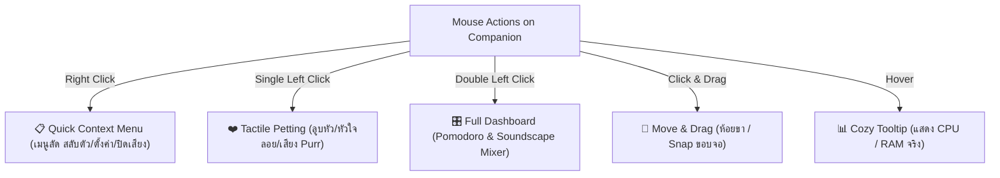
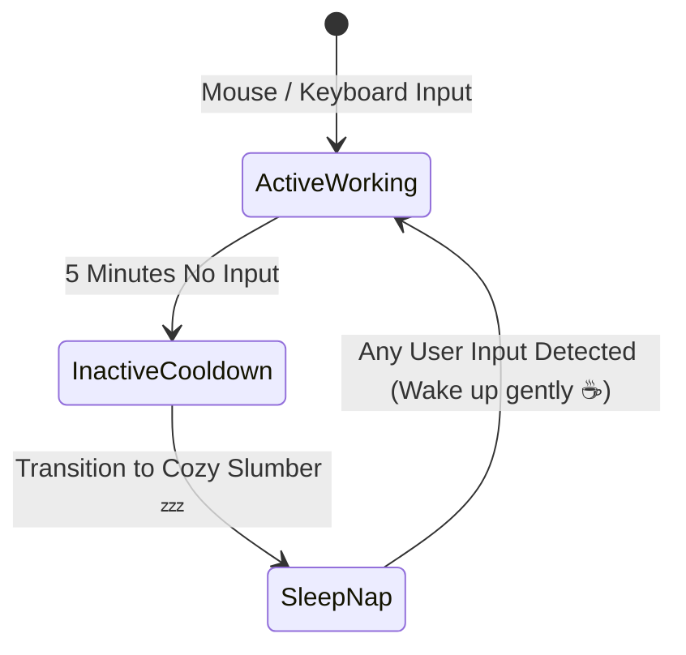

# 🧸 Specification: Cozy Mechanics & Emotional Companionship

## 1. 📌 Philosophy & Emotional Intent (สัตว์เลี้ยงแก้เหงา)
**Lo-fi Bun Companion** ไม่ใช่เพียงแอปพลิเคชันมอนิเตอร์ฮาร์ดแวร์ทั่วไป แต่ถูกสร้างขึ้นเพื่อเป็น **"เพื่อนร่วมโต๊ะทำงานที่อบอุ่นและมีชีวิต"**:
- ไม่ส่งเสียงหรือเคลื่อนไหวกระตุกรบกวนสมาธิ (Distraction-Free Comfort)
- ให้ความรู้สึกว่ามีสิ่งมีชีวิตตัวเล็กๆ คอยอยู่เคียงข้างและสู้ไปด้วยกันในทุกโปรเจกต์
- ตอบสนองต่อการสัมผัส (Tactile & Rewarding Feedback)

---

## 2. 🖱️ Comprehensive Mouse & Desktop Interaction Map (ระบบสั่งการผ่านเมาส์)

เพื่อให้การใช้งานลื่นไหลและไม่รบกวนสมาธิ การสั่งการทั้งหมดจะถูกควบคุมผ่านท่าทางเมาส์ที่ชัดเจน:



### 📋 ตารางข้อกำหนดพฤติกรรมของเมาส์ (Interaction Matrix)

| ท่าทางเมาส์ (Mouse Gesture) | พฤติกรรมที่ตอบสนอง (Interaction Behavior) | รายละเอียดทางเทคนิค & Feedback |
| :--- | :--- | :--- |
| **คลิกขวา (Right Click)** | **เปิด Quick Context Menu** | เปิดเมนูสั่งการด่วนแบบ Native/Custom Frameless Menu ไม่บังหน้าจอ |
| **คลิกซ้าย 1 ครั้ง (Single Click)** | **ลูบหัวน้อง (Head Pat / Petting)** | สัตว์เลี้ยงยิ้มตาหยี + แอนิเมชันหัวใจพาสเทลลอย `FloatingHearts` + เสียง Purr เบาๆ |
| **ดับเบิลคลิก (Double Click)** | **เปิด/ย่อ Full Dashboard** | ขยายหน้าต่างสู่โหมด Pomodoro Focus Suite & Sound Mixer หรือย่อกลับ |
| **คลิกซ้ายค้างแล้วลาก (Drag)** | **ย้ายตำแหน่งสัตว์เลี้ยง** | น้องเปลี่ยนเป็นท่าห้อยขากลางอากาศ (Dangling pose) และ Snap ขอบจอเมื่อปล่อย |
| **เมาส์ชี้ค้าง (Hover)** | **แสดง Cozy Tooltip** | Tooltip สไตล์ Lo-fi โชว์ข้อมูลสถานะ เช่น `CPU: 18% | RAM: 42% (Focus Mode)` |

---

### 🎛️ โครงสร้างเมนูคลิกขวา (Right-Click Context Menu Structure)

```text
┌────────────────────────────────────────────────────────┐
│  🐰 Lo-fi Bun Companion                          v0.1.0 │
├────────────────────────────────────────────────────────┤
│  🎛️  Open Full Focus Dashboard           (Double Click)│
│  🐾  Switch Companion                      ▶ Submenu   │ ──▶ [ • 🐰 Lo-fi Bun (Active) ]
│  ⏱️  Quick Pomodoro (25m Focus)                         │     [   🐱 Coffee Neko       ]
│  🔇  Mute / Unmute Ambient Sounds                       │     [   🐶 Bakery Shiba      ]
│  🌱  Eco Mode (Battery Saver 12 FPS)                    │     [   🍊 Onsen Capybara    ]
│  📌  Always on Top                       [✔ Enabled]   │     [   🦜 DJ Cockatiel      ]
├────────────────────────────────────────────────────────┤     [   🐬 Wave Dolphin      ]
│  ⚙️  Preferences & Hotkeys...                           │
│  ❌  Quit Companion                                     │
└────────────────────────────────────────────────────────┘
```

## 3. 💤 Inactivity & Ambient Life State (ระบบตรวจจับความเงียบ)



- **5-Minute AFK Rule**: หากไม่มีการใช้งานเมาส์หรือคีย์บอร์ดเกิน 5 นาที (แม้ CPU จะมีโปรแกรมอื่นรันอยู่):
  - สัตว์เลี้ยงจะค่อยๆ หาวและเข้าสู่ **"ท่านอนสัปหงก / หลับปุ๋ย"** (Cozy Nap) พร้อมฟองสบู่ความฝัน
  - ช่วยสร้างบรรยากาศสงบ และเตือนให้ผู้ใช้รู้ว่ากำลังพักสายตาอยู่
- **Gentle Wakeup**: เมื่อผู้ใช้กลับมาแตะเมาส์ น้องจะค่อยๆ ตื่น บิดขี้เกียจ และหยิบถ้วยชา/คีย์บอร์ดมานั่งทำงานต่อ

---

## 4. 🍵 Future Cozy Extensions (Gen 2 & Gen 3 Spec Preview)

### 1. Idle Focus Foraging (Gen 2.2)
- ในระหว่างการจับเวลา Pomodoro 25 นาที น้องจะออกไปเก็บวัตถุดิบลึกลับ (เช่น ยอดใบชาอู่หลง, เมล็ดกาแฟดอยช้าง, ผลส้มยูซุ)
- เมื่อทำงานครบเวลา จะมีข้อความกวนๆ แต่น่ารักปรากฏ: *"น้องเก็บใบชาชั้นดีมาให้คุณชงดื่มพักสายตาแล้วนะ!"*

### 2. Silent Co-Working "Study Cafe" (Gen 3.0)
- เชื่อมต่อห้อง Study Cafe ด้วย Room Code สั้นๆ ผ่าน WebRTC P2P (Zero server cost, zero lag)
- ผู้ใช้จะเห็นสัตว์เลี้ยงของเพื่อน (เช่น Neko ของเพื่อน A, Shiba ของเพื่อน B) มานั่งทำงานเรียงกันบนบาร์คาเฟ่
- กดส่งถ้วยชาหรือปรบมือให้กำลังใจกันได้แบบเงียบสงบ
