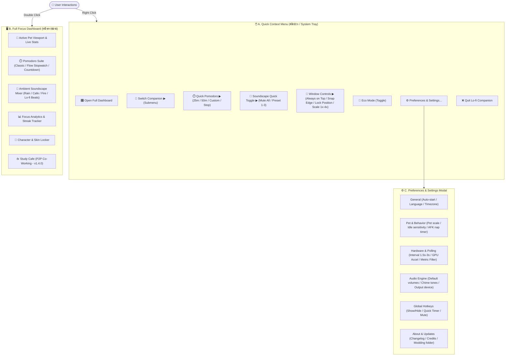

# 🧭 Specification: Master Menu & Navigation Architecture (Release Matrix)

เอกสารระบุโครงสร้างเมนู หน้าต่างการตั้งค่า (Preferences) และเมนูลัดคลิกขวา (Context Menu) ทั้งหมดของ **Lo-fi Bun Companion** พร้อมตารางเปรียบเทียบการปล่อยฟีเจอร์ในแต่ละ Version (`0.1.0` ➜ `1.x.x`)

---

## 1. 🗂️ Master Menu Topology (แผนผังเมนูรวมทั้งระบบ)



---

## 2. 🖱️ Detailed Context Menu Specification (เมนูคลิกขวา)

เมนูคลิกขวาถูกออกแบบให้อ่านง่าย รวดเร็ว และมี Submenu แยกย่อยสำหรับคำสั่งที่ใช้บ่อย:

```text
┌─────────────────────────────────────────────────────────────┐
│  🐰 Lo-fi Bun Companion                               v0.1.0│
├─────────────────────────────────────────────────────────────┤
│  🎛️  Open Full Focus Dashboard             (Double Click)  │
│  🐾  Switch Companion                     ▶ Submenu         │
│  ⏱️  Focus Timer                          ▶ Submenu         │
│  🎵  Ambient Soundscape                   ▶ Submenu         │
│  📌  Window Behavior                      ▶ Submenu         │
│  🌱  Eco Mode (Battery Saver 12 FPS)       [ ✔ Enabled ]    │
├─────────────────────────────────────────────────────────────┤
│  ⚙️  Preferences & Hotkeys...              (Ctrl + ,)       │
│  🔄  Check for Updates...                                   │
│  ❌  Quit Lo-fi Companion                  (Ctrl + Q)       │
└─────────────────────────────────────────────────────────────┘
```

### 📂 รายละเอียด Submenus ของเมนูคลิกขวา:

#### 1. 🐾 `Switch Companion ▶`
* `[•] 🐰 Lo-fi Bun (Flagship)` *(Active)*
* `[ ] 🐱 Coffee Neko`
* `[ ] 🐶 Bakery Shiba`
* `[ ] 🍊 Onsen Capybara`
* `[ ] 🦜 DJ Cockatiel`
* `[ ] 🐬 Wave Dolphin`
* `───────────────────────────`
* `📁 Open Custom Skins Folder...` *(v1.1.0)*

#### 2. ⏱️ `Focus Timer ▶`
* `▶ Start 25m Focus (Pomodoro)`
* `▶ Start 50m Deep Work`
* `▶ Start 5m Short Break`
* `▶ Start 15m Long Break`
* `⏹ Stop / Reset Timer`
* `───────────────────────────`
* `💧 Hydration Reminder (Every 30m) [✔ On]`

#### 3. 🎵 `Ambient Soundscape ▶`
* `🔇 Mute All Sounds` *(Toggle)*
* `🌧️ Preset 1: Rainy Window Cafe`
* `🔥 Preset 2: Campfire & Stars`
* `📚 Preset 3: Library Lo-fi Beats`
* `───────────────────────────`
* `🔊 Master Volume: [ 50% ]`

#### 4. 📌 `Window Behavior ▶`
* `[✔] Always on Top`
* `[✔] Snap to Screen Edges`
* `[ ] Lock Position (Disable Drag)`
* `🔍 Scale Size ▶ [ 1x (64px) | 2x (128px) | • 3x (192px) | 4x (256px) ]`
* `👻 Window Opacity ▶ [ 100% | • 90% | 75% | 50% ]`

---

## 3. ⚙️ Preferences & Settings Modal (หน้าต่างตั้งค่าระบบ)

เมื่อผู้ใช้กด `⚙️ Preferences...` หรือคีย์ลัด `Ctrl + ,` จะเปิดหน้าต่างตั้งค่าแบบ Tabbed Modal:

| แท็บตั้งค่า (Settings Tab) | รายการตัวเลือก (Configuration Options) | คำอธิบาย & ค่าเริ่มต้น (Default) |
| :--- | :--- | :--- |
| **🏠 General** | • Start on System Boot (เปิดพร้อมเปิดคอม)<br>• Minimize to System Tray (ย่อลง Tray)<br>• Language (ไทย / English)<br>• Theme Tint (Auto / Day / Sunset / Night) | ค่าเริ่มต้น: Enabled, Tray Enabled, Auto Theme |
| **🐰 Pet Behavior** | • Default Companion (เลือกตัวละครเริ่มต้น)<br>• AFK Sleep Sensitivity (3m / 5m / 10m)<br>• Petting Heart FX (เปิด/ปิดเอฟเฟกต์หัวใจ)<br>• Speech Bubble Frequency (Off / 15m / 30m) | ค่าเริ่มต้น: Bun, 5 นาที, Enabled, 15m |
| **⚡ Hardware & Metrics** | • Polling Interval (`1.5s` Standard / `3.0s` Eco)<br>• CPU Hysteresis Threshold ($\pm 3\%$ Buffer)<br>• RAM Heavy Threshold (80% Trigger Prop)<br>• GPU Hardware Acceleration (On/Off) | ค่าเริ่มต้น: 1.5s, ±3%, 80%, On |
| **🎵 Sound & Audio** | • Master Volume (0-100%)<br>• Timer End Chime (เลือกเสียงกระดิ่ง/ชามธิเบต/เสียงนกร้อง)<br>• Background Audio Playback (เล่นต่อเนื่องแม้โฟกัสหน้าต่างอื่น) | ค่าเริ่มต้น: Master 50%, Zen Chime, Enabled |
| **⌨️ Global Hotkeys** | • Toggle Show/Hide Pet (`Ctrl + Shift + B`)<br>• Start/Pause Pomodoro (`Ctrl + Shift + P`)<br>• Mute All Audio (`Ctrl + Shift + M`)<br>• Open Dashboard (`Ctrl + Shift + D`) | สามารถกด Rebind ปุ่มคีย์ลัดได้ตามต้องการ |
| **ℹ️ About & System** | • Current Version (`vX.Y.Z`)<br>• View Changelog & Release Notes<br>• Open Data / Logs Directory<br>• Link to GitHub & Community Discord | ข้อมูลโปรเจกต์และเครดิต |

---

## 4. 📅 Release Phasing Matrix (แผนการปล่อยเมนูในแต่ละ Version)

ตารางแสดงความพร้อมของแต่ละเมนูตาม **Lean SemVer Roadmap**:

| ฟังก์ชัน / เมนู | `0.1.0` (Core) | `0.2.0` (Telemetry) | `1.0.0` (Desktop Mascot) | `1.1.0` (Friends) | `2.0.0` (Productivity) | `3.0.0` (Soundscape) |
| :--- | :---: | :---: | :---: | :---: | :---: | :---: |
| **Pixel Art CSS Sprite Renderer** | 🟢 มี | 🟢 มี | 🟢 มี | 🟢 มี | 🟢 มี | 🟢 มี |
| **Interactive Mock Sliders (Lab)** | 🟢 มี | 🟢 มี | 🟢 มี | 🟢 มี | 🟢 มี | 🟢 มี |
| **Windows Hardware Polling** | ⚪ | 🟢 มี | 🟢 มี | 🟢 มี | 🟢 มี | 🟢 มี |
| **Desktop Transparent Floating Window** | ⚪ | ⚪ | 🟢 มี (.exe) | 🟢 มี | 🟢 มี | 🟢 มี |
| **Window Controls (Always on Top, Scale, Drag)** | ⚪ | ⚪ | 🟢 มี | 🟢 มี | 🟢 มี | 🟢 มี |
| **Right-Click Context Menu (Base & Stats)** | ⚪ | ⚪ | 🟢 มี | 🟢 มี | 🟢 มี | 🟢 มี |
| **6 Companions Roster Switcher** | 🟡 (Registry) | 🟡 (Registry) | 🟡 (Registry) | 🟢 มี (Full 6 Pets) | 🟢 มี | 🟢 มี |
| **Tactile Petting & Heart Animations** | ⚪ | ⚪ | ⚪ | 🟢 มี | 🟢 มี | 🟢 มี |
| **Pomodoro Focus Suite (25/5m & Auto-Rest)** | ⚪ | ⚪ | ⚪ | ⚪ | 🟢 มี | 🟢 มี |
| **Focus Streak Tracker & Reminders** | ⚪ | ⚪ | ⚪ | ⚪ | 🟢 มี | 🟢 มี |
| **Soundscape Mixer (Rain/Cafe/Lo-fi Beats)** | ⚪ | ⚪ | ⚪ | ⚪ | ⚪ | 🟢 มี |
| **Multi-Channel Audio Volume Controls** | ⚪ | ⚪ | ⚪ | ⚪ | ⚪ | 🟢 มี |
| **Preferences Modal & Custom Hotkeys** | ⚪ | ⚪ | ⚪ | ⚪ | 🟢 มี | 🟢 มี |

---

## 5. 🧩 Technical Data Schema for Menu State

```typescript
// types/menu.ts - Schema Definition for Context Menu & Preferences
export interface ContextMenuItem {
  id: string;
  label: string;
  icon?: string;
  shortcut?: string;
  checked?: boolean;
  disabled?: boolean;
  action?: () => void;
  submenu?: ContextMenuItem[];
}

export interface UserPreferences {
  general: {
    startOnBoot: boolean;
    minimizeToTray: boolean;
    language: 'th' | 'en';
    themeMode: 'auto' | 'day' | 'sunset' | 'night';
  };
  pet: {
    selectedCompanionId: string;
    scale: 1 | 2 | 3 | 4;
    afkSleepMinutes: number;
    enableHeartFx: boolean;
    speechBubbleIntervalMinutes: number;
  };
  hardware: {
    pollingIntervalMs: number;
    cpuHysteresisPercent: number;
    ramThresholdPercent: number;
    enableGpuAcceleration: boolean;
  };
  audio: {
    masterVolume: number;
    isMuted: boolean;
    timerEndSound: 'zen_chime' | 'soft_bell' | 'birds';
  };
  hotkeys: {
    toggleVisibility: string;
    togglePomodoro: string;
    toggleMute: string;
  };
}
```
