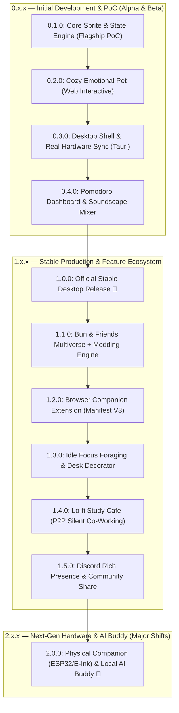

# 🗺️ Master Specification: Phased Versioning Roadmap & Ecosystem Architecture (SemVer 2.0.0)

## 1. 📌 Overview & Core Strategy
**Lo-fi Bun Companion** ถูกออกแบบด้วยสถาปัตยกรรมแบบ **Modular & Layered Architecture** (Data Registry ➜ State Engine ➜ GPU Renderer) เพื่อให้บรรลุเป้าหมาย:
1. **Zero-Overhead Budget**: ใช้ทรัพยากรน้อยที่สุดในทุกเวอร์ชัน (<35MB RAM, CPU ~0.0% ขณะ Idle)
2. **Cozy Emotional Pet**: สัตว์เลี้ยงแก้เหงาที่อบอุ่น ไม่ใช่เพียงแค่เกจวัดตัวเลขฮาร์ดแวร์
3. **Safe Feedback Loops**: แต่ละ Version สามารถเปิดทดสอบและปรับแต่งได้อย่างอิสระ
4. **Infinite Extensibility**: รองรับการเติบโตตั้งแต่ Desktop Widget สู่ระบบ Modding, Social Co-working, และ Physical Hardware
5. **Strict SemVer 2.0.0 Compliance**: จัดการ Release cycle ตามมาตรฐานสากล (`MAJOR.MINOR.PATCH`)

---

## 2. 🌌 Master Roadmap (SemVer 2.0.0 Overview)

---

## 3. 📋 รายละเอียดแต่ละ Release Milestone

### 🐾 0.x.x — Initial Development & Desktop Prototype
* **0.1.0 — Core Sprite Engine & Flagship Lo-fi Bun PoC**:
  - โครงสร้าง React + Vite + TypeScript + CSS Modules + Vitest + ESLint + Prettier
  - แอนิเมชัน Pixel Art 5 ท่าทางของ **🐰 Lo-fi Bun** (จิบชา, พิมพ์งาน, ไฟลุก, แบกกองแครอท, กอดหมอนหลับ)
  - Pure CSS `steps()` GPU-accelerated Sprite Renderer (CPU 0.0%) + Breathing Idle micro-animation
  - สถาปัตยกรรม Pluggable Companion Registry (พร้อมต่อเติมสัตว์เลี้ยงตัวถัดไปใน 1.1.0 ได้ทันที)
  - Pure Utility Functions แยกจาก Store: `hysteresis.ts` + `stateResolver.ts` (Unit-testable อิสระ)
  - Interactive Mock Hardware Slider สำหรับทดสอบปรับค่า CPU/RAM/Disk ได้ทันที

* **0.2.0 — The Cozy Emotional Pet (Web Interactive)**:
  - Tactile Petting: คลิกลูบหัว Lo-fi Bun แล้วมีหัวใจลอย (`FloatingHearts`) และเสียง Purr ตอบรับนุ่มๆ
  - First Boot Unboxing: ตอนเปิดครั้งแรก Lo-fi Bun โผล่จากกล่องพัสดุ พร้อม speech bubble ต้อนรับ 📦
  - AFK Inactivity Detection (>5 นาทีไม่แตะคอม ➜ Lo-fi Bun เข้าสู่ท่านอนสัปหงก) + Gentle Wakeup
  - Time-of-Day Ambient Tint: สีพื้นหลังเปลี่ยนตามเวลาจริง (เช้า/กลางวัน/ค่ำ/ดึก) 🌅
  - Speech Bubble System: ฟองคำพูดน่ารักโผล่สุ่มทุก 10-15 นาที ("☕ ชงชาให้นะ~")

* **0.3.0 — Desktop Shell & Real Hardware Sync**:
  - Tauri v2 Desktop Shell: หน้าต่างไร้ขอบ (Frameless), Always-on-Top, พื้นหลังโปร่งใส
  - Mini Floating Pet Widget (~80x80px) ลากได้อิสระพร้อมระบบ Snap ขอบจอ + Dangling Pose
  - Real Hardware Polling: Rust `sysinfo` crate (CPU, RAM, Disk I/O) ทุก 1.5 วินาที แทน Mock Sliders
  - Hysteresis Filtering (±3% Buffer) ป้องกันแอนิเมชันกระตุกจากค่าจริง

* **0.4.0 — Pomodoro Dashboard & Soundscape Mixer**:
  - Expandable Pomodoro Dashboard (Classic Pomodoro, Countdown, Stopwatch, Hydration)
  - Audio Engine (Muted by default, เสียงเตือนนุ่มนวลตอนหมดเวลา)
  - Eco Mode / Battery Saver Toggle (ลดแอนิเมชันเป็น 12 FPS + polling ทุก 3 วินาที)
  - Focus Streak Milestones: Confetti burst เมื่อทำ Pomodoro ครบ 3 รอบติด 🎊

---

### 🎉 1.0.0 — Official First Stable Production Release
* **1.0.0 — Complete Lo-fi Suite Launch**:
  - รวบรวมฟังก์ชันทั้งหมดจาก `0.1.0` ถึง `0.4.0` สู่เวอร์ชันสมบูรณ์พร้อมแจกจ่าย
  - Cross-Platform Packaging:
    - 🪟 Windows: Portable Single-File `.exe` (~10MB) & `.msi` Installer (Auto-start)
    - 🍏 macOS: `.dmg` (Apple Silicon & Intel) + Menu Bar Companion
    - 🐧 Linux: `.AppImage` & `.deb`
    - 🌐 Web: PWA / Web Demo
  - Automated Unit Tests ผ่าน Vitest 100%

---

### 🎨 1.x.x — Feature Expansions (Minor Releases)
* **1.1.0 — Bun & Friends Multiverse + Modding Engine**:
  - เปิดตัวเพื่อนใหม่อีก **5 ตัว** (*🐱 Neko, 🐶 Shiba, 🍊 Capybara, 🦜 Cockatiel, 🐬 Dolphin*)
  - Folder Drop-in Custom Skins (`skins/<name>/meta.json` + `sprites.png`) สำหรับศิลปิน Pixel Art
* **1.2.0 — Browser Companion Extension (Manifest V3)**:
  - รองรับ Chrome Web Store, Firefox Add-ons, Edge Add-ons (Side Panel & New Tab Mode)
* **1.3.0 — Idle Focus Foraging & Desk Decorator**:
  - ปลดล็อกเควสต์ผจญภัยเก็บใบชาและของตกแต่งห้องทำงาน Isometric Pixel Art
* **1.4.0 — Lo-fi Study Cafe (Lightweight P2P Co-Working)**:
  - สร้างห้อง Silent Co-working ผ่าน WebRTC นั่งทำงานคู่กับสัตว์เลี้ยงของเพื่อน
* **1.5.0 — Discord Rich Presence & Community**:
  - แสดงสถานะบน Discord ("Studying with Bun: 45m focused 🍵")

---

### 🚀 2.0.0 — Next-Gen Hardware & AI Buddy (Major Evolution)
* **2.0.0 — DIY Physical Hardware & Local Ambient AI**:
  - เฟิร์มแวร์เชื่อมต่อหน้าจอตั้งโต๊ะจริง (ESP32 / E-Ink Display)
  - Context-Aware Local AI ตรวจจับสภาพอากาศและส่ง Post-it ให้กำลังใจ
