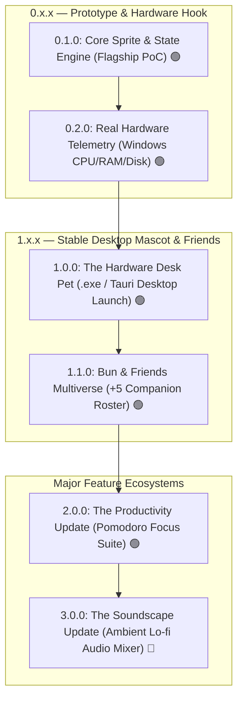

# 🗺️ Master Specification: Phased Versioning Roadmap & Lean Product Architecture (SemVer 2.0.0)

## 1. 📌 Overview & Core Strategy
**Lo-fi Bun Companion** ถูกออกแบบด้วยสถาปัตยกรรมแบบ **Modular & Layered Architecture** (Data Registry ➜ State Engine ➜ GPU Renderer) เพื่อให้บรรลุเป้าหมาย:
1. **Zero-Overhead Budget**: ใช้ทรัพยากรน้อยที่สุดในทุกเวอร์ชัน (<35MB RAM, CPU ~0.0% ขณะ Idle)
2. **Lean Value Delivery (Ship Early, Ship Real)**: ปล่อยแอป Desktop ตัวจริง (.exe บน Windows) สู่ผู้ใช้ให้เร็วที่สุดใน `v1.0.0`
3. **Pluggable & Extensible Foundations**: สถาปัตยกรรม State Engine & Registry รองรับการเพิ่มตัวละครใหม่อีก 5 ตัวใน `v1.1.0` โดยไม่ต้องรื้อระบบ
4. **Focused Major Upgrades**: แยกการอัปเกรดใหญ่เป็นโมดูลชัดเจน (Productivity Pomodoro ใน `v2.0.0`, Soundscape Mixer ใน `v3.0.0`)
5. **Strict SemVer 2.0.0 Compliance**: จัดการ Release cycle ตามมาตรฐานสากล (`MAJOR.MINOR.PATCH`)

---

## 2. 🌌 Master Roadmap (SemVer 2.0.0 Overview)

---

## 3. 📋 รายละเอียดแต่ละ Release Milestone

### 🐾 0.x.x — Initial Development & Desktop Prototype
* **0.1.0 — Core Sprite Engine & Flagship Lo-fi Bun PoC** *(Completed 🟢)*:
  - โครงสร้าง React 18 + Vite + TypeScript Strict + CSS Modules + Vitest + ESLint + Prettier
  - แอนิเมชัน Pixel Art 5 ท่าทางของ **🐰 Lo-fi Bun** (จิบชา, พิมพ์งาน, ไฟลุก, แบกกองแครอท, กอดหมอนหลับ)
  - Pure CSS `steps()` GPU-accelerated Sprite Renderer (CPU 0.0%) + SVG Pixel Spritesheet (256x320 px)
  - สถาปัตยกรรม Pluggable Companion Registry (`types/companion.ts`)
  - Pure Utility Functions แยกจาก Store: `hysteresis.ts` ($\pm 3\%$ Asymmetric Buffer) + `stateResolver.ts`
  - Interactive Mock Hardware Slider Lab Showcase (`App.tsx`)
  - ผ่าน 5-Pillar Automated Quality Gates (59 Vitest tests 100%)

* **0.2.0 — Real Hardware Telemetry Engine** *(Completed 🟢)*:
  - Windows OS Hardware Telemetry Provider: ดึงค่า CPU Utilization, RAM Usage, และ Disk I/O จริง
  - Dual-Provider Pattern:
    - `NativeWindowsTelemetryProvider` (อ่านค่าจริงในสภาพแวดล้อม Desktop)
    - `WebMockTelemetryProvider` (จำลองค่าสำหรับ Web Browser Dev & Vitest Tests)
  - Zero-Overhead Polling: Background polling interval 1.5s - 2.0s ป้องกันการหน่วง Main Thread
  - เชื่อมต่อ Telemetry เข้าสู่ Zustand Store (`useCompanionStore`) พร้อมปุ่มสลับ Live vs Mock Mode

---

### 🎉 1.0.0 — Official First Stable Production Release
* **1.0.0 — 📦 The Hardware Desk Pet (Tauri Desktop App)** *(Completed 🟢)*:
  - First Official Desktop Release (.exe Single-File Installer & Portable บน Windows)
  - Floating Pet Mascot Mode: หน้าต่าง Frameless ไร้ขอบ, พื้นหลังโปร่งใส, ปักหมุด Always-on-Top
  - ลากย้ายน้องต่ายวางบนหน้าจอทำงานได้อย่างอิสระ (Draggable Floating Mascot)
  - Quick Context Menu (คลิกขวา):
    - 📌 Always-on-Top Toggle
    - 🔍 Window Scale (1x, 2x, 3x, 4x)
    - 📊 Live Telemetry Stats Tooltip (ดูตัวเลข CPU/RAM/Disk ปัจจุบัน)
    - ❌ Quit Application
  - Resource Budget: RAM < 35MB, CPU Idle ~0.0%

---

### 🎨 1.x.x — Feature Expansions (Minor Releases)
* **1.1.0 — 🐾 Bun & Friends Multiverse (Character Expansion)** *(Completed 🟢)*:
  - ปลดล็อกเพื่อนใหม่อีก **5 ตัวละคร** สลับเล่นได้ทันที:
    - 🐱 **Neko**: แมวส้มจิบลาเต้อุ่นๆ / พิมพ์งานสลับอุ้งเท้า
    - 🐶 **Shiba**: ชิบะจิบชาโฮจิฉะ / วิ่งบนลู่วิ่งไฟฟ้า
    - 🍊 **Capybara**: คาปิบาร่าแช่น้ำส้มยูซุ / ทานกิ่งไม้ชิลๆ
    - 🦜 **Cockatiel**: นกคอกคาเทลไซ้ขน / โยกหัวจิกคีย์บอร์ด
    - 🐬 **Dolphin**: โลมาลอยน้ำพ่นละอองน้ำ / รัวครีบเล่นน้ำ
  - Quick Companion Switcher ผ่าน Submenu ใน Context Menu
  - ผลิต Vector Spritesheet 256x320 px ตามมาตรฐานเดิมของ Lo-fi Bun

---

### 🍅 2.0.0 — The Productivity Update (Major Release)
* **2.0.0 — Pomodoro Focus Suite & Rest Automation** *(Completed 🟢)*:
  - Classic 25/5 Pomodoro Timer พร้อมโหมด Deep Work (50/10), Custom Timer, และ Long Break Automation (รอบที่ 4)
  - Rest Automation Hook: เมื่อหมดเวลาทำงาน น้องสัตว์เลี้ยงทั้ง 6 ตัวจะเข้าสู่โหมดพักผ่อน (`REST`) กอดหมอน/แช่น้ำส้มยูซุนอนหลับอัตโนมัติ เพื่อเตือนให้ผู้ใช้พักสายตา
  - Daily Focus Streak Tracker (🍅 x N) และบันทึกลง LocalStorage
  - Zero-Asset Web Audio Soft Pentatonic Bell Chime เตือนเมื่อจบแต่ละช่วง
  - Floating Mini Progress Widget & Full Focus Dashboard Modal (รองรับ Double-Click Mascot / Stage)
  - Context Menu Overhaul พร้อม Lo-fi Slim Scrollbar ป้องกันเมนูล้นขอบหน้าต่างเดสก์ท็อป
  - ผ่าน 5-Pillar Quality Gates (171 Vitest tests 100%)

---

### 🎧 3.0.0 — The Soundscape Update (Major Release)
* **3.0.0 — Ambient Lo-fi Audio Mixer** *(Next Up 🎯)*:
  - Multi-Channel Web Audio Engine สำหรับสร้างบรรยากาศการทำงาน
  - ปรับระดับเสียงแยกอิสระ 4 ช่องสัญญาณ:
    - 🎶 Lo-fi Chill Beats
    - 🌧️ Soft Rain on Window
    - ⌨️ Mechanical Keyboard Clicks (Brown/Blue Switch sound)
    - ☕ Cozy Cafe Murmur & Coffee Pouring
  - Sound Presets (Rainy Evening, Cafe Study, Midnight Focus, Mute All)
  - Master Mute Shortcut & Low-power Audio Suspender เมื่อไม่ได้เปิดเสียง
