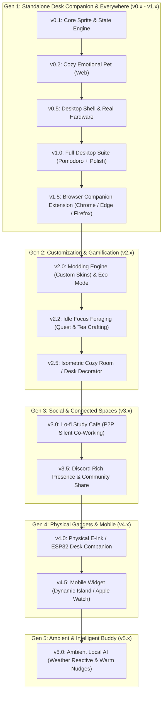

# 🗺️ Master Specification: Phased Versioning Roadmap & Ecosystem Architecture

## 1. 📌 Overview & Core Strategy
**Lo-fi Bun Companion** ถูกออกแบบด้วยสถาปัตยกรรมแบบ **Modular & Layered Architecture** (Data Registry ➜ State Engine ➜ GPU Renderer) เพื่อให้บรรลุเป้าหมาย:
1. **Zero-Overhead Budget**: ใช้ทรัพยากรน้อยที่สุดในทุกเวอร์ชัน (<35MB RAM, CPU ~0.0% ขณะ Idle)
2. **Cozy Emotional Pet**: สัตว์เลี้ยงแก้เหงาที่อบอุ่น ไม่ใช่เพียงแค่เกจวัดตัวเลขฮาร์ดแวร์
3. **Safe Feedback Loops**: แต่ละ Version สามารถเปิดทดสอบและปรับแต่งได้อย่างอิสระ
4. **Infinite Extensibility**: รองรับการเติบโตตั้งแต่ Desktop Widget สู่ระบบ Modding, Social Co-working, และ Physical Hardware

---

## 2. 🌌 Master Roadmap (Gen 1 – Gen 5)

---

## 3. 📋 รายละเอียดแต่ละ Generation

### 🐾 Gen 1: Standalone Desk Companion (v0.1 – v1.5) — *Focus: 🐰 Lo-fi Bun Flagship*
* **v0.1 — Core Sprite Engine & Flagship Lo-fi Bun PoC**:
  - โครงสร้าง React + Vite + TypeScript + CSS Modules + Vitest
  - แอนิเมชัน Pixel Art 5 ท่าทางของ **🐰 Lo-fi Bun** (จิบชา, พิมพ์งาน, ไฟลุก, แบกกองแครอท, กอดหมอนหลับ)
  - Pure CSS `steps()` GPU-accelerated Sprite Renderer (CPU 0.0%) + Breathing Idle micro-animation
  - สถาปัตยกรรม Pluggable Companion Registry (พร้อมต่อเติมสัตว์เลี้ยงตัวถัดไปใน v2.0 ได้ทันที)
  - Pure Utility Functions แยกจาก Store: `hysteresis.ts` + `stateResolver.ts` (Unit-testable อิสระ)
  - Interactive Mock Hardware Slider สำหรับทดสอบปรับค่า CPU/RAM/Disk ได้ทันที
* **v0.2 — The Cozy Emotional Pet (Web Interactive)**:
  - Tactile Petting: คลิกลูบหัว Lo-fi Bun แล้วมีหัวใจลอย (`FloatingHearts`) และเสียง Purr ตอบรับนุ่มๆ
  - First Boot Unboxing: ตอนเปิดครั้งแรก Lo-fi Bun โผล่จากกล่องพัสดุ พร้อม speech bubble ต้อนรับ 📦
  - AFK Inactivity Detection (>5 นาทีไม่แตะคอม ➜ Lo-fi Bun เข้าสู่ท่านอนสัปหงก) + Gentle Wakeup
  - Time-of-Day Ambient Tint: สีพื้นหลังเปลี่ยนตามเวลาจริง (เช้า/กลางวัน/ค่ำ/ดึก) 🌅
  - Speech Bubble System: ฟองคำพูดน่ารักโผล่สุ่มทุก 10-15 นาที ("☕ ชงชาให้นะ~")
* **v0.5 — Desktop Shell & Real Hardware Sync** *(NEW)*:
  - Tauri v2 Desktop Shell: หน้าต่างไร้ขอบ (Frameless), Always-on-Top, พื้นหลังโปร่งใส
  - Mini Floating Pet Widget (~80x80px) ลากได้อิสระพร้อมระบบ Snap ขอบจอ + Dangling Pose
  - Real Hardware Polling: Rust `sysinfo` crate (CPU, RAM, Disk I/O) ทุก 1.5 วินาที แทน Mock Sliders
  - Hysteresis Filtering (±3% Buffer) ป้องกันแอนิเมชันกระตุกจากค่าจริง
* **v1.0 — Complete Lo-fi Suite (MVP Production Release)**:
  - Expandable Pomodoro Dashboard (Classic Pomodoro, Countdown, Stopwatch, Hydration)
  - Audio Engine (Muted by default, เสียงเตือนนุ่มนวลตอนหมดเวลา)
  - Eco Mode / Battery Saver Toggle (ลดแอนิเมชันเป็น 12 FPS + polling ทุก 3 วินาที)
  - Focus Streak Milestones: Confetti burst เมื่อทำ Pomodoro ครบ 3 รอบติด 🎊
  - Cross-Platform Packaging:
    - 🪟 Windows: Portable Single-File `.exe` (~10MB) & `.msi` Installer (Auto-start)
    - 🍏 macOS: `.dmg` (Apple Silicon & Intel) + Menu Bar Companion
    - 🐧 Linux: `.AppImage` & `.deb`
    - 🌐 Web: PWA / Web Demo
  - Automated Unit Tests ผ่าน Vitest 100%

* **v1.5 — Browser Companion Extension (Manifest V3)**:
  - รองรับ Chrome Web Store, Firefox Add-ons, Edge Add-ons
  - **Side Panel Mode**: นั่งทำงานแถบด้านข้างจอขณะท่องเว็บ/ค้นคว้าข้อมูล
  - **New Tab Cozy Desk**: หน้าแท็บใหม่สไตล์ Lo-fi พร้อม Pomodoro Timer
  - **Tab-Overload Reaction**: ดึงจำนวน Tabs ด้วย `chrome.tabs` (แท็บเยอะ = น้องแบกกองแครอทเหงื่อตก)
  - **Browser Hardware API**: ดึง CPU/Memory ผ่าน `chrome.system.cpu` และ `chrome.system.memory`

---

### 🎨 Gen 2: "Bun & Friends" Multiverse & Modding (v2.0 – v2.5) — *Focus: 6 Animals & Community Modding*
* **v2.0 — Bun & Friends + Modding Engine**:
  - เปิดตัวเพื่อนใหม่อีก **5 ตัว** (*🐱 Neko, 🐶 Shiba, 🍊 Capybara, 🦜 Cockatiel, 🐬 Dolphin*)
  - Folder Drop-in Custom Skins (`skins/<name>/meta.json` + `sprites.png`) สำหรับศิลปิน Pixel Art
  - Battery Saver Mode (ปรับแอนิเมชันเป็น 12 FPS สไตล์เรโทรเพื่อประหยัดไฟโน้ตบุ๊ก)

* **v2.2 — Idle Focus Foraging (ระบบผจญภัยขณะเราทำงาน)**:
  - ทุกๆ 25 นาทีที่ตั้งใจทำงาน น้องจะออกเดินทางไปเก็บใบชา/ผลไม้/เมล็ดกาแฟกลับมาให้
* **v2.5 — Isometric Cozy Room Decorator**:
  - ใช้แต้ม Focus Hours ปลดล็อกของตกแต่งโต๊ะทำงานสไตล์ Pixel Art (โคมไฟ, หน้าต่างฝนตก, เครื่องเล่นเทป)

---

### ☕ Gen 3: Social & Connected World (v3.0 – v3.5)
* **v3.0 — Lo-fi Study Cafe (Lightweight P2P Co-Working)**:
  - สร้างห้อง Study Room ด้วยรหัสง่ายๆ ทำงานร่วมกับเพื่อนแบบ Silent Co-working ผ่าน WebRTC
  - เห็นสัตว์เลี้ยงของเพื่อนนั่งทำงานอยู่ข้างๆ เราแบบ Real-time โดยไม่รบกวนสมาธิ
* **v3.5 — Discord Rich Presence**:
  - แสดงสถานะบน Discord ("Studying with Bun: 45m focused 🍵")

---

### 📟 Gen 4: Physical Companion & Mobile (v4.0 – v4.5)
* **v4.0 — DIY Physical Hardware Companion (ESP32 / E-Ink Display)**:
  - เฟิร์มแวร์เชื่อมต่อหน้าจอตั้งโต๊ะจริง ดึงค่า CPU และเวลา Pomodoro ผ่าน Wi-Fi/Bluetooth
* **v4.5 — Mobile & Smartwatch Companion**:
  - วิดเจ็ต Dynamic Island / Live Activity (iOS & Android) และ Apple Watch

---

### 🧠 Gen 5: Ambient & Intelligent Buddy (v5.0)
* **v5.0 — Context-Aware Local AI**:
  - ตรวจจับสภาพอากาศภายนอก (ฝนตก ➜ กางร่ม, ดึก ➜ เปิดโคมไฟ)
  - ส่งกระดาษโน้ต Post-it เล็กๆ บนโต๊ะให้กำลังใจอย่างเป็นธรรมชาติ โดยประมวลผล Local 100%
