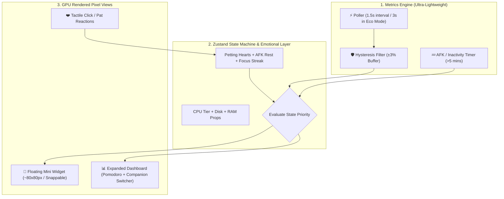

# 🎯 Task: Lightweight Cozy Companion MVP (Initial Concept Draft)
> ⚠️ **Note (Status: Superseded)**: แผนงานฉบับร่างเบื้องต้นนี้ถูก Refactor แยกย่อยเป็นแผนงานรายเวอร์ชันตามหลัก **SemVer 2.0.0 & The Gradual WOW Journey** แล้ว โดยเริ่มดำเนินการที่ [2026-08-30-0.1.0-core-sprite-engine.md](file:///c:/DevProjects/lofi_bun_companion/non-docs/tasks/2026-08-30-0.1.0-core-sprite-engine.md)
- **Date**: 2026-08-29
- **Status**: ⚪ Superseded by v0.1.0 Task Plan
- **Author/Owner**: Agent & User

---

## 1. 📌 Objective (เป้าหมาย)
สร้างรากฐานโปรเจกต์ **Lo-fi Bun Companion** ในไดเรกทอรี `lofi-bun-companion/` โดยยึดหลัก **"เบาหวิว ไม่กินเครื่อง แต่เป็นสัตว์เลี้ยงแก้เหงาที่อบอุ่นและมีชีวิตชีวา"** 
- รองรับ 6 สัตว์เลี้ยง (*Bun, Neko, Shiba, Capybara, Cockatiel, Dolphin*)
- ระบบจำลอง Hardware Metric พร้อมตัวปรับแต่งจำลอง (Mock Metric Slider) สำหรับ Web Preview
- ตัวจับเวลา Pomodoro แบบ Toggleable (เปิด/ปิดได้)
- การตอบสนองทางอารมณ์ (Tactile Petting, Heart Float FX, AFK Nap)
- Zero-Overhead GPU CSS Steps Animation และ Unit Test ครอบคลุมด้วย Vitest

---

## 2. 🗺️ Architecture & Flow (โครงสร้างและแผนผัง)

---

## 3. 🎯 Target Files & Components
- `lofi-bun-companion/package.json` - Vite + React + TypeScript + TailwindCSS + Vitest
- `lofi-bun-companion/src/types/companion.ts` - Data contracts for 6 pets, hardware tiers, emotions
- `lofi-bun-companion/src/stores/companionStore.ts` - Zustand store (Metric state + Emotional state + Pomodoro)
- `lofi-bun-companion/src/hooks/useHardwareMetrics.ts` - Lightweight poller hook with mock support
- `lofi-bun-companion/src/components/MiniPet/MiniPetWidget.tsx` - Draggable, clickable floating pet
- `lofi-bun-companion/src/components/PetRenderer/PetSprite.tsx` - Pure CSS Step Animator (Zero CPU overhead)
- `lofi-bun-companion/src/components/Dashboard/PomodoroDashboard.tsx` - Expandable cozy focus suite
- `lofi-bun-companion/src/__tests__/companionStore.test.ts` - Vitest test suite for state machine & priorities

---

## 4. 🛠️ Implementation Steps (ขั้นตอนการทำ)
- [ ] **Step 1**: Initialize Vite React TypeScript project in `lofi-bun-companion/` with Tailwind CSS & Vitest.
- [ ] **Step 2**: Create TypeScript type definitions (`types/companion.ts`) for all 6 pets, states, and props.
- [ ] **Step 3**: Implement Zustand store (`stores/companionStore.ts`) with strict state priority (AFK/Rest > Disk > CPU + RAM Prop overlay) and emotional petting counter.
- [ ] **Step 4**: Build GPU-accelerated CSS Sprite Renderer (`PetSprite.tsx`) with pixelated rendering and cozy tactile petting micro-effects.
- [ ] **Step 5**: Build Mini Floating Widget (`MiniPetWidget.tsx`) with drag physics, hover tooltip, quick pat click, and edge snapping.
- [ ] **Step 6**: Build Expandable Cozy Dashboard with Pomodoro timer, animal switcher, and mock hardware slider.
- [ ] **Step 7**: Write and execute automated Vitest unit tests verifying state transitions, priority chains, and zero memory leaks.

---

## 5. ❓ Open Questions & Decisions (จุดที่ต้องตกลงกัน)
- [x] **Audio Policy**: Muted by default เพื่อไม่ให้กินเครื่องและไม่แย่งเสียงกับ Spotify/YouTube ของผู้ใช้
- [x] **Animation Strategy**: Pure CSS `steps()` GPU-accelerated แทน Canvas loop เพื่อให้ CPU ทำงาน 0.0% ขณะ Idle
- [x] **Emotional Touch**: เพิ่มคลิกลูบหัวแล้วมีหัวใจปุ๊งปิ๊ง เพื่อให้รู้สึกเหมือนเป็นสัตว์เลี้ยงตัวจริง ไม่ใช่แค่เกจวัด

---

## 6. ✅ Verification & Quality Checklist (การตรวจสอบ)
- [ ] Automated unit tests pass (`npm test` / Vitest)
- [ ] Typecheck passes without errors (`npm run typecheck` or `tsc --noEmit`)
- [ ] Zero console warnings or performance drops in browser
- [ ] Smooth transition between Mini Pet Mode and Expanded Dashboard
