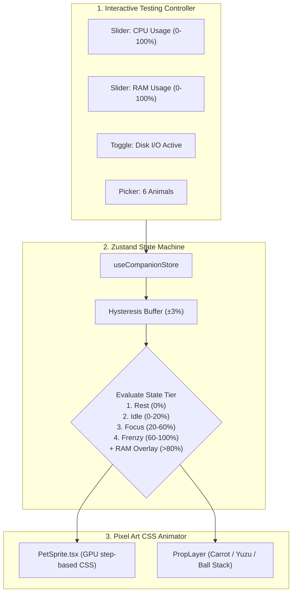

# 🎯 Task: Version 0.1 — Core Sprite & State Engine (Flagship: Lo-fi Bun PoC)
- **Date**: 2026-08-29
- **Target Version**: `v0.1`
- **Status**: 🟡 Ready for Execution
- **Author/Owner**: Agent & User

---

## 1. 📌 Objective (เป้าหมาย)
วางรากฐานโปรเจกต์ **Lo-fi Bun Companion** ในโฟลเดอร์ `lofi-bun-companion/` โดยเน้น **สัตว์เลี้ยงตัวแรก (🐰 Lo-fi Bun)** ให้สมบูรณ์แบบที่สุด เพื่อลดความซับซ้อนและง่ายต่อการทดสอบ:
- แสดงผลแอนิเมชัน Pixel Art ของ **Lo-fi Bun** ครบ 5 สถานะ (`Idle` จิบชา, `Focus` พิมพ์งาน, `Frenzy` ไฟลุกพิมพ์รัว, `Heavy RAM` แบกกองแครอท, `Rest` กอดหมอนหลับ) ด้วย GPU Pure CSS Step Animations (CPU 0.0%)
- ออกแบบ Data Registry ใน `types/companion.ts` ให้เป็นแบบ **Pluggable** (เพื่อรองรับการเพิ่มสัตว์เลี้ยงอีก 5 ตัวใน v2.0 Bun & Friends ได้อย่างง่ายดายโดยไม่ต้องแก้โค้ด Engine)
- มี State Store (Zustand) จัดการลำดับความสำคัญของสถานะ
- มี **Mock Metric Controller** ให้ผู้ใช้สามารถเลื่อน Slider ปรับ CPU %, RAM %, Disk เพื่อทดสอบการเปลี่ยนท่าทางของ Lo-fi Bun ได้ทันที

---

## 2. 🗺️ Architecture & Component Flow

---

## 3. 🎯 Target Files & Components
- `lofi-bun-companion/package.json` — Vite + React 18 + TypeScript + CSS Modules + Vitest + ESLint + Prettier
- `lofi-bun-companion/eslint.config.js` — ESLint v9 Flat Config (TypeScript + React Hooks rules)
- `lofi-bun-companion/.prettierrc` — Code style rules (2 spaces, single quotes, semicolons)
- `lofi-bun-companion/src/types/companion.ts` — Companion Data Registry & State types (Lo-fi Bun first, Pluggable for v2.0)
- `lofi-bun-companion/src/utils/hysteresis.ts` — Pure function for ±3% threshold buffer filtering
- `lofi-bun-companion/src/utils/stateResolver.ts` — Pure function for evaluating priority state from metrics
- `lofi-bun-companion/src/stores/companionStore.ts` — Thin State Store wrapping pure utility functions
- `lofi-bun-companion/src/components/PetRenderer/PetSprite.tsx` — GPU CSS Step Animator + Breathing Idle
- `lofi-bun-companion/src/components/Controls/MockMetricController.tsx` — Interactive Testing Sliders
- `lofi-bun-companion/src/App.tsx` — Showcase view combining Pet Renderer and Mock Controller
- `lofi-bun-companion/src/__tests__/utils.test.ts` — Vitest unit tests for hysteresis & stateResolver pure functions
- `lofi-bun-companion/src/__tests__/companionStore.test.ts` — Vitest unit tests verifying store state transitions

---

## 4. 🛠️ Implementation Steps (ขั้นตอนการทำ)
- [ ] **Step 1**: Initialize Vite React TypeScript project in `lofi-bun-companion/` with CSS Modules, Vitest, ESLint, and Prettier (configure `npm run verify`).
- [ ] **Step 2**: Define TypeScript types & Pluggable Registry schema (`types/companion.ts`) starting with **Lo-fi Bun**.
- [ ] **Step 2b**: Implement Pure Utility Functions (`utils/hysteresis.ts` + `utils/stateResolver.ts`) — unit-testable independently from Store.
- [ ] **Step 2c**: Write Vitest unit tests for pure utility functions to validate state transitions and hysteresis logic.
- [ ] **Step 3**: Implement Zustand companion store (`stores/companionStore.ts`) as thin wrapper calling pure utils.
- [ ] **Step 3b**: Write Vitest unit tests for companion store to verify end-to-end state flow.
- [ ] **Step 4**: Build `PetSprite.tsx` with CSS `steps()` spritesheet animation + Breathing Idle micro-animation (Greybox placeholder first, real sprites later).
- [ ] **Step 5**: Build `MockMetricController.tsx` with friendly sliders to test CPU (0-100%), RAM (>80% Carrot Stack), and Rest mode.
- [ ] **Step 6**: Wire everything into `App.tsx` and run the complete 5-Pillar verification (`npm run verify`).
- [ ] **Step 6b**: Replace Greybox placeholder sprites with final Lo-fi Bun Pixel Art spritesheet.

---

## 5. ✅ Verification & Acceptance Criteria
- [ ] แอนิเมชันของ **Lo-fi Bun** ขยับนุ่มนวลแบบ Pixel Art 100% GPU พร้อม Breathing Idle micro-animation
- [ ] เลื่อน Slider ปรับ CPU (0-100%) แล้วท่าทางเปลี่ยนถูกต้อง (จิบชา ➜ พิมพ์งาน ➜ ไฟลุกพิมพ์รัว)
- [ ] ปรับ RAM >80% แล้วมี Overlay Prop กองแครอทซ้อนทับขึ้นมาอย่างสวยงาม
- [ ] Pure Utils (`hysteresis.ts` + `stateResolver.ts`) แยกจาก Store และมี Unit Tests ครอบคลุม
- [ ] โค้ดถูกออกแบบแบบ Pluggable Registry พร้อมเพิ่มเพื่อนอีก 5 ตัวใน v2.0 ได้ทันที
- [ ] **5-Pillar Quality Gate (`npm run verify`) ผ่าน 100% ครบทุกเสาหลัก**:
  1. `npm run lint` (ESLint 0 errors/warnings)
  2. `npm run format:check` (Prettier 100% formatted)
  3. `npm run typecheck` (TypeScript strict 0 errors)
  4. `npm test` (Vitest suites pass 100%)
  5. `npm run build` (Vite production bundle compiles cleanly)

