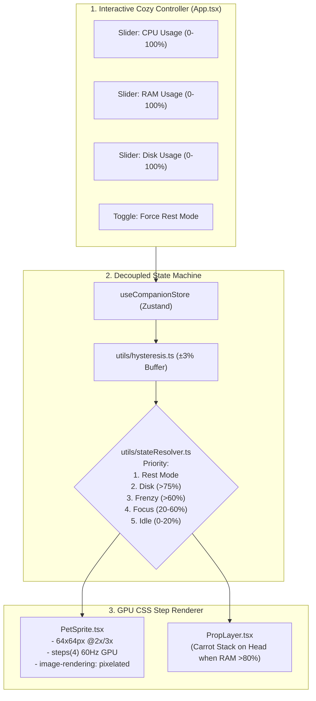

# 🎯 Task: Release 0.1.0 — Core Sprite & State Engine (Flagship: Lo-fi Bun PoC)
- **Date**: 2026-08-30
- **Target Version**: `0.1.0` (SemVer 2.0.0)
- **Status**: 🟢 Completed (100% Verified)
- **Author/Owner**: Agent & User

---

## 1. 📌 Objective & Scope (เป้าหมายและขอบเขต)
วางรากฐานโปรเจกต์ **Lo-fi Bun Companion** ในโฟลเดอร์ `lofi-bun-companion/` โดยเน้น **สัตว์เลี้ยงตัวแรก (🐰 Lo-fi Bun)** ให้สมบูรณ์แบบที่สุด พร้อมระบบทดสอบและการตรวจสอบคุณภาพระดับสากล:
1. **Pixel Art CSS Sprite Renderer**:
   - Frame Base: `64x64px` (ขยายแบบคมชัดด้วย CSS `image-rendering: pixelated;`)
   - 4-Frame Loop ต่อท่าทาง (`steps(4)` 300ms–1000ms) + Subtle Breathing Idle
   - ครบ 6 สถานะ/เลเยอร์: 
     - `IDLE` (จิบชา 800ms)
     - `FOCUS` (พิมพ์งาน 600ms)
     - `FRENZY` (ไฟลุกพิมพ์รัว 300ms)
     - `DISK` (เปิดสมุดพลิกหน้าค้นหารัวๆ 400ms)
     - `REST` (กอดหมอนหลับ 1000ms)
     - `HEAVY_RAM` (Carrot Stack Prop ซ้อนบนหัวเมื่อ RAM >80%)
   - มี Crisp Inline SVG Pixel Art ในตัว สำหรับทดสอบได้ทันทีแบบ Zero-Asset Dependency
2. **Pluggable Companion Data Registry (`types/companion.ts`)**:
   - โครงสร้างข้อมูลแบบเปิด พร้อมรับเพื่อนอีก 5 ตัวใน Release `1.1.0` โดยไม่ต้องรื้อ Engine
3. **Decoupled State Machine & Pure Math Functions**:
   - `utils/hysteresis.ts`: ฟังก์ชันคำนวณบัฟเฟอร์ $\pm 3\%$ ป้องกันอาการภาพกระตุก
   - `utils/stateResolver.ts`: ฟังก์ชันจัดลำดับ Priority: `REST` > `DISK` (>75%) > `FRENZY` (>60%) > `FOCUS` (20-60%) > `IDLE` (0-20%)
   - `stores/companionStore.ts`: Zustand Store น้ำหนักเบา ใช้ Selective Subscriptions เพื่อ 0% CPU Idle
4. **Cozy Lo-fi Showcase UI (`App.tsx`)**:
   - หน้าจอห้องทดลองบรรยากาศอบอุ่น (Dark Espresso & Pastel Palette, Glassmorphism Mock Controller Sliders 3 ช่อง: CPU, RAM, Disk)
5. **5-Pillar Quality Verification (`npm run verify`)**:
   - ผ่านครบทั้ง 5 เสาหลัก: Linting (0 warnings), Formatting, Strict Typecheck, Vitest Unit Tests (100%), และ Production Build

---

## 2. 🗺️ Architecture & Component Flow



---

## 3. 🎯 Target File Structure

```text
lofi-bun-companion/
├── package.json                          # Vite + React 18 + TS + Vitest + ESLint + Prettier
├── tsconfig.json                         # Strict TypeScript configuration
├── eslint.config.js                      # ESLint v9 Flat Config (TS + React Hooks)
├── .prettierrc                           # Prettier rules (2 spaces, single quotes, semi)
├── index.html                            # HTML5 root with Google Fonts (Outfit / Inter)
├── vite.config.ts                        # Vite & Vitest configuration
└── src/
    ├── types/
    │   └── companion.ts                  # Companion Registry Schema & State Types
    ├── utils/
    │   ├── hysteresis.ts                 # Pure ±3% threshold smoothing
    │   └── stateResolver.ts              # Pure state priority evaluator
    ├── stores/
    │   └── companionStore.ts             # Thin Zustand store with selectors
    ├── components/
    │   ├── PetRenderer/
    │   │   ├── PetSprite.tsx             # GPU CSS steps animator
    │   │   ├── PropLayer.tsx             # Overlay prop (Carrot Stack on head)
    │   │   └── PetSprite.module.css      # Pixel-art keyframes & step math
    │   └── Controls/
    │       ├── MockMetricController.tsx  # Cozy Glassmorphism Sliders (CPU, RAM, Disk)
    │       └── MockMetricController.module.css
    ├── assets/
    │   └── sprites/
    │       └── bun-sprites.svg           # High-precision vector pixel-art spritesheet
    ├── __tests__/
    │   ├── hysteresis.test.ts            # Unit tests for threshold boundaries
    │   ├── stateResolver.test.ts         # Unit tests for state hierarchy
    │   └── companionStore.test.ts        # Integration tests for store flow
    ├── App.tsx                           # Cozy Showcase Lab
    ├── App.module.css                    # Lo-fi desk backdrop & theme tokens
    └── main.tsx                          # React DOM entry point
```

---

## 4. 🛠️ Detailed Implementation Checklist & Technical Blueprints (พิมพ์เขียวเชิงเทคนิค)

### 🔹 Phase 1: Project Setup, Tooling & 5-Pillar Quality Gates
- [x] **Step 1.1 Scaffolding**: สร้างโครงสร้างโปรเจกต์ React 18 + TypeScript ภายใน `lofi-bun-companion/`
- [x] **Step 1.2 Dependencies & Scripts**: กำหนด `package.json` พร้อม 5 Quality Scripts:
  ```json
  "scripts": {
    "dev": "vite",
    "build": "tsc && vite build",
    "preview": "vite preview",
    "lint": "eslint .",
    "format:check": "prettier --check .",
    "format": "prettier --write .",
    "typecheck": "tsc --noEmit",
    "test": "vitest run",
    "verify": "npm run lint && npm run format:check && npm run typecheck && npm test && npm run build"
  }
  ```
- [x] **Step 1.3 Quality Configurations**:
  - [x] **ESLint v9 Flat Config (`eslint.config.js`)**: กำหนดค่า `@eslint/js`, `typescript-eslint`, และ `eslint-plugin-react-hooks`
  - [x] **Prettier (`.prettierrc`)**: `{"semi": true, "singleQuote": true, "tabWidth": 2, "trailingComma": "es5"}`
  - [x] **Strict TypeScript (`tsconfig.json`)**: `{"compilerOptions": {"strict": true, "noUnusedLocals": true, "noUnusedParameters": true, "target": "ES2022", "moduleResolution": "bundler"}}`
- [x] **Step 1.4 Runtime & Test Setup**:
  - [x] **Vite & Vitest (`vite.config.ts`)**: `plugins: [react()]`, `test: { globals: true, environment: 'jsdom' }`
  - [x] **HTML Entry (`index.html`)**: โหลด Google Fonts (`Outfit` / `Inter`) และเพิ่ม CSS token `image-rendering: pixelated;`
- [x] **Step 1.5 Baseline Verification**: ทดสอบรัน `npm run verify` รอบแรกเพื่อให้มั่นใจว่า Pipeline เครื่องมือพร้อม 100%

---

### 🔹 Phase 2: Domain Types & Decoupled State Machine (TDD Approach)
- [x] **Step 2.1 Domain Types (`src/types/companion.ts`)**:
  ```ts
  export type CompanionState = 'IDLE' | 'FOCUS' | 'FRENZY' | 'DISK' | 'REST';

  export interface HardwareMetrics {
    cpuUsage: number;   // 0 - 100%
    ramUsage: number;   // 0 - 100%
    diskUsage: number;  // 0 - 100%
  }

  export interface ResolvedCompanionState {
    activeState: CompanionState;
    isHeavyRam: boolean; // ramUsage > 80% (Overlay Prop)
    timestamp: number;
  }

  export interface CompanionMetadata {
    id: string;
    name: string;
    role: string;
    spriteUrl: string;
    propUrl: string;
    animationDurations: Record<CompanionState, number>; // in ms
  }

  export type CompanionRegistry = Record<string, CompanionMetadata>;
  ```
- [x] **Step 2.2 Hysteresis Smoothing Function (`src/utils/hysteresis.ts`)**:
  * **CPU Thresholds**:
    * ขาขึ้น $\ge 20\%$ เข้าสู่ `FOCUS`, ขาลง $< 17\%$ กลับสู่ `IDLE`
    * ขาขึ้น $\ge 60\%$ เข้าสู่ `FRENZY`, ขาลง $< 57\%$ กลับสู่ `FOCUS`
  * **Disk Threshold**:
    * ขาขึ้น $\ge 75\%$ เข้าสู่ `DISK`, ขาลง $< 72\%$ ออกจาก `DISK`
  ```ts
  export function evaluateHysteresis(
    currentValue: number,
    previousState: CompanionState,
    risingThreshold: number,
    buffer: number = 3
  ): boolean
  ```
- [x] **Step 2.3 State Priority Evaluator (`src/utils/stateResolver.ts`)**:
  * **Priority 1**: `forceRest === true` $\to$ `REST`
  * **Priority 2**: `diskUsage >= 75%` (หรือสถานะเดิมคือ DISK และ `diskUsage >= 72%`) $\to$ `DISK`
  * **Priority 3 (CPU Workload)**:
    - ถ้าเดิมคือ `FRENZY` และ `cpuUsage >= 57%` หรือ `cpuUsage >= 60%` $\to$ `FRENZY`
    - ถ้าเดิมคือ `FOCUS` และ `cpuUsage >= 17%` หรือ `cpuUsage >= 20%` $\to$ `FOCUS`
    - นอกนั้น $\to$ `IDLE`
  * **Independent Prop**: `ramUsage > 80%` $\to$ `isHeavyRam = true`
- [x] **Step 2.4 Automated Unit Tests (Vitest)**:
  - [x] `src/__tests__/hysteresis.test.ts` (Boundary Cases: 16.9%, 17%, 20%, 56.9%, 57%, 60%, 71.9%, 72%, 75%)
  - [x] `src/__tests__/stateResolver.test.ts` (Priority Combinations: Rest Override, Disk Priority, Heavy RAM Flag)
- [x] **Step 2.5 Unit Test Verification**: รัน `npm test` เพื่อตรวจสอบให้ผ่าน 100%

---

### 🔹 Phase 3: Zustand State Store
- [x] **Step 3.1 Reactive Store Implementation (`src/stores/companionStore.ts`)**:
  ```ts
  interface CompanionStoreState {
    metrics: HardwareMetrics;
    forceRest: boolean;
    activeCompanionId: string;
    resolvedState: ResolvedCompanionState;
    
    // Actions
    setMetrics: (metrics: Partial<HardwareMetrics>) => void;
    setForceRest: (forceRest: boolean) => void;
    setActiveCompanionId: (id: string) => void;
    resetToDefaults: () => void;
  }
  ```
  * *Selective Subscriptions Pattern เพื่อการันตี 0% CPU Overhead ตอน Idle*
- [x] **Step 3.2 Store Integration Tests (`src/__tests__/companionStore.test.ts`)**:
  - [x] เขียนเทสต์ทดสอบการอัปเดตค่าและการแจ้งเตือน Subscribers
- [x] **Step 3.3 Test Suite Verification**: รัน `npm test` ตรวจสอบ Store ผ่าน 100%

---

### 🔹 Phase 4: Vector Pixel-Art & GPU CSS Step Animator
- [x] **Step 4.1 Vector Spritesheet (`src/assets/sprites/bun-sprites.svg`)**:
  * **Spritesheet Dimensions**: 256 x 320 px (4 frames x 64px แนวนอน, 5 ท่าทาง x 64px แนวตั้ง)
    * แถวที่ 1 (Y: 0px): `IDLE` (4 Frames — ชามัทฉะ & หูกระดิก)
    * แถวที่ 2 (Y: 64px): `FOCUS` (4 Frames — พิมพ์งาน & ผงกหัว)
    * แถวที่ 3 (Y: 128px): `FRENZY` (4 Frames — พิมพ์รัว & ไฟลุก)
    * แถวที่ 4 (Y: 192px): `DISK` (4 Frames — พลิกหน้าสมุดบันทึกคาราเมลรัวๆ)
    * แถวที่ 5 (Y: 256px): `REST` (4 Frames — นอนกอดหมอนลาเวนเดอร์ & ฟองสบู่)
  * **Prop Asset (`src/assets/sprites/prop-carrot.svg`)**: กองแครอท 3 หัว (28x20px)
- [x] **Step 4.2 GPU CSS Step Animator (`PetSprite.tsx` & `PetSprite.module.css`)**:
  ```css
  .spriteCanvas {
    width: 64px;
    height: 64px;
    image-rendering: pixelated;
    image-rendering: crisp-edges;
    position: relative;
  }
  @keyframes playFrames {
    from { background-position-x: 0px; }
    to { background-position-x: -256px; }
  }
  .idle   { background-position-y: 0px; animation: playFrames 0.8s steps(4) infinite; }
  .focus  { background-position-y: -64px; animation: playFrames 0.6s steps(4) infinite; }
  .frenzy { background-position-y: -128px; animation: playFrames 0.3s steps(4) infinite; }
  .disk   { background-position-y: -192px; animation: playFrames 0.4s steps(4) infinite; }
  .rest   { background-position-y: -256px; animation: playFrames 1.0s steps(4) infinite; }
  ```
- [x] **Step 4.3 Head Prop Layer (`PropLayer.tsx` / `PetSprite.tsx`)**:
  ```css
  .propCarrot {
    position: absolute;
    top: -8px;
    left: 18px;
    width: 28px;
    height: 20px;
    animation: propBob 0.8s steps(2) infinite;
  }
  ```

---

### 🔹 Phase 5: Cozy Showcase Lab UI & Controller
- [x] **Step 5.1 Glassmorphism Controller (`MockMetricController.tsx` & `.module.css`)**:
  * [x] Slider ควบคุม CPU Usage (0–100%, Accent: `#FF9A3C`)
  * [x] Slider ควบคุม RAM Usage (0–100%, Accent: `#A3B899`)
  * [x] Slider ควบคุม Disk Usage (0–100%, Accent: `#8EA8C3`)
  * [x] Toggle สวิตช์ Rest Mode (Force Rest, Accent: `#DDD5E9`)
  * [x] Glassmorphism Tokens: `background: rgba(46, 34, 31, 0.65)`, `backdrop-filter: blur(12px)`, `border: 1px solid rgba(255, 248, 240, 0.12)`
- [x] **Step 5.2 Showcase Container (`App.tsx` & `App.module.css`)**:
  * [x] จัดเลย์เอาต์แผ่นรองโต๊ะ Lo-fi Desk Mat (`#1C1614` Dark Espresso)
  * [x] ป้ายสถานะเรียลไทม์ (Active State, RAM Prop, FPS)
  * [x] เชื่อมต่อ PetStage Viewport กับ Pure CSS Step Animator (`PetSprite`) และ Controller
- [x] **Step 5.3 Main Entry Point (`main.tsx`)**: ผูก React DOM Tree เข้ากับ Root Container

---

### 🔹 Phase 6: Full 5-Pillar Verification & Final Delivery
- [x] **Step 6.1 5-Pillar Automated Gate**:
  - [x] `npm run lint` (ESLint 0 errors, 0 warnings)
  - [x] `npm run format:check` (Prettier 100% compliant)
  - [x] `npm run typecheck` (`tsc --noEmit` 0 errors)
  - [x] `npm test` (Unit & Integration Tests ผ่านครบ 100%)
  - [x] `npm run build` (Vite Build Bundle สำเร็จสมบูรณ์)
- [x] **Step 6.2 Combined Gate**: รัน `npm run verify` ผ่านแบบ One-Shot 100%
- [x] **Step 6.3 Devlog Entry**: บันทึกรายงานใน `non-docs/devlogs/2026-08/2026-08-30.md`

---

## 5. ✅ Acceptance Criteria & Quality Gate Checklist
- [x] **Sprite Quality**: ภาพ Pixel Art ของ Lo-fi Bun คมชัด ไม่เบลอ (`pixelated`), ขยับต่อเนื่องด้วย Pure CSS 0.0% CPU
- [x] **State Responsiveness**:
  - CPU 0–20%: น้องนั่งจิบชา (Idle)
  - CPU 20–60%: น้องพิมพ์คีย์บอร์ดเรื่อยๆ (Focus)
  - CPU 60–100%: น้องพิมพ์รัวไฟลุก (Frenzy)
  - Disk >75%: น้องเปิดสมุดพลิกหน้าค้นหารัวๆ (Disk)
  - RAM >80%: มีกองแครอทซ้อนขึ้นมาบนหัว (Carrot Stack Prop)
  - Toggle Rest: น้องกอดหมอนหลับทันที (Rest Priority 1)
- [x] **Hysteresis Smoothing**: เลื่อน Slider ใกล้จุดตัด 20%, 60% และ 75% แล้วแอนิเมชันไม่กระตุกสลับไปมา
- [x] **Extensibility**: `types/companion.ts` รองรับการเพิ่มเพื่อนใหม่อีก 5 ตัวใน 1.1.0 ได้ทันที
- [x] **Automated Quality Gate (`npm run verify`)**:
  - `npm run lint` ➜ 0 errors, 0 warnings
  - `npm run format:check` ➜ 100% compliant
  - `npm run typecheck` ➜ Strict 0 errors
  - `npm test` ➜ Unit & Integration tests pass 100% (8 test files, 59 tests)
  - `npm run build` ➜ Production bundle compiles cleanly (55 modules)
