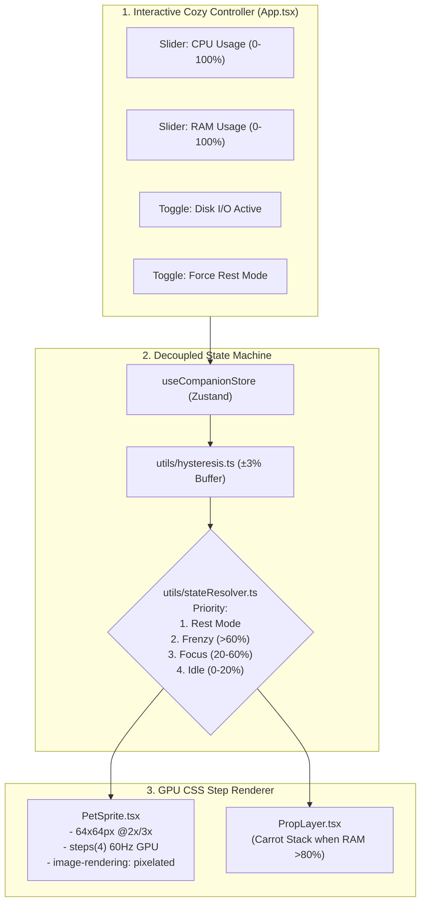

# 🎯 Task: Release 0.1.0 — Core Sprite & State Engine (Flagship: Lo-fi Bun PoC)
- **Date**: 2026-08-30
- **Target Version**: `0.1.0` (SemVer 2.0.0)
- **Status**: 🟡 Ready for Execution
- **Author/Owner**: Agent & User

---

## 1. 📌 Objective & Scope (เป้าหมายและขอบเขต)
วางรากฐานโปรเจกต์ **Lo-fi Bun Companion** ในโฟลเดอร์ `lofi-bun-companion/` โดยเน้น **สัตว์เลี้ยงตัวแรก (🐰 Lo-fi Bun)** ให้สมบูรณ์แบบที่สุด พร้อมระบบทดสอบและการตรวจสอบคุณภาพระดับสากล:
1. **Pixel Art CSS Sprite Renderer**:
   - Frame Base: `64x64px` (ขยายแบบคมชัดด้วย CSS `image-rendering: pixelated;`)
   - 4-Frame Loop ต่อท่าทาง (`steps(4)` 600ms–800ms) + Subtle Breathing Idle
   - ครบ 5 สถานะ: `IDLE` (จิบชา), `FOCUS` (พิมพ์งาน), `FRENZY` (ไฟลุกพิมพ์รัว), `REST` (กอดหมอนหลับ), และ `HEAVY_RAM` (Carrot Stack Prop Overlay)
   - มี Crisp Inline SVG Pixel Art ในตัว สำหรับทดสอบได้ทันทีแบบ Zero-Asset Dependency
2. **Pluggable Companion Data Registry (`types/companion.ts`)**:
   - โครงสร้างข้อมูลแบบเปิด พร้อมรับเพื่อนอีก 5 ตัวใน Release `1.1.0` โดยไม่ต้องรื้อ Engine
3. **Decoupled State Machine & Pure Math Functions**:
   - `utils/hysteresis.ts`: ฟังก์ชันคำนวณบัฟเฟอร์ $\pm 3\%$ ป้องกันอาการภาพกระตุก
   - `utils/stateResolver.ts`: ฟังก์ชันจัดลำดับ Priority แบบ Pure Function
   - `stores/companionStore.ts`: Zustand Store น้ำหนักเบา ใช้ Selective Subscriptions เพื่อ 0% CPU Idle
4. **Cozy Lo-fi Showcase UI (`App.tsx`)**:
   - หน้าจอห้องทดลองบรรยากาศอบอุ่น (Dark Espresso & Pastel Palette, Glassmorphism Mock Controller Sliders)
5. **5-Pillar Quality Verification (`npm run verify`)**:
   - ผ่านครบทั้ง 5 เสาหลัก: Linting (0 warnings), Formatting, Strict Typecheck, Vitest Unit Tests (100%), และ Production Build

---

## 2. 🗺️ Architecture & Component Flow



---

## 3. 🎯 Target File Structure

```text
lofi-bun-companion/
├── package.json                          # Vite + React 18 + TS + Vitest + ESLint + Prettier
├── tsconfig.json                         # Strict TypeScript configuration
├── eslint.config.js                      # ESLint v9 Flat Config (TS + React Hooks)
├── .prettierrc                           # Prettier rules (2 spaces, single quotes, semi)
├── index.html                            # HTML5 root with Google Fonts (Outfit / Inter)
├── vite.config.ts                        # Vite & Vitest configuration
└── src/
    ├── types/
    │   └── companion.ts                  # Companion Registry Schema & State Types
    ├── utils/
    │   ├── hysteresis.ts                 # Pure ±3% threshold smoothing
    │   └── stateResolver.ts              # Pure state priority evaluator
    ├── stores/
    │   └── companionStore.ts             # Thin Zustand store with selectors
    ├── components/
    │   ├── PetRenderer/
    │   │   ├── PetSprite.tsx             # GPU CSS steps animator
    │   │   ├── PropLayer.tsx             # Overlay prop (Carrot Stack)
    │   │   └── PetSprite.module.css      # Pixel-art keyframes & step math
    │   └── Controls/
    │       ├── MockMetricController.tsx  # Cozy Glassmorphism Sliders
    │       └── MockMetricController.module.css
    ├── assets/
    │   └── sprites/
    │       └── bun-sprites.svg           # High-precision vector pixel-art spritesheet
    ├── __tests__/
    │   ├── hysteresis.test.ts            # Unit tests for threshold boundaries
    │   ├── stateResolver.test.ts         # Unit tests for state hierarchy
    │   └── companionStore.test.ts        # Integration tests for store flow
    ├── App.tsx                           # Cozy Showcase Lab
    ├── App.module.css                    # Lo-fi desk backdrop & theme tokens
    └── main.tsx                          # React DOM entry point
```

---

## 4. 🛠️ Detailed Implementation Checklist (ขั้นตอนการทำอย่างละเอียด)

### 🔹 Phase 1: Tooling, Configuration & Quality Gates
- [ ] **Step 1.1**: Initialize Vite React TypeScript project in `lofi-bun-companion/`
- [ ] **Step 1.2**: Configure `package.json` with standard verification scripts:
  - `"lint"`: `eslint .`
  - `"format:check"`: `prettier --check .`
  - `"format"`: `prettier --write .`
  - `"typecheck"`: `tsc --noEmit`
  - `"test"`: `vitest run`
  - `"verify"`: `npm run lint && npm run format:check && npm run typecheck && npm test && npm run build`
- [ ] **Step 1.3**: Configure ESLint v9 Flat Config (`eslint.config.js`) and `.prettierrc`
- [ ] **Step 1.4**: Configure `vite.config.ts` with Vitest (`globals: true`, `environment: 'jsdom'`)

### 🔹 Phase 2: Domain Types & Pure Math Utilities (TDD Approach)
- [ ] **Step 2.1**: Define `types/companion.ts` (State enums, CompanionMetadata, MetricPayload, Pluggable CompanionRegistry)
- [ ] **Step 2.2**: Implement `utils/hysteresis.ts` (Pure function for boundary checking with $\pm 3\%$ buffer)
- [ ] **Step 2.3**: Implement `utils/stateResolver.ts` (Pure function for mapping metrics to `IDLE | FOCUS | FRENZY | REST` + `isHeavyRam`)
- [ ] **Step 2.4**: Write Vitest unit tests:
  - `__tests__/hysteresis.test.ts` (test edge values: 19.9%, 20.0%, 23.0%, 57.0%, 60.0%, 63.0%)
  - `__tests__/stateResolver.test.ts` (test all priority combinations & RAM flag)

### 🔹 Phase 3: Zustand Store with Optimized Selectors
- [ ] **Step 3.1**: Implement `stores/companionStore.ts` wrapping pure utils with minimal re-render footprint
- [ ] **Step 3.2**: Write Vitest integration tests (`__tests__/companionStore.test.ts`) validating reactive state updates

### 🔹 Phase 4: CSS Sprite Renderer & Pixel Art Engine
- [ ] **Step 4.1**: Create `assets/sprites/bun-sprites.svg` (Crisp 64x64 pixel art frames for 5 poses)
- [ ] **Step 4.2**: Implement `components/PetRenderer/PetSprite.tsx` & `PetSprite.module.css`:
  - `steps(4)` 60Hz GPU animation
  - `image-rendering: pixelated`
  - Breathing idle micro-animation
- [ ] **Step 4.3**: Implement `components/PetRenderer/PropLayer.tsx` for Carrot Stack overlay on RAM >80%

### 🔹 Phase 5: Cozy Showcase UI & Controller
- [ ] **Step 5.1**: Implement `components/Controls/MockMetricController.tsx` with Glassmorphism styling and tactile sliders
- [ ] **Step 5.2**: Assemble `App.tsx` with warm Lo-fi desk mat theme, status indicators, and state badge
- [ ] **Step 5.3**: Run `npm run verify` to ensure all 5 quality pillars pass with 0 errors

---

## 5. ✅ Acceptance Criteria & Quality Gate Checklist
- [ ] **Sprite Quality**: ภาพ Pixel Art ของ Lo-fi Bun คมชัด ไม่เบลอ (`pixelated`), ขยับต่อเนื่องด้วย Pure CSS 0.0% CPU
- [ ] **State Responsiveness**:
  - CPU 0–20%: น้องนั่งจิบชา (Idle)
  - CPU 20–60%: น้องพิมพ์คีย์บอร์ดเรื่อยๆ (Focus)
  - CPU 60–100%: น้องพิมพ์รัวไฟลุก (Frenzy)
  - RAM >80%: มีกองแครอทซ้อนขึ้นมา (Carrot Stack Prop)
  - Toggle Rest: น้องกอดหมอนหลับทันที (Rest Priority)
- [ ] **Hysteresis Smoothing**: เลื่อน Slider ใกล้จุดตัด 20% และ 60% แล้วแอนิเมชันไม่กระตุกสลับไปมา
- [ ] **Extensibility**: `types/companion.ts` รองรับการเพิ่มเพื่อนใหม่อีก 5 ตัวใน 1.1.0 ได้ทันที
- [ ] **Automated Quality Gate (`npm run verify`)**:
  - `npm run lint` ➜ 0 errors, 0 warnings
  - `npm run format:check` ➜ 100% compliant
  - `npm run typecheck` ➜ Strict 0 errors
  - `npm test` ➜ Unit & Integration tests pass 100%
  - `npm run build` ➜ Production bundle compiles cleanly
