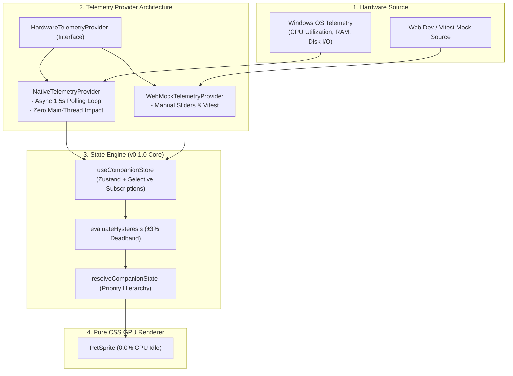

# 🎯 Task: Release 0.2.0 — Real Hardware Telemetry Engine
- **Date**: 2026-08-30
- **Target Version**: `0.2.0` (SemVer 2.0.0)
- **Status**: 🟡 Ready for Development
- **Author/Owner**: Agent & User

---

## 1. 📌 Objective & Scope (เป้าหมายและขอบเขต)
สร้างระบบเชื่อมต่อและอ่านค่าภาระการทำงานจริงของเครื่องคอมพิวเตอร์ (**Real Hardware Telemetry Engine**) เพื่อนำค่า CPU, RAM และ Disk I/O จริงบนระบบปฏิบัติการ (Windows) มาขับเคลื่อน State Machine ของสัตว์เลี้ยงแทน Mock Sliders:

1. **Pluggable Telemetry Provider Architecture**:
   - ออกแบบสัญญา Interface กลาง `HardwareTelemetryProvider` ที่แยกการทำงานระหว่าง Native Provider (สำหรับ Desktop App) และ Mock/Simulated Provider (สำหรับ Web Browser และ Vitest Tests)
   - ป้องกันอาการพังเมื่อรันในสภาพแวดล้อมที่ไม่มี Native OS Bridge
2. **Zero-Overhead Background Polling**:
   - กำหนดรอบ Polling อัตโนมัติที่ประหยัดพลังงาน (1.5s - 2.0s Interval)
   - ใช้ Web Worker หรือ Non-blocking Async Polling เพื่อไม่ให้รบกวน Main Thread และ 60 FPS GPU Step Animator
3. **Zustand Store & State Machine Integration**:
   - นำค่าจริงเข้าสู่ `useCompanionStore.getState().setMetrics(...)` อย่างราบรื่น
   - ระบบ Hysteresis $\pm 3\%$ ที่สร้างไว้ใน `v0.1.0` จะทำหน้าที่กรอง Jitter จากค่าฮาร์ดแวร์จริงทันที
4. **Dual Mode Control on Lab UI**:
   - เพิ่มสวิตช์ Toggle สลับระหว่าง **Live Hardware Mode** (อ่านค่าจริง) กับ **Manual Simulation Mode** (ปรับ Slider เอง) บนหน้าจอ Showcase
5. **5-Pillar Quality Gate Verification (`npm run verify`)**:
   - ผ่านครบ 5 เสาหลัก: Linting (0 warnings), Formatting, Strict Typecheck, Vitest Unit Tests (100%), และ Production Build

---

## 2. 🗺️ Architecture & Component Flow



---

## 3. 🎯 Target File Structure

```text
lofi-bun-companion/src/
├── telemetry/
│   ├── types.ts                      # Telemetry Provider interfaces & status types
│   ├── telemetryManager.ts           # Provider singleton & lifecycle manager (start/stop/switch)
│   ├── providers/
│   │   ├── NativeTelemetryProvider.ts # Native OS polling provider (Tauri / System Bridge)
│   │   └── WebMockTelemetryProvider.ts# In-memory/Slider fallback provider
│   └── useTelemetry.ts               # React hook for easy component subscription
├── stores/
│   └── companionStore.ts             # Update with telemetryMode ('LIVE' | 'MANUAL')
├── components/
│   └── Controls/
│       └── MockMetricController.tsx  # Add Live/Manual Mode toggle switch & live badge
└── __tests__/
    ├── telemetryManager.test.ts      # Unit tests for provider switching & lifecycle
    ├── NativeTelemetryProvider.test.ts# Unit tests for polling interval & error recovery
    └── WebMockTelemetryProvider.test.ts # Unit tests for mock values & deterministic simulation
```

---

## 4. 🛠️ Detailed Implementation Checklist

### 🔹 Phase 1: Telemetry Domain Contracts & Providers
- [ ] **Step 1.1 Contracts (`src/telemetry/types.ts`)**:
  - ประกาศ `TelemetryMode = 'LIVE' | 'MANUAL'`
  - กำหนด Interface `HardwareTelemetryProvider` (methods: `start()`, `stop()`, `getLatestMetrics()`, `onMetricsUpdate()`, `isSupported()`)
- [ ] **Step 1.2 WebMock Provider (`src/telemetry/providers/WebMockTelemetryProvider.ts`)**:
  - พัฒนา Mock Provider สำหรับใช้บน Web Browser และ Vitest
- [ ] **Step 1.3 Native Provider (`src/telemetry/providers/NativeTelemetryProvider.ts`)**:
  - พัฒนา Native OS Provider พร้อม Fallback ปลอดภัยหากเรียกใช้นอก Desktop Environment
- [ ] **Step 1.4 Telemetry Manager (`src/telemetry/telemetryManager.ts`)**:
  - Singleton จัดการ Lifecycle การเริ่ม/หยุด Polling และส่งค่าเข้า Zustand Store

---

### 🔹 Phase 2: Store Integration & React Hook
- [ ] **Step 2.1 Store Telemetry Extension (`src/stores/companionStore.ts`)**:
  - เพิ่ม `telemetryMode: 'LIVE' | 'MANUAL'` ใน State
  - Action `setTelemetryMode(mode)` เพื่อสลับการรับสัญญาณ
- [ ] **Step 2.2 Telemetry Hook (`src/telemetry/useTelemetry.ts`)**:
  - Custom React Hook จัดการ Auto-start/cleanup เมื่อ Component Mount/Unmount

---

### 🔹 Phase 3: UI Controls & Showcase Update
- [ ] **Step 3.1 Mode Switcher in Controller (`MockMetricController.tsx`)**:
  - เพิ่มปุ่ม Toggle สลับโหมด **⚡ LIVE METRICS** vs **🎛️ MANUAL SIMULATION**
  - เมื่ออยู่ในโหมด LIVE ให้ Disabled Sliders ชั่วคราวและแสดง Pulsing Indicator สีเขียว
- [ ] **Step 3.2 Live Telemetry Badges in HUD (`App.tsx`)**:
  - แสดง Polling Latency และ Source Provider Badge (`Windows Native` / `Web Fallback`)

---

### 🔹 Phase 4: Automated Testing & 5-Pillar Verification
- [ ] **Step 4.1 Unit Tests**:
  - `src/__tests__/telemetryManager.test.ts`
  - `src/__tests__/NativeTelemetryProvider.test.ts`
  - `src/__tests__/WebMockTelemetryProvider.test.ts`
- [ ] **Step 4.2 5-Pillar Automated Gate**:
  - `npm run verify` (Lint, Format, Typecheck, Test, Build) ผ่านครบ 100%

---

## 5. ✅ Acceptance Criteria
- [ ] สลับระหว่าง Live Mode และ Manual Simulation Mode ได้อย่างไร้รอยต่อ
- [ ] ขณะอยู่ใน Live Mode ค่า CPU, RAM, Disk จะอัปเดตทุก 1.5–2.0s และขับเคลื่อนท่าทางของ Lo-fi Bun ได้อย่างถูกต้อง
- [ ] ระบบ Hysteresis $\pm 3\%$ ทำงานราบรื่น ไม่เกิดอาการภาพกระตุกสลับไปมาเมื่อค่าแกว่ง
- [ ] รันบน Web Browser ปกติได้โดยไม่เกิด Runtime Error (Graceful Fallback)
- [ ] ทุก Test Suites ใน `npm test` ผ่าน 100% และ `npm run verify` สำเร็จสมบูรณ์
