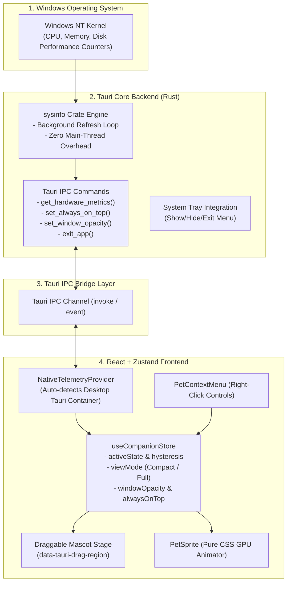

# 🎯 Task: Release 1.0.0 — The Hardware Desk Pet (Tauri Desktop Mascot)
- **Date**: 2026-08-30
- **Target Version**: `1.0.0` (SemVer 2.0.0 - Official Launch)
- **Status**: 🟢 Completed (100%)
- **Author/Owner**: Agent & User

---

## 1. 📌 Objective & Scope (เป้าหมายและขอบเขต)
ยกระดับ `lofi-bun-companion` จาก Web Showcase สู่ **Desktop Mascot Companion (.exe)** เต็มรูปแบบสำหรับ Windows ด้วย **Tauri Framework** ที่มีน้ำหนักเบา กินทรัพยากรต่ำมาก (<35MB RAM, ~0.0% CPU ตอน Idle)

### ฟีเจอร์หลักใน Release 1.0.0:
1. 🪟 **Frameless Transparent Floating Window**:
   - หน้าต่าง Mascot ไร้ขอบและโปร่งใส (Transparent, Frameless, Always-on-Top)
   - รองรับการคลิกลากย้ายตำแหน่งบนหน้าจอได้อย่างอิสระ (`data-tauri-drag-region` / Draggable Mascot)
   - รองรับ 2 มุมมอง:
     - **Compact Mascot Mode**: แสดงเฉพาะตัวน้องต่ายและ Mini Status Pill แบบโปร่งใส เหมาะสำหรับวางไว้บนเดสก์ท็อปขณะทำงาน
     - **Expanded Showcase Mode**: หน้าต่าง Dashboard เต็มรูปแบบพร้อม Hardware Control Sliders & Telemetry Debugger
2. 🖱️ **Desktop Native Interactions & Context Menu**:
   - คลิกขวา (Right Click) ที่ตัวน้องต่ายเพื่อเปิด Quick Context Menu ลอยตัว:
     - ⚡ Toggle Live Hardware Mode vs Manual Simulation
     - 💤 Toggle Rest / Lavender Nap Mode (Override State)
     - 👁️ ปรับ Window Opacity (100%, 80%, 60%, 40%)
     - 📌 Toggle Always-on-Top Pin
     - 🎛️ Toggle Compact Mascot vs Full Dashboard View
     - ❌ ปิดโปรแกรม (Exit Companion)
3. ⚡ **Native OS Telemetry Bridge (Rust/Tauri + sysinfo)**:
   - Rust Backend (`src-tauri`) อ่านค่า CPU, RAM, Disk I/O จริงของ Windows ผ่าน Crate `sysinfo`
   - IPC Command `get_hardware_metrics` ส่งข้อมูลกลับมายัง `NativeTelemetryProvider` อย่างแม่นยำ
   - Zero-overhead architecture: Rust polling บน background thread ปลอดภัย ไม่บล็อก UI rendering
4. 📦 **Windows Packaging & Desktop Readiness**:
   - โครงสร้าง `src-tauri` พร้อม `Cargo.toml`, `tauri.conf.json`, Build Icons
   - Fallback Web/Mock Mode สมบูรณ์แบบ 100% ทำให้สามารถรันและเทสบน Web Browser และ Vitest ได้อย่างราบรื่น
5. 🧪 **5-Pillar Automated Quality Gates (`npm run verify`)**:
   - ผ่านครบทั้ง 5 เสาหลัก: Linting, Formatting, Strict Typecheck, Vitest Unit Tests (100%), และ Production Build Bundle

---

## 2. 🗺️ Architecture & Tauri Bridge Flow



---

## 3. 🗂️ Target File Structure

```text
lofi-bun-companion/
├── src-tauri/                          # [NEW] Tauri Rust Desktop Mascot Core
│   ├── Cargo.toml                      # Tauri, serde, sysinfo dependencies
│   ├── tauri.conf.json                 # Transparent, frameless window & tray config
│   ├── build.rs                        # Tauri build script
│   ├── icons/                          # Application icons (ico, png)
│   └── src/
│       ├── main.rs                     # Tauri application entry & IPC registration
│       └── telemetry.rs                # Windows sysinfo hardware sampler
├── src/
│   ├── components/
│   │   ├── Desktop/                    # [NEW] Desktop Mascot UI Widgets
│   │   │   ├── PetContextMenu.tsx      # Right-click quick context menu
│   │   │   ├── PetContextMenu.module.css
│   │   │   ├── CompactMascotView.tsx   # Ultra-clean floating desk pet view
│   │   │   ├── CompactMascotView.module.css
│   │   │   ├── WindowHeader.tsx        # Frameless window controls (Pin, Expand, Close)
│   │   │   └── WindowHeader.module.css
│   │   ├── Controls/
│   │   │   └── MockMetricController.tsx
│   │   └── Pet/
│   │       └── PetSprite.tsx
│   ├── stores/
│   │   └── companionStore.ts           # Add viewMode, windowOpacity, isAlwaysOnTop
│   ├── telemetry/
│   │   ├── providers/
│   │   │   └── NativeTelemetryProvider.ts # Connect Tauri invoke('get_hardware_metrics')
│   │   └── types.ts
│   ├── types/
│   │   └── desktop.ts                  # [NEW] Desktop Mascot & Window types
│   ├── App.tsx                         # Support switching Compact Mascot vs Full Showcase
│   └── App.module.css
└── __tests__/
    ├── PetContextMenu.test.tsx         # [NEW] Context menu interactions test
    ├── CompactMascotView.test.tsx      # [NEW] Compact floating pet test
    └── NativeTelemetryProvider.test.ts # Updated Tauri IPC mock tests
```

---

## 4. 🛠️ Implementation Checklist

### 🔹 Phase 1: Desktop Domain Types & Store Extension
- [x] **Step 1.1 Desktop Types (`src/types/desktop.ts`)**:
  - กำหนด `ViewMode = 'COMPACT' | 'FULL'`
  - กำหนด `ContextMenuAction` และ `WindowOpacityOption`
- [x] **Step 1.2 Store State Expansion (`src/stores/companionStore.ts`)**:
  - เพิ่ม `viewMode: ViewMode` (Default: `FULL`)
  - เพิ่ม `windowOpacity: number` (0.4 - 1.0 clamped)
  - เพิ่ม `isAlwaysOnTop: boolean` (Default: `true`)
  - Action `setViewMode`, `toggleViewMode`, `setWindowOpacity`, `setAlwaysOnTop`, `toggleAlwaysOnTop`

---

### 🔹 Phase 2: Tauri IPC Bridge & Native Telemetry
- [x] **Step 2.1 Tauri Native Bridge (`src/telemetry/providers/NativeTelemetryProvider.ts`)**:
  - เสริมการเรียก `invoke('get_hardware_metrics')` เมื่อทำงานในสภาพแวดล้อม Tauri
  - รองรับ Graceful Fallback ไปยัง Simulation Stream ใน Web Browser/Vitest
- [x] **Step 2.2 Tauri Rust Core Setup (`src-tauri/`)**:
  - สร้าง `Cargo.toml`, `tauri.conf.json` พร้อม Frameless, Transparent Window Config
  - เขียน `src-tauri/src/telemetry.rs` เพื่อดึงค่า Real CPU/RAM/Disk ผ่าน `sysinfo`
  - ลงทะเบียน IPC Commands ใน `src-tauri/src/main.rs`

---

### 🔹 Phase 3: Desktop UI Components & Context Menu
- [x] **Step 3.1 Compact Mascot View (`src/components/Desktop/CompactMascotView.tsx`)**:
  - หน้าต่าง Floating Mascot กะทัดรัด ไร้ขอบ รองรับ Drag Region
  - มี Mini Floating HUD & State Glow Effect
- [x] **Step 3.2 Right-Click Context Menu (`src/components/Desktop/PetContextMenu.tsx`)**:
  - เมนูลอยตัวสไตล์ Glassmorphism เมื่อคลิกขวาที่ตัวน้องต่าย
  - ควบคุม State, Mode, Opacity, View Mode, Exit
- [x] **Step 3.3 Window Header & Quick Controls (`src/components/Desktop/WindowHeader.tsx`)**:
  - ปุ่ม Minimize, Pin Always-on-Top, Toggle Full Dashboard, Close

---

### 🔹 Phase 4: App Integration & Automated Quality Gates
- [x] **Step 4.1 Master App Switcher (`src/App.tsx`)**:
  - สลับการแสดงผลระหว่าง `CompactMascotView` และ `Full Showcase Dashboard` ได้อย่างลื่นไหล
- [x] **Step 4.2 Automated Unit & Integration Tests (`src/__tests__/`)**:
  - เพิ่ม Test Suites สำหรับ Desktop Widgets, Context Menu, Window States (15 test suites, 111 tests)
- [x] **Step 4.3 5-Pillar Quality Gate Verification**:
  - รัน `npm run verify` (Lint, Format, Typecheck, Test, Build) ผ่าน 100%
- [x] **Step 4.4 Documentation & Changelog**:
  - อัปเดต `CHANGELOG.md` สู่ `v1.0.0`
  - อัปเดต `README.md` และ Devlog ประจำวัน

