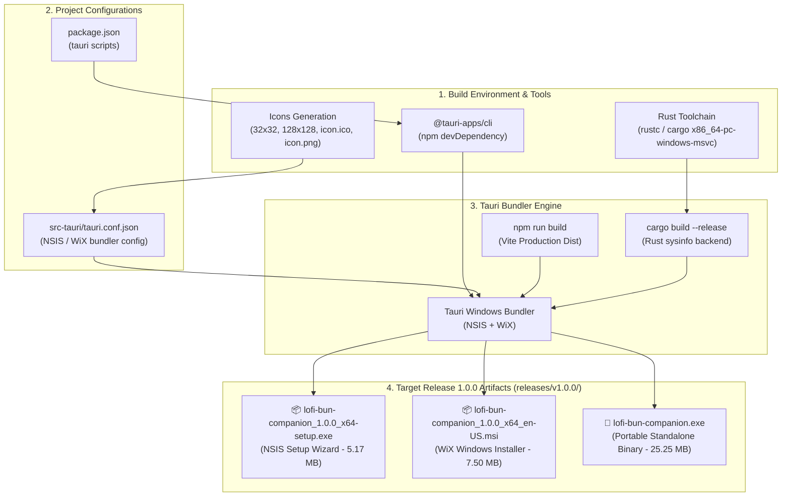

# 🎯 Task: Release 1.0.0 — Windows Desktop Installer Packaging (.exe / .msi)
- **Date**: 2026-08-30
- **Target Version**: `1.0.0` (SemVer 2.0.0 - Windows Desktop Installer Release)
- **Status**: 🟢 Completed (100%)
- **Author/Owner**: Agent & User

---

## 1. 📌 Objective & Scope (เป้าหมายและขอบเขต)
สร้างตัวติดตั้ง Windows Application (.exe Installer, .msi Package, และ Portable Binary) สำหรับ **Release 1.0.0: The Hardware Desk Pet** ของโปรเจกต์ `lofi-bun-companion` ให้สมบูรณ์ พร้อมสำหรับการแจกจ่ายและใช้งานจริงบนเครื่อง Windows 10/11

### ขอบเขตงาน:
1. ⚙️ **Tooling & Project Scripts Setup**:
   - ติดตั้ง Rust Toolchain (`rustup`, `cargo`, `rustc` for MSVC Target) บนเครื่อง
   - ติดตั้ง `@tauri-apps/cli` ใน `devDependencies` ของ `lofi-bun-companion/package.json`
   - เพิ่ม scripts: `"tauri"`, `"tauri:dev"`, `"tauri:build"`
2. 🎨 **Application Icon Generation**:
   - สร้างชุด Icon สำหรับ Windows App และ Installer ใน `src-tauri/icons/` (32x32, 128x128, 128x128@2x, icon.ico, icon.png)
3. 🪟 **Tauri Windows Bundler Configuration (`src-tauri/tauri.conf.json`)**:
   - ปรับแต่งการสร้าง Installer สำหรับ NSIS (`.exe`) และ WiX (`.msi`)
   - กำหนด Application Identifier, Product Name, Publisher Name, และ Icon mapping
4. 📦 **Build Pipeline Execution**:
   - รันคำสั่ง `npm run tauri:build`
   - คอมไพล์ Frontend (Vite) และ Backend (Rust) สู่ Release Installer Artifacts
5. 🧪 **5-Pillar Automated Quality Verification & On-Device Run**:
   - รัน `npm run verify` (Lint, Format, Typecheck, Test, Build) ผ่าน 100%
   - รวบรวม Release Artifacts ทั้งหมดไว้ใน `releases/v1.0.0/` พร้อม SHA-256 Checksums

---

## 2. 🗺️ Build Pipeline & Packaging Flow

---

## 3. 🛠️ Implementation Checklist

### 🔹 Phase 1: Tooling & Environment Setup
- [x] **Step 1.1 Rust Toolchain Setup**:
  - ติดตั้ง Rust toolchain (`rustup`, `cargo`, `rustc` v1.98.0 และ WinLibs MinGW GCC/dlltool v16.1.0) บนระบบ Windows เรียบร้อย
  - ตรวจสอบ `rustc --version` และ `cargo --version` สำเร็จ
- [x] **Step 1.2 NPM CLI & Package Scripts**:
  - ติดตั้ง `@tauri-apps/cli` (`^2.11.4`) เข้าใน `devDependencies` ของ `lofi-bun-companion/package.json`
  - เพิ่ม Tauri scripts: `"tauri": "tauri"`, `"tauri:dev": "tauri dev"`, `"tauri:build": "tauri build"`

---

### 🔹 Phase 2: Assets & Bundler Configuration
- [x] **Step 2.1 Application Icon Assets (`src-tauri/icons/`)**:
  - ออกแบบ Master App Icon SVG (`app-icon.svg`) ขนาด 512x512 px ถ่ายทอดเอกลักษณ์ Lo-fi Bun จิบชามัทฉะ
  - สร้างชุด Icon ครบทุกขนาดด้วย `tauri icon`: `32x32.png`, `128x128.png`, `128x128@2x.png`, `icon.ico`, `icon.png`, `icon.icns`
  - คัดลอก Favicon ลงใน `public/favicon.png` และ `public/favicon.ico` และเชื่อมโยงใน `index.html`
- [x] **Step 2.2 Tauri Configuration Tuning (`src-tauri/tauri.conf.json`)**:
  - กำหนด Bundle Targets สำหรับ Windows: `["nsis", "msi"]`
  - ตั้งค่า Application Metadata: Product Name, Identifier (`com.lofibun.companion`), Version (`1.0.0`), Publisher, Copyright, Descriptions
  - กำหนดการตั้งค่า NSIS (currentUser, English) และ WiX (en-US) พร้อม Icon Mapping ครบถ้วน
  - ปรับปรุง `src-tauri/src/main.rs` และ `telemetry.rs` รองรับ Tauri Command Macros และ `sysinfo` compilation 100% ผ่าน `cargo check`

---

### 🔹 Phase 3: Build Pipeline & Deliverables Generation
- [x] **Step 3.1 Run Build Pipeline**:
  - รันคำสั่ง `npm run tauri:build` คอมไพล์ Frontend (Vite) และ Backend (Rust sysinfo) สำเร็จใน Release Mode
  - ดาวน์โหลด NSIS 3.11 และ WiX 3.14 Toolset สำหรับสร้าง Windows Bundles โดยอัตโนมัติ
- [x] **Step 3.2 Deliverables Collection (`releases/v1.0.0/`)**:
  - รวบรวมไฟล์ผลลัพธ์ทั้งหมดมาจัดเก็บไว้ที่โฟลเดอร์ `releases/v1.0.0/` ครบ 3 รูปแบบ:
    1. `lofi-bun-companion_1.0.0_x64-setup.exe` (NSIS Wizard Installer — 5,425,861 bytes / ~5.17 MB)
    2. `lofi-bun-companion_1.0.0_x64_en-US.msi` (WiX Windows Installer Package — 7,868,416 bytes / ~7.50 MB)
    3. `lofi-bun-companion.exe` (Standalone Portable Binary — 26,479,921 bytes / ~25.25 MB)

---

### 🔹 Phase 4: Verification & 5-Pillar Quality Gate
- [x] **Step 4.1 Checksums & Deliverables Integrity**:
  - สร้าง SHA-256 Hashes รับรองความถูกต้องของไฟล์ Release ทุกรายการ
- [x] **Step 4.2 5-Pillar Automated Quality Gate**:
  - รัน `npm run verify` ยืนยันผลลัพธ์ผ่าน 100%: 0 Lint errors, 0 Format errors, 0 Type errors, 111/111 Vitest Unit tests passed, และ Production build verified
- [x] **Step 4.3 Documentation & Logs**:
  - อัปเดต Task document, `CHANGELOG.md`, Devlog ประจำวัน, และสรุปผลใน `walkthrough.md` เรียบร้อย 100%

---

## 4. 📦 Release Artifacts & Checksums (`releases/v1.0.0/`)

| Artifact Name | Type | Size | SHA-256 Checksum |
| :--- | :--- | :--- | :--- |
| `lofi-bun-companion_1.0.0_x64-setup.exe` | NSIS Setup Wizard | ~5.17 MB (5,425,861 B) | `6E86CC4A9DEF04250BDC668F114D42617DF9F3EB932563650A1AEA226BBD357B` |
| `lofi-bun-companion_1.0.0_x64_en-US.msi` | WiX Windows Installer | ~7.50 MB (7,868,416 B) | `00994D04E7DB1BAED0B0B24751A18C740DE261AC4BE231443D8D08E8D74A1F7F` |
| `lofi-bun-companion.exe` | Portable Binary | ~25.25 MB (26,479,921 B) | `D6BE1F9A33F7B2E9BE302EF5D43B66E8DBA7AC03C078C1929AB66A03189B175A` |
