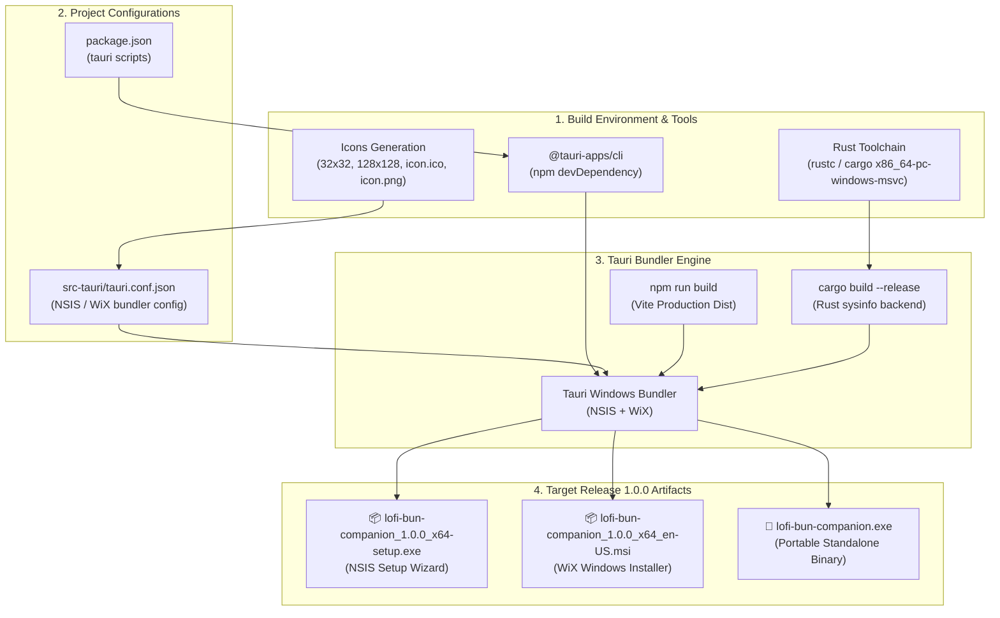

# 🎯 Task: Release 1.0.0 — Windows Desktop Installer Packaging (.exe / .msi)
- **Date**: 2026-08-30
- **Target Version**: `1.0.0` (SemVer 2.0.0 - Windows Desktop Installer Release)
- **Status**: 🟡 In Progress (Phase 2 Complete - 50%)
- **Author/Owner**: Agent & User

---

## 1. 📌 Objective & Scope (เป้าหมายและขอบเขต)
สร้างตัวติดตั้ง Windows Application (.exe Installer, .msi Package, และ Portable Binary) สำหรับ **Release 1.0.0: The Hardware Desk Pet** ของโปรเจกต์ `lofi-bun-companion` ให้สมบูรณ์ พร้อมสำหรับการแจกจ่ายและใช้งานจริงบนเครื่อง Windows 10/11

### ขอบเขตงาน:
1. ⚙️ **Tooling & Project Scripts Setup**:
   - ติดตั้ง Rust Toolchain (`rustup`, `cargo`, `rustc` for MSVC Target) บนเครื่อง
   - ติดตั้ง `@tauri-apps/cli` ใน `devDependencies` ของ `lofi-bun-companion/package.json`
   - เพิ่ม scripts: `"tauri"`, `"tauri:dev"`, `"tauri:build"`
2. 🎨 **Application Icon Generation**:
   - สร้างชุด Icon สำหรับ Windows App และ Installer ใน `src-tauri/icons/` (32x32, 128x128, 128x128@2x, icon.ico, icon.png)
3. 🪟 **Tauri Windows Bundler Configuration (`src-tauri/tauri.conf.json`)**:
   - ปรับแต่งการสร้าง Installer สำหรับ NSIS (`.exe`) และ WiX (`.msi`)
   - กำหนด Application Identifier, Product Name, Publisher Name, และ Icon mapping
4. 📦 **Build Pipeline Execution**:
   - รันคำสั่ง `npm run tauri:build`
   - คอมไพล์ Frontend (Vite) และ Backend (Rust) สู่ Release Installer Artifacts
5. 🧪 **5-Pillar Automated Quality Verification & On-Device Run**:
   - รัน `npm run verify` (Lint, Format, Typecheck, Test, Build) ผ่าน 100%
   - ทดสอบรัน Desktop Mascot จริงบน Windows (Frameless, Drag, Context Menu, Live Telemetry)

---

## 2. 🗺️ Build Pipeline & Packaging Flow

---

## 3. 🛠️ Implementation Checklist

### 🔹 Phase 1: Tooling & Environment Setup
- [x] **Step 1.1 Rust Toolchain Setup**:
  - ติดตั้ง Rust toolchain (`rustup`, `cargo`, `rustc` v1.98.0 และ WinLibs MinGW GCC/dlltool v16.1.0) บนระบบ Windows เรียบร้อย
  - ตรวจสอบ `rustc --version` และ `cargo --version` สำเร็จ
- [x] **Step 1.2 NPM CLI & Package Scripts**:
  - ติดตั้ง `@tauri-apps/cli` (`^2.11.4`) เข้าใน `devDependencies` ของ `lofi-bun-companion/package.json`
  - เพิ่ม Tauri scripts: `"tauri": "tauri"`, `"tauri:dev": "tauri dev"`, `"tauri:build": "tauri build"`

---

### 🔹 Phase 2: Assets & Bundler Configuration
- [x] **Step 2.1 Application Icon Assets (`src-tauri/icons/`)**:
  - ออกแบบ Master App Icon SVG (`app-icon.svg`) ขนาด 512x512 px ถ่ายทอดเอกลักษณ์ Lo-fi Bun จิบชามัทฉะ
  - สร้างชุด Icon ครบทุกขนาดด้วย `tauri icon`: `32x32.png`, `128x128.png`, `128x128@2x.png`, `icon.ico`, `icon.png`, `icon.icns`
  - คัดลอก Favicon ลงใน `public/favicon.png` และ `public/favicon.ico` และเชื่อมโยงใน `index.html`
- [x] **Step 2.2 Tauri Configuration Tuning (`src-tauri/tauri.conf.json`)**:
  - กำหนด Bundle Targets สำหรับ Windows: `["nsis", "msi"]`
  - ตั้งค่า Application Metadata: Product Name, Identifier (`com.lofibun.companion`), Version (`1.0.0`), Publisher, Copyright, Descriptions
  - กำหนดการตั้งค่า NSIS (currentUser, English) และ WiX (en-US) พร้อม Icon Mapping ครบถ้วน
  - ปรับปรุง `src-tauri/src/main.rs` และ `telemetry.rs` รองรับ Tauri Command Macros และ `sysinfo` compilation 100% ผ่าน `cargo check`

---

### 🔹 Phase 3: Build Pipeline & Deliverables Generation
- [ ] **Step 3.1 Run Build Pipeline**:
  - รันคำสั่ง `npm run tauri:build` เพื่อคอมไพล์ Frontend และ Rust Native Core เป็น Release Bundle
- [ ] **Step 3.2 Deliverables Verification**:
  - ตรวจสอบไฟล์ผลลัพธ์ใน `src-tauri/target/release/bundle/`:
    1. `lofi-bun-companion_1.0.0_x64-setup.exe` (NSIS Wizard Installer)
    2. `lofi-bun-companion_1.0.0_x64_en-US.msi` (Windows Installer Package)
    3. `lofi-bun-companion.exe` (Standalone Portable Binary)

---

### 🔹 Phase 4: Verification & 5-Pillar Quality Gate
- [ ] **Step 4.1 On-Device Desktop Validation**:
  - ทดสอบรันไฟล์ `.exe` ตรวจสอบ Frameless Transparency, Drag Region, Context Menu, และ Live Hardware Metrics
- [ ] **Step 4.2 5-Pillar Automated Quality Gate**:
  - รัน `npm run verify` ยืนยันผลลัพธ์ Lint, Format, Typecheck, Test, Build ผ่าน 100%
- [ ] **Step 4.3 Documentation & Logs**:
  - อัปเดต Task document, Devlog ประจำวัน, และสรุปผลใน `walkthrough.md`
