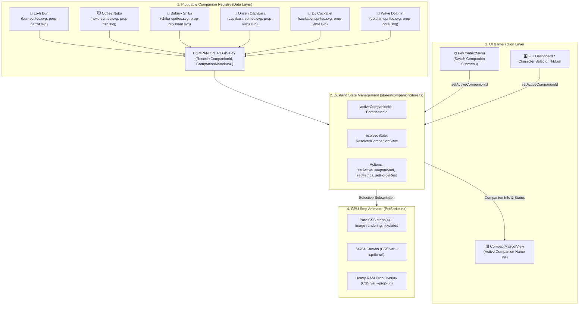

# 🎯 Task: Release 1.1.0 — Bun & Friends Multiverse (Character Expansion 🐾)

- **Date**: 2026-08-30
- **Target Version**: `1.1.0` (SemVer 2.0.0 — Minor Feature Release)
- **Branch**: `dev-feat/1.1.0-friends-multiverse`
- **Status**: 🟡 In Planning / Ready for Implementation
- **Author/Owner**: Antigravity & User

---

## 1. 📌 Objective & Scope (เป้าหมายและขอบเขต)

ขยายจักรวาลของ **Lo-fi Bun Companion** สู่ระบบ **Pluggable Companion Multiverse** โดยเปิดให้ผู้ใช้สามารถสลับเพื่อนร่วมโต๊ะทำงานได้ 6 ตัวละคร (Lo-fi Bun + 5 ตัวละครใหม่) ผ่านทั้ง **Desktop Context Menu (Quick Switcher)** และ **Full Dashboard Selector** โดยยังคงรักษาปรัชญา **Zero-Overhead Budget** (<35MB RAM, CPU ~0.0% ตอน Idle) และ **Universal 6-State Animation Contract**

### 🐾 ตัวละครทั้งหมดใน Roster 1.1.0

| ตัวละคร | ID | Signature Prop | Prop Asset | Sprite Asset |
| :--- | :--- | :--- | :--- | :--- |
| 🐰 **Lo-fi Bun** | `bun` | กองแครอท 3 หัว | `prop-carrot.svg` | `bun-sprites.svg` ✅ |
| 🐱 **Coffee Neko** | `neko` | กองปลาทูย่าง 3 ตัว | `prop-fish.svg` | `neko-sprites.svg` |
| 🐶 **Bakery Shiba** | `shiba` | คอนโดครัวซองต์ 4 ชิ้น | `prop-croissant.svg` | `shiba-sprites.svg` |
| 🍊 **Onsen Capybara** | `capybara` | กองส้มยูซุ 5 ผล | `prop-yuzu.svg` | `capybara-sprites.svg` |
| 🦜 **DJ Cockatiel** | `cockatiel` | กองแผ่นเสียงไวนิล 4 แผ่น | `prop-vinyl.svg` | `cockatiel-sprites.svg` |
| 🐬 **Wave Dolphin** | `dolphin` | ปะการัง & หอยมุก | `prop-coral.svg` | `dolphin-sprites.svg` |

---

## 2. 🗺️ Pluggable Architecture & Data Flow

---

## 3. 📋 Phased Implementation Checklist

> **Definition of Done (DoD) รวม**: งานในแต่ละ Phase ถือว่า Done ก็ต่อเมื่อ:
> 1. Code ตรงตาม Acceptance Criteria ของ Phase นั้น
> 2. `npm run verify` ผ่าน 100% (0 Lint errors, 0 Type errors, 0 Prettier issues, 0 Test failures, Build Success)
> 3. ไม่มีการ Regression บน Test Suite ที่มีอยู่เดิม

---

### Phase 1: Data Registry & Type Enhancements 🗂️

**เป้าหมาย**: สร้าง Single Source of Truth สำหรับ Companion metadata ทั้งหมด โดยไม่ต้องแก้ไข Renderer เมื่อเพิ่มตัวละครใหม่ (Pluggable)

#### Checklist

- [x] **[P1-1]** สร้าง `src/data/companionRegistry.ts` — Pluggable Companion Registry
  - ประกาศ `COMPANION_REGISTRY: Record<CompanionId, CompanionMetadata>`
  - รวม metadata ครบ 6 ตัวละคร: `id`, `displayName`, `emoji`, `role`, `spriteUrl`, `propUrl`, `animationDurations`
  - Export helper: `getCompanion(id: CompanionId): CompanionMetadata`
  - Export helper: `getAllCompanions(): CompanionMetadata[]`

- [x] **[P1-2]** อัปเดต `src/types/companion.ts` — Extended Type Contracts
  - เพิ่ม `CompanionId = 'bun' | 'neko' | 'shiba' | 'capybara' | 'cockatiel' | 'dolphin'`
  - เพิ่ม `AnimationDurations` type: `{ idle: number; focus: number; frenzy: number; disk: number; rest: number }`
  - อัปเดต `CompanionMetadata` ให้มี: `id: CompanionId`, `displayName: string`, `emoji: string`, `role: string`, `spriteUrl: string`, `propUrl: string`, `animationDurations: AnimationDurations`

- [x] **[P1-3]** อัปเดต `src/stores/companionStore.ts` — Active Companion State
  - เปลี่ยน `activeCompanionId` type จาก `string` เป็น `CompanionId`
  - ตรวจสอบว่า `setActiveCompanionId(id: CompanionId)` ทำงานถูกต้อง
  - เพิ่ม selector helper `useActiveCompanionMetadata()` ที่ดึง metadata จาก Registry ตาม `activeCompanionId`

#### Acceptance Criteria (Phase 1)

- `COMPANION_REGISTRY` มีข้อมูลครบ 6 entries — `Object.keys(COMPANION_REGISTRY).length === 6`
- TypeScript `tsc --noEmit` ผ่าน 0 errors กับ `CompanionId` union type ใหม่
- `getCompanion('bun')` คืนค่า metadata ที่มี `spriteUrl` ถูกต้อง และ `animationDurations.idle === 800`
- Invalid ID (เช่น `'invalid' as any`) ถูกจับผิดโดย TypeScript Compiler ก่อน Runtime

---

### Phase 2: Vector Pixel Art Assets & Spritesheets 🎨

**เป้าหมาย**: สร้าง SVG Spritesheet และ Prop Overlay ครบ 5 ตัวละครใหม่ตามมาตรฐาน **Universal 6-State Contract**

> **Asset Standard**:
> - Spritesheet: `256 x 320 px` (4 Frames x 5 States, 64px per frame)
> - Prop Overlay: `64 x 64 px` (2-frame bob/spin animation)
> - Outline: 1-pixel Dark tone outline บน Transparent background
> - Palette Budget: 16–24 สีต่อตัวละคร

#### Checklist

- [x] **[P2-1]** สร้าง `src/assets/sprites/neko-sprites.svg` (256x320 px)
  - Row 0 `IDLE` 800ms: นั่งกอดแก้วกาแฟ ควันลอยกรุ่น หางแกว่ง
  - Row 1 `FOCUS` 600ms: รัวอุ้งมือกดคีย์บอร์ดแจ๊ส 2 ข้าง
  - Row 2 `FRENZY` 300ms: หูพับ Airplane ears รัวอุ้งมือสปีดสูง เม็ดเหงื่อ
  - Row 3 `DISK` 400ms: สองอุ้งมือข่วนกล่องพัสดุรัว เศษกระดาษฟุ้ง
  - Row 4 `REST` 1000ms: ขดตัวกลมในกล่องพัสดุ หางพันรอบตัว
  - Colors: `NEKO_ORANGE #FF9E4A`, `APRON_MOCHA #5C3D2E`, `EYE_EMERALD #4E9F3D`

- [x] **[P2-2]** สร้าง `src/assets/sprites/prop-fish.svg` (64x64 px, 2-frame bob)
  - กองปลาทูย่าง 3 ตัวซ้อนกัน ดุ๊กดิ๊กตามจังหวะท่าทางหลัก

- [x] **[P2-3]** สร้าง `src/assets/sprites/shiba-sprites.svg` (256x320 px)
  - Row 0 `IDLE` 800ms: กอดก้อนแป้ง หมวกเชฟเอียง หางม้วนแกว่ง
  - Row 1 `FOCUS` 600ms: นวดกดแป้งโดว์เข้าจังหวะ 2 มือขึ้นลง
  - Row 2 `FRENZY` 300ms: นวดแป้งจนฟุ้ง ตาหยีสู้ตาย ควันจากเตาอบ
  - Row 3 `DISK` 400ms: สองขาหน้าตะกุยขุดกระสอบแป้ง หูตั้งตรง
  - Row 4 `REST` 1000ms: นอนแผ่สองสลึง หมวกเชฟหลุดปิดตา ท้องกระเพื่อม
  - Colors: `SHIBA_GOLD #E5A953`, `SHIBA_CREAM #FFF4E0`, `HAT_WHITE #FFFFFF`

- [x] **[P2-4]** สร้าง `src/assets/sprites/prop-croissant.svg` (64x64 px, 2-frame bob)
  - คอนโดครัวซองต์เนยสด 4 ชิ้นซ้อนกันสูงโยกเยก

- [x] **[P2-5]** สร้าง `src/assets/sprites/capybara-sprites.svg` (256x320 px)
  - Row 0 `IDLE` 800ms: นั่งแช่น้ำในอ่างไม้ ส้มยูซุบนหัวนิ่ง ไอน้ำลอยเอื่อย
  - Row 1 `FOCUS` 600ms: กะพริบตาทีละข้างอย่างมีสติ ใบไม้ลอยวนตามผิวน้ำ
  - Row 2 `FRENZY` 300ms: น้ำในอ่างเดือดปุดๆ ส้มหมุนติ้ว หน้าตายังนิ่งสงบ Zen
  - Row 3 `DISK` 400ms: ขยับปากเคี้ยวแทะกิ่งไม้รัวๆ ตาหยี่มีความสุข
  - Row 4 `REST` 1000ms: จมตัวลงในน้ำ เหลือแต่จมูกกับส้มยูซุ หลับตาพริ้ม
  - Colors: `CAPY_BROWN #8C6239`, `YUZU_YELLOW #FFD13B`, `SPRING_AQUA #8BD3DD`

- [x] **[P2-6]** สร้าง `src/assets/sprites/prop-yuzu.svg` (64x64 px, 2-frame bob)
  - กองส้มยูซุ 5 ผล ลอยละล่องเหนือน้ำเหนือหัวตัวละคร

- [ ] **[P2-7]** สร้าง `src/assets/sprites/cockatiel-sprites.svg` (256x320 px)
  - Row 0 `IDLE` 800ms: ยืนโยกหัวเบาๆ หงอนขนพริ้วขึ้นลงตามจังหวะ
  - Row 1 `FOCUS` 600ms: สวมหูฟัง จะงอยปากและเท้าเคาะแผ่นไวนิลสร้างบีท
  - Row 2 `FRENZY` 300ms: Extreme Headbang แผ่นเสียงหมุนไฟแลบ โน้ตดนตรีลอยฟุ้ง
  - Row 3 `DISK` 400ms: จะงอยปากจิกแทะเมล็ดทานตะวันรัว สะบัดเปลือกฟุ้งกระจาย
  - Row 4 `REST` 1000ms: ซุกหน้าเก็บจะงอยปากเข้าในขนปีก หลับตานิ่งบนคอนไม้
  - Colors: `TIEL_GREY #9E9E9E`, `TIEL_YELLOW #FFF176`, `TIEL_ORANGE #FF7043`, `GEAR_TEAL #4DB6AC`

- [ ] **[P2-8]** สร้าง `src/assets/sprites/prop-vinyl.svg` (64x64 px, 2-frame spin)
  - กองแผ่นเสียงไวนิล 4 แผ่นซ้อนกัน หมุนเล็กน้อย Groove animation

- [ ] **[P2-9]** สร้าง `src/assets/sprites/dolphin-sprites.svg` (256x320 px)
  - Row 0 `IDLE` 800ms: ลอยตัวนิ่งบนผิวน้ำ ครีบขยับ ฟองอากาศหัวใจลอยขึ้นช้าๆ
  - Row 1 `FOCUS` 600ms: แหวกว่ายเป็นวงกลมราบรื่น Flow State คลื่นน้ำพลิ้วไหว
  - Row 2 `FRENZY` 300ms: กระโดดหมุน 360 องศา พุ่งเหนือน้ำ ละอองน้ำแตกกระจายเร็ว
  - Row 3 `DISK` 400ms: เปล่งคลื่นโซนาร์วงแหวนเรืองแสงฟ้านวลกระจายรอบทิศทางรัว
  - Row 4 `REST` 1000ms: หลับตา ลอยนิ่งบนห่วงยางเป็ดเหลือง ฟองอากาศลอยแตกเบาๆ
  - Colors: `OCEAN_BLUE #4EA8DE`, `BELLY_WHITE #F0F8FF`, `BUBBLE_AQUA #90E0EF`, `CORAL_PINK #FF8FAB`

- [ ] **[P2-10]** สร้าง `src/assets/sprites/prop-coral.svg` (64x64 px, 2-frame bob)
  - กิ่งปะการังสีชมพูและหอยมุกหลากสี วางเรียงรายบนหัวโลมา

#### Acceptance Criteria (Phase 2)

- SVG Spritesheet มี `viewBox="0 0 256 320"` และ Prop มี `viewBox="0 0 64 64"` ถูกต้องทุกไฟล์
- Frame Grid: แต่ละ State Row ครอบคลุม 4 Frames เรียงแนวนอน (256px รวม)
- `image-rendering: pixelated` มีผลชัดเจนเมื่อ Scale ขึ้น 2x–4x
- Prop Overlay วางซ้อนบนหัวตัวละครแล้ว ไม่บดบัง Face Expression ของ State หลัก
- ทุก Sprite ผ่าน Eye Test ใน Character Gallery HTML Preview

---

### Phase 3: PetSprite GPU Renderer (Dynamic Companion) ⚡

**เป้าหมาย**: อัปเดต `PetSprite.tsx` ให้รองรับการสลับตัวละครแบบ Dynamic โดยไม่มี Re-render ที่ไม่จำเป็น

#### Checklist

- [ ] **[P3-1]** อัปเดต `src/components/Pet/PetSprite.tsx` — Dynamic Sprite Loader
  - อ่าน `activeCompanionId` จาก `useCompanionStore` ด้วย Selective Subscription
  - เรียก `getCompanion(activeCompanionId)` จาก Registry เพื่อดึง `spriteUrl`, `propUrl`, และ `animationDurations`
  - คำนวณ CSS `animation-duration` แบบ Dynamic จาก `animationDurations[resolvedState.activeState]`

- [ ] **[P3-2]** อัปเดต CSS Module (`PetSprite.module.css`) สำหรับ Dynamic Background
  - ลบ Hardcoded `bun-sprites.svg` URL ออกจาก CSS
  - ใช้ CSS Custom Properties `--sprite-url` และ `--prop-url` ที่ Set ผ่าน TSX inline `style` prop
  - Pattern: `.sprite { background-image: var(--sprite-url); image-rendering: pixelated; }`

- [ ] **[P3-3]** ตรวจสอบว่า Prop Overlay สลับ `propUrl` ตามตัวละครที่เลือกอย่างถูกต้อง
  - แสดง Prop เมื่อ `resolvedState.isHeavyRam === true` เท่านั้น
  - ซ่อน Prop เมื่อ RAM กลับมาปกติ (<80%)

- [ ] **[P3-4]** (Optional) เพิ่ม Smooth Companion Transition
  - CSS `opacity` fade-out/fade-in 150ms เมื่อ `activeCompanionId` เปลี่ยน
  - ป้องกัน Frame Flash ระหว่างการโหลด Sprite ใหม่

#### Acceptance Criteria (Phase 3)

- สลับตัวละครใน Store → Sprite เปลี่ยนทันทีโดยไม่ต้อง Reload หน้า
- Animation timing ตรงตาม spec: `IDLE=800ms`, `FOCUS=600ms`, `FRENZY=300ms`, `DISK=400ms`, `REST=1000ms`
- Prop Overlay ปรากฏ/หายไปตาม `isHeavyRam` flag อย่างถูกต้องสำหรับทุกตัวละคร
- CPU usage ยังคง 0.0% บน Idle (ตรวจสอบผ่าน Browser DevTools Performance tab)
- ไม่มี `console.error` หรือ React Warning ขณะสลับตัวละคร

---

### Phase 4: UI Companion Switcher 🎛️

**เป้าหมาย**: ให้ผู้ใช้สลับตัวละครได้จาก 2 จุด — Context Menu (Quick Switch) และ Full Dashboard (Visual Selector Ribbon)

#### Checklist

- [ ] **[P4-1]** อัปเดต `src/components/Desktop/PetContextMenu.tsx` — Switch Companion Submenu
  - เพิ่มหมวด **🐾 Switch Companion** เป็น Submenu ใหม่ใน Context Menu
  - แสดงรายการตัวละคร 6 ตัวจาก `getAllCompanions()` พร้อม Emoji + Display Name
  - แสดง Active Radio Indicator (●) หน้าตัวละครที่กำลังใช้งานอยู่
  - เรียก `setActiveCompanionId(id)` เมื่อผู้ใช้คลิกเลือก และปิด Menu อัตโนมัติ

- [ ] **[P4-2]** อัปเดต Full Dashboard (`src/App.tsx`) — Character Selector Ribbon
  - เพิ่ม Character Selector Ribbon/Tab Row ด้านบน Dashboard
  - แสดง Card ขนาดเล็กของแต่ละตัวละคร (Emoji + Name + Role snippet)
  - Highlight / Active Border บน Card ของตัวละครที่ Active อยู่
  - เรียก `setActiveCompanionId(id)` เมื่อกด Card

- [ ] **[P4-3]** อัปเดต `src/components/Desktop/CompactMascotView.tsx` — Active Companion Pill
  - แสดง Companion Name Pill (เช่น `🐰 Lo-fi Bun`) ใต้ตัวละคร หรือแสดงเมื่อ Hover
  - Pill อัปเดต Reactive ตาม `activeCompanionId` จาก Store

#### Acceptance Criteria (Phase 4)

- Context Menu Submenu แสดง 6 ตัวละครถูกต้อง พร้อม Active Indicator บนตัวที่เลือก
- กด Companion ใน Context Menu → ตัวละครบน `CompactMascotView` สลับทันที (<100ms latency)
- Full Dashboard Character Ribbon แสดง Card ทั้ง 6 ตัว Active State ไฮไลต์ถูกต้อง
- `CompactMascotView` แสดงชื่อตัวละคร Active อย่างถูกต้อง
- UI ไม่มี Layout Shift หรือ Flicker เมื่อสลับตัวละคร

---

### Phase 5: Vitest Test Suites & 5-Pillar Quality Gate 🧪

**เป้าหมาย**: รับประกันว่าทุกส่วนของระบบ Multiverse ทำงานถูกต้อง และไม่ทำให้ Test เดิมพัง

#### Checklist

- [ ] **[P5-1]** สร้าง `src/__tests__/companionRegistry.test.ts` — Registry Integrity Tests
  - `COMPANION_REGISTRY` มีครบ 6 entries: `bun`, `neko`, `shiba`, `capybara`, `cockatiel`, `dolphin`
  - ทุก entry มี field ครบ: `id`, `displayName`, `emoji`, `role`, `spriteUrl`, `propUrl`, `animationDurations`
  - `animationDurations` ตรงตาม Universal Contract: `idle=800, focus=600, frenzy=300, disk=400, rest=1000`
  - `spriteUrl` และ `propUrl` ไม่ใช่ empty string
  - `getCompanion('bun')` คืนค่าที่ถูกต้อง / `getAllCompanions()` คืน Array 6 items

- [ ] **[P5-2]** อัปเดต `src/__tests__/companionStore.test.ts` — Companion Switcher Tests
  - `setActiveCompanionId('neko')` → `activeCompanionId` เปลี่ยนเป็น `'neko'`
  - Default `activeCompanionId` คือ `'bun'`
  - `resetToDefaults()` คืน `activeCompanionId` กลับเป็น `'bun'`

- [ ] **[P5-3]** อัปเดต `src/__tests__/PetSprite.test.tsx` — Dynamic Renderer Tests
  - เมื่อ `activeCompanionId = 'neko'` → CSS var `--sprite-url` ชี้ไปที่ `neko-sprites.svg`
  - เมื่อ `isHeavyRam = true` → Prop Overlay ปรากฏ และ `--prop-url` ถูกต้อง
  - เมื่อ `isHeavyRam = false` → Prop Overlay ซ่อน (not visible)

- [ ] **[P5-4]** อัปเดต `src/__tests__/PetContextMenu.test.tsx` — Switcher UI Tests
  - Context Menu แสดง Switch Companion Submenu ที่มีรายการ 6 ตัวละคร
  - คลิกเลือก `shiba` → `setActiveCompanionId('shiba')` ถูกเรียก 1 ครั้ง
  - Active Indicator (●) แสดงบน Companion ที่ตรงกับ `activeCompanionId` ปัจจุบัน

- [ ] **[P5-5]** รัน 5-Pillar Quality Gate ให้ผ่าน 100%
  - [ ] `npm run lint` — 0 errors, 0 warnings
  - [ ] `npm run format:check` — Prettier 100% matched
  - [ ] `npm run typecheck` — `tsc --noEmit` 0 errors
  - [ ] `npm test` — Vitest All suites pass, 0 failures (Test count >= 130+)
  - [ ] `npm run build` — Vite Production Bundle built successfully

#### Acceptance Criteria (Phase 5)

- Test Coverage ครอบคลุมทุก Public API ของ `companionRegistry.ts`
- ไม่มี Test Regression จาก 111 Tests เดิม (ก่อนหน้า Milestone 1.0.0)
- `npm run verify` ผ่าน 100% ทุก Gate ด้วย Exit Code 0

---

## 4. 🛡️ Master Acceptance Criteria & Definition of Done (DoD)

### Functional Requirements

- [ ] สลับตัวละครทั้ง 6 ตัวได้อย่างลื่นไหลจากทั้ง Context Menu และ Dashboard Ribbon
- [ ] ทุกตัวละครเล่นแอนิเมชัน 5 ท่า (`IDLE`, `FOCUS`, `FRENZY`, `DISK`, `REST`) ถูกต้อง 100%
- [ ] Prop Overlay (`HEAVY_RAM`) แสดงสิ่งของเฉพาะตัวของแต่ละ Companion อย่างถูกต้อง
- [ ] Companion Name Pill ใน `CompactMascotView` อัปเดตสอดคล้องกับตัวละคร Active

### Performance Requirements

- [ ] CPU 0.0% บน Idle mode — Pure CSS `steps()` animation ไม่มี JavaScript interval ขับเคลื่อน
- [ ] RAM < 35MB รวม Asset SVG ทั้ง 12 ไฟล์แล้ว
- [ ] Companion Switch Latency < 100ms (UI Response ไม่รู้สึก Lag)

### Quality Requirements

- [ ] `npm run verify` ผ่าน 100% ทุก 5 Gate ด้วย 0 errors
- [ ] Automated Test Count >= 130 tests (เพิ่มจาก 111 เดิม)
- [ ] ไม่มี TypeScript `any` ที่ไม่จำเป็น ใน Registry หรือ Renderer ใหม่
- [ ] ไม่มี `console.error` หรือ React Warning ใน Browser Console

### Documentation Requirements

- [ ] อัปเดต `CHANGELOG.md` บันทึก `[1.1.0]` release ตาม Keep a Changelog 1.1.0 format
- [ ] อัปเดต Character spec files สถานะ `🟡 Draft` -> `🟢 Specification Ready` หลัง Sprite สร้างเสร็จ
- [ ] บันทึก Devlog session ใน `non-docs/devlogs/2026-08/2026-08-30.md`

---

## 5. 🔗 Related Files & Specs

| ประเภท | ไฟล์ | หมายเหตุ |
| :--- | :--- | :--- |
| **Spec** | [characters/README.md](file:///c:/DevProjects/lofi_bun_companion/non-docs/specs/characters/README.md) | Universal 6-State Contract & Asset Standards |
| **Spec** | [version-roadmap.md](file:///c:/DevProjects/lofi_bun_companion/non-docs/specs/version-roadmap.md) | Milestone Release Context |
| **Spec** | [menu-navigation-spec.md](file:///c:/DevProjects/lofi_bun_companion/non-docs/specs/menu-navigation-spec.md) | Context Menu Architecture |
| **Character** | [character-design-bun.md](file:///c:/DevProjects/lofi_bun_companion/non-docs/specs/characters/character-design-bun.md) | 🐰 Lo-fi Bun (Flagship) |
| **Character** | [character-design-neko.md](file:///c:/DevProjects/lofi_bun_companion/non-docs/specs/characters/character-design-neko.md) | 🐱 Coffee Neko |
| **Character** | [character-design-shiba.md](file:///c:/DevProjects/lofi_bun_companion/non-docs/specs/characters/character-design-shiba.md) | 🐶 Bakery Shiba |
| **Character** | [character-design-capybara.md](file:///c:/DevProjects/lofi_bun_companion/non-docs/specs/characters/character-design-capybara.md) | 🍊 Onsen Capybara |
| **Character** | [character-design-cockatiel.md](file:///c:/DevProjects/lofi_bun_companion/non-docs/specs/characters/character-design-cockatiel.md) | 🦜 DJ Cockatiel |
| **Character** | [character-design-dolphin.md](file:///c:/DevProjects/lofi_bun_companion/non-docs/specs/characters/character-design-dolphin.md) | 🐬 Wave Dolphin |
| **Gallery** | [character-gallery.html](file:///c:/DevProjects/lofi_bun_companion/non-docs/specs/characters/character-gallery.html) | Interactive Pixel Art Preview Studio |

