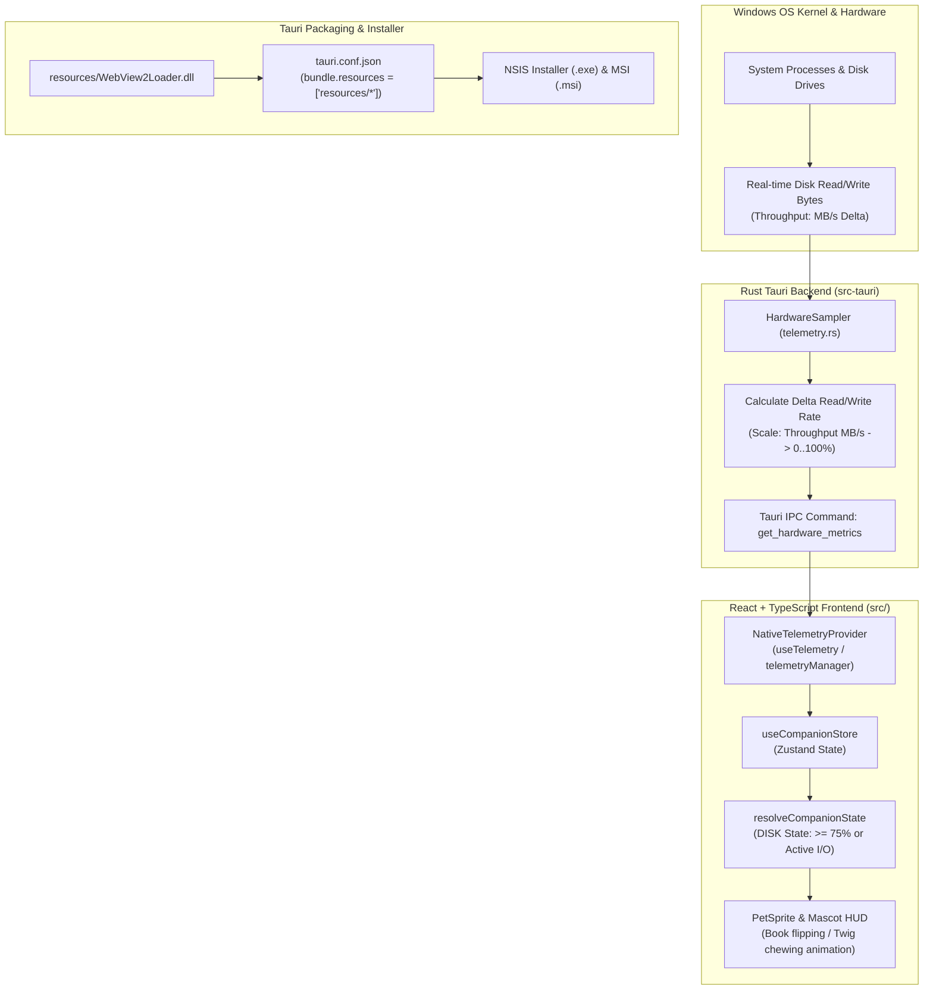

# 🎯 Task: Release 1.1.1 — Fix Real Disk I/O Activity & WebView2Loader.dll Bundle
- **Date**: 2026-08-31
- **Target Version**: `1.1.1` (SemVer 2.0.0 — Patch Release)
- **Status**: 🟢 Completed / Testing
- **Author/Owner**: Agent & User

---

## 1. 📌 Objective & Problem Statement (เป้าหมายและปัญหาที่พบ)

ในเวอร์ชัน `v1.1.0` ที่ผ่านมา มีรายงานบัคสำคัญ 2 จุดที่ต้องได้รับการแก้ไขใน Patch `v1.1.1`:

### ปัญหาที่ 1: การคำนวณ Disk Telemetry ผิดพลาด (Disk Capacity vs Disk I/O Activity)
- **Root Cause**: ใน `telemetry.rs` คำนวณ `disk_usage` จากเปอร์เซ็นต์พื้นที่จัดเก็บข้อมูลที่ถูกใช้ (Used Storage / Total Storage) เช่น ไดรฟ์เต็ม 60% ก็จะรายงาน 60% ตลอดเวลา ส่งผลให้หากผู้ใช้มีดิสก์ที่ใช้งานเกินเกณฑ์ หรือเปิดแอป ตัวกระต่าย/สัตว์เลี้ยงจะไม่สะท้อนการอ่าน/เขียนดิสก์จริง (Disk I/O Read/Write Activity) แต่จะค้างตามความจุของดิสก์
- **Solution**: ปรับแก้ `telemetry.rs` ให้อ่านและคำนวณปริมาณ Throughput การอ่าน/เขียนข้อมูลจริง (Total Read/Write Throughput per interval หรือ Process I/O Rate) แปลงเป็นสเกล 0–100% ให้ตรงกับพฤติกรรม Disk I/O Activity จริง พร้อมทั้งจูน State Resolver Threshold ให้ตอบสนองอย่างแม่นยำ

### ปัญหาที่ 2: ตัวติดตั้ง NSIS ขาดไฟล์ `WebView2Loader.dll`
- **Root Cause**: ตัวติดตั้ง NSIS ที่บิลด์ออกมาไม่รวม `WebView2Loader.dll` ทำให้อาจเปิดโปรแกรมไม่ได้บนเครื่อง Windows ที่ไม่มี DLL นี้อยู่ใน System PATH
- **Solution**: ย้าย/คัดลอก `WebView2Loader.dll` เข้าไปยัง `lofi-bun-companion/src-tauri/resources/` และกำหนดค่า `bundle.resources` ใน `tauri.conf.json` เพื่อให้ Tauri Bundler รวม DLL เข้าไปในโฟลเดอร์ติดตั้งของ NSIS โดยอัตโนมัติ

---

## 2. 🗺️ Architecture & Telemetry Pipeline Diagram



---

## 3. 🎯 Target File Modifications

```text
lofi-bun-companion/
├── package.json                              # Version bump to 1.1.1
├── src-tauri/
│   ├── Cargo.toml                            # Version bump to 1.1.1
│   ├── tauri.conf.json                       # Version bump to 1.1.1 & bundle.resources configuration
│   ├── resources/
│   │   └── WebView2Loader.dll                # Bundled native DLL dependency
│   └── src/
│       └── telemetry.rs                      # Disk I/O throughput rate calculation & test suite
└── src/
    └── utils/
        └── stateResolver.ts                  # Tuning / verifying thresholds & tests
```

---

## 4. 🛠️ Detailed Implementation Checklist

### 🔹 Phase 1: Git Branch & Environment Setup
- [x] ตรวจสอบ Git Status และสร้าง Branch `dev-fix/1.1.1-disk-io-and-installer` จาก `dev`

### 🔹 Phase 2: Fix Disk I/O Activity Calculation (`telemetry.rs`)
- [x] ปรับปรุง `HardwareSampler` ใน `telemetry.rs`:
  - บันทึกการอ่าน/เขียนข้อมูลจากกระบวนการ (Processes disk I/O read/write delta) ด้วย `sysinfo`
  - คำนวณอัตรา Data Transfer Rate (Throughput ในหน่วย MB/s)
  - แมปค่า Rate ให้เป็นสเกล 0–100% (50 MB/s saturation ceiling)
- [x] เพิ่ม Rust unit test suite (`telemetry::tests`) ตรวจสอบ Payload range, default value, และ camelCase serialization

### 🔹 Phase 3: Fix WebView2Loader.dll Packaging & Tauri Bundle Config
- [x] สร้างโฟลเดอร์ `lofi-bun-companion/src-tauri/resources/`
- [x] คัดลอก `WebView2Loader.dll` จาก `releases/v1.1.0/` ไปยัง `lofi-bun-companion/src-tauri/resources/`
- [x] เพิ่มการตั้งค่า `"resources": ["resources/WebView2Loader.dll"]` ใน `bundle` ของ `tauri.conf.json`

### 🔹 Phase 4: Version Bump & 5-Pillar Quality Gate Verification
- [x] ปรับเวอร์ชันเป็น `1.1.1` ใน:
  - `lofi-bun-companion/package.json`
  - `lofi-bun-companion/src-tauri/tauri.conf.json`
  - `lofi-bun-companion/src-tauri/Cargo.toml`
- [x] รัน 5-Pillar Quality Gates (`npm run verify`):
  - Linting (`eslint`) ผ่าน 0 warnings
  - Formatting (`prettier`) ผ่าน 100%
  - Typecheck (`tsc --noEmit`) ผ่าน 0 errors
  - Vitest Unit & Integration Tests (16 files / 138 tests ผ่าน 100%)
  - Web Production Build (`vite build`) ผ่านสมบูรณ์
- [x] บิลด์ Production Desktop Installer ด้วย `npm run tauri:build` และตรวจสอบผลลัพธ์ใน `src-tauri/target/release/bundle/nsis/`

---

## 5. ✅ Acceptance Criteria
- [x] ในโหมด Live Hardware Telemetry ค่า Disk Usage ตอบสนองต่อการอ่านเขียนข้อมูลจริง (Disk I/O) แทนที่จะค้างตามความจุฮาร์ดดิสก์
- [x] เมื่อมีการอ่านเขียนดิสก์ระดับสูง สัตว์เลี้ยงจะเปลี่ยนเป็นท่า DISK (เช่น กระต่ายเปิดสมุดพลิกหน้าเร็ว, คาปิบาร่าแทะกิ่งไม้เร็ว) อย่างถูกต้อง
- [x] ตัวติดตั้ง NSIS (`.exe`) มีไฟล์ `WebView2Loader.dll` แนบไปด้วยและสามารถติดตั้งและเปิดโปรแกรมได้ปกติ
- [x] 5-Pillar Automated Quality Gates (`npm run verify`) ผ่านครบ 100% (0 errors)
- [x] เวอร์ชันอัปเดตเป็น `1.1.1` ถูกต้องตามมาตรฐาน SemVer 2.0.0

