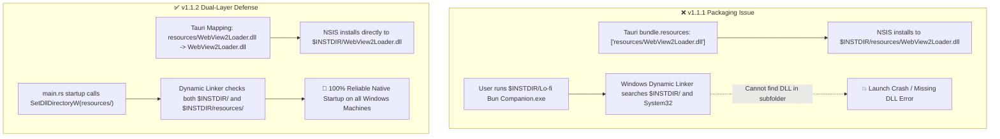

# 🎯 Task: Release 1.1.2 — Fix Windows WebView2Loader.dll Runtime Resolution & NSIS Packaging

- **Status**: 🟢 COMPLETED
- **Target Version**: `1.1.2` (SemVer Patch)
- **Branch**: `dev-fix/1.1.2-webview2loader-path`
- **Scope**: Tauri Bundler, NSIS Packaging, Native Windows DLL Search Path

---

## 📌 1. ปัญหาและสาเหตุ (Problem & Root Cause)

### รายละเอียดข้อผิดพลาด:
1. ในเวอร์ชัน 1.1.1 มีการกำหนด `resources: ["resources/WebView2Loader.dll"]` ซึ่ง Tauri Bundler นำไปวางไว้ใน `$INSTDIR/resources/WebView2Loader.dll`
2. ระบบปฏิบัติการ Windows มีลำดับการค้นหา DLL (Dynamic Link Library Search Order) โดยจะตรวจสอบที่ Directory ของ `.exe` และ System Paths แต่ไม่ค้นหาในโฟลเดอร์ย่อย `resources/`
3. ทำให้เครื่องที่ไม่ได้ติดตั้ง WebView2 Runtime แบบ System-wide หรือเครื่อง Standalone พบปัญหาไม่สามารถเริ่มทำงานได้

---

## 🛠️ 2. แผนการดำเนินงาน (Action Items)

### 🔹 Phase 1: Resource Mapping & Configuration Update
- [x] อัปเดตเวอร์ชัน `1.1.2` ใน `package.json`, `Cargo.toml`, `tauri.conf.json`
- [x] ปรับปรุงการตั้งค่า `bundle.resources` ใน `tauri.conf.json` เพื่อแมปไฟล์ไปยัง Root (`WebView2Loader.dll`)

### 🔹 Phase 2: Native Rust DLL Search Path Fallback
- [x] เพิ่ม Win32 `SetDllDirectoryW` FFI helper ใน `src-tauri/src/main.rs` ก่อน Tauri App Builder เริ่มทำงาน
- [x] ตรวจสอบว่าหากโฟลเดอร์ `resources` มีอยู่ จะลงทะเบียนเข้า DLL Search Path ของ Process ทันที

### 🔹 Phase 3: Verification & 5-Pillar Quality Gates
- [x] รัน `npm run verify` (ESLint, Prettier, TypeScript, Vitest, Vite Build) — ผ่าน 100% (138/138 tests)
- [x] ทดสอบบิลด์ Tauri ด้วย `cargo check` ใน `src-tauri/` — ผ่าน 0 errors

### 🔹 Phase 4: Documentation & Changelog
- [x] สร้าง Devlog `non-docs/devlogs/2026-09/2026-09-02.md`
- [x] อัปเดต `CHANGELOG.md` สำหรับเวอร์ชัน `1.1.2`
