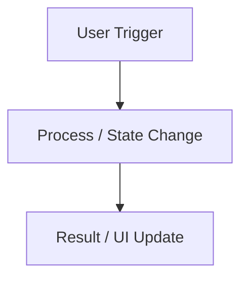

# 🎯 Task: [Task Name]
- **Date**: YYYY-MM-DD
- **Status**: [🟡 In Progress / 🟢 Completed / ⏸️ Paused]
- **Author/Owner**: Agent & User

---

## 1. 📌 Objective (เป้าหมาย)
สรุปสั้นๆ ว่า task นี้ทำอะไร เพื่ออะไร และขอบเขตงานครอบคลุมแค่ไหน

---

## 2. 🗺️ Architecture & Flow (โครงสร้างและแผนผัง)

---

## 3. 🎯 Target Files & Components
- `path/to/component.tsx` - คำอธิบายสั้นๆ
- `path/to/store.ts` - คำอธิบายสั้นๆ
- `src/__tests__/feature.test.ts` - Unit test suite

---

## 4. 🛠️ Implementation Steps (ขั้นตอนการทำ)
- [ ] Step 1: ...
- [ ] Step 2: ...
- [ ] Step 3: ...

---

## 5. ❓ Open Questions & Decisions (จุดที่ต้องตกลงกัน)
- [ ] ทางเลือก A vs ทางเลือก B (ข้อดี / ข้อเสีย)

---

## 6. ✅ Verification & Quality Checklist (การตรวจสอบ)
- [ ] Automated unit tests pass (`npm test`)
- [ ] Typecheck passes without errors (`tsc --noEmit`)
- [ ] Manual verification in browser (No console warnings/errors)
